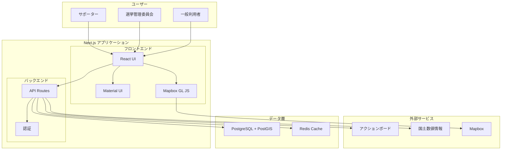
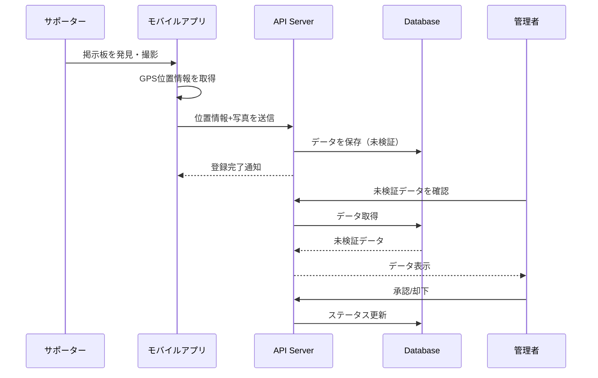
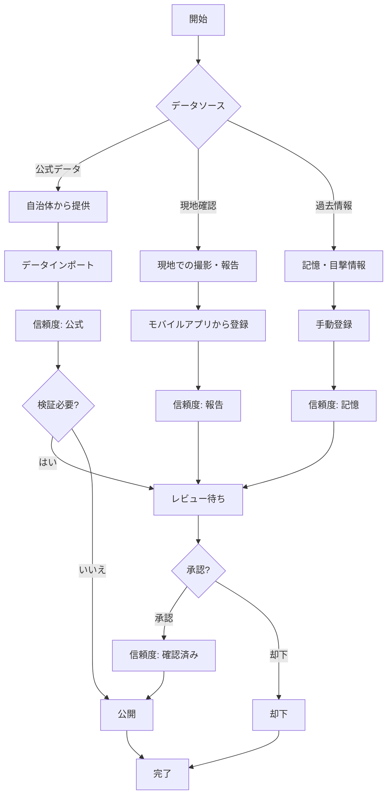
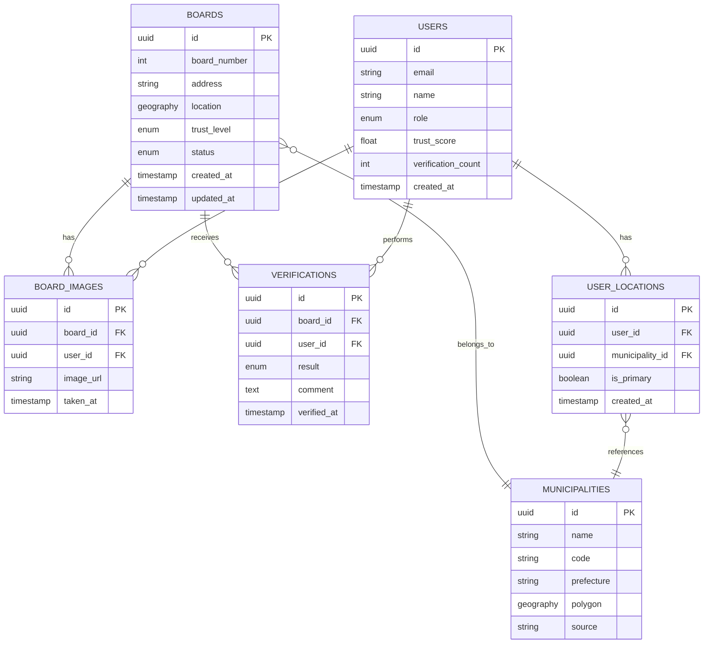

# アーキテクチャ図

## システム全体構成図

```mermaid
graph TB
    subgraph "ユーザー"
        A[サポーター]
        B[選挙管理委員会]
        C[一般利用者]
    end

    subgraph "Next.js アプリケーション"
        subgraph "フロントエンド"
            D[React UI]
            E[Material UI]
            F[Mapbox GL JS]
        end
        subgraph "バックエンド"
            G[API Routes]
            H[認証]
        end
    end

    subgraph "外部サービス"
        K[アクションボード]
        L[国土数値情報]
        M[Mapbox]
    end

    subgraph "データ層"
        I[PostgreSQL + PostGIS]
        J[Redis Cache]
    end

    A --> D
    B --> D
    C --> D
    D --> E
    D --> F
    D --> G
    G --> H
    G --> I
    G --> J
    G --> K
    G --> L
    F --> M
```

## データフロー図

```mermaid
sequenceDiagram
    participant S as サポーター
    participant M as モバイルアプリ
    participant API as API Server
    participant DB as Database
    participant Admin as 管理者

    S->>M: 掲示板を発見・撮影
    M->>M: GPS位置情報を取得
    M->>API: 位置情報+写真を送信
    API->>DB: データを保存（未検証）
    API-->>M: 登録完了通知

    Admin->>API: 未検証データを確認
    API->>DB: データ取得
    DB-->>API: 未検証データ
    API-->>Admin: データ表示
    Admin->>API: 承認/却下
    API->>DB: ステータス更新
```

## データ収集ワークフロー

```mermaid
flowchart TD
    Start[開始] --> Check{データソース}

    Check -->|公式データ| Official[自治体から提供]
    Check -->|現地確認| Field[現地での撮影・報告]
    Check -->|過去情報| Memory[記憶・目撃情報]

    Official --> Import[データインポート]
    Field --> Mobile[モバイルアプリから登録]
    Memory --> Manual[手動登録]

    Import --> Level1[信頼度: 公式]
    Mobile --> Level3[信頼度: 報告]
    Manual --> Level4[信頼度: 記憶]

    Level1 --> Verify{検証必要?}
    Level3 --> Review[レビュー待ち]
    Level4 --> Review

    Review --> Approve{承認?}
    Approve -->|承認| Level2[信頼度: 確認済み]
    Approve -->|却下| Reject[却下]

    Verify -->|はい| Review
    Verify -->|いいえ| Publish[公開]

    Level2 --> Publish
    Publish --> End[完了]
    Reject --> End
```

## ER図

```mermaid
erDiagram
    BOARDS ||--o{ BOARD_IMAGES : has
    BOARDS ||--o{ VERIFICATIONS : receives
    BOARDS }o--|| MUNICIPALITIES : belongs_to
    USERS ||--o{ VERIFICATIONS : performs
    USERS ||--o{ BOARD_IMAGES : uploads
    USERS ||--o{ USER_LOCATIONS : has
    USER_LOCATIONS }o--|| MUNICIPALITIES : references

    BOARDS {
        uuid id PK
        int board_number
        string address
        geography location
        enum trust_level
        enum status
        timestamp created_at
        timestamp updated_at
    }

    BOARD_IMAGES {
        uuid id PK
        uuid board_id FK
        uuid user_id FK
        string image_url
        timestamp taken_at
    }

    VERIFICATIONS {
        uuid id PK
        uuid board_id FK
        uuid user_id FK
        enum result
        text comment
        timestamp verified_at
    }

    MUNICIPALITIES {
        uuid id PK
        string name
        string code
        string prefecture
        geography polygon
        string source
    }

    USERS {
        uuid id PK
        string email
        string name
        enum role
        float trust_score
        int verification_count
        timestamp created_at
    }

    USER_LOCATIONS {
        uuid id PK
        uuid user_id FK
        uuid municipality_id FK
        boolean is_primary
        timestamp created_at
    }
```

---

最終更新: 2025年9月27日