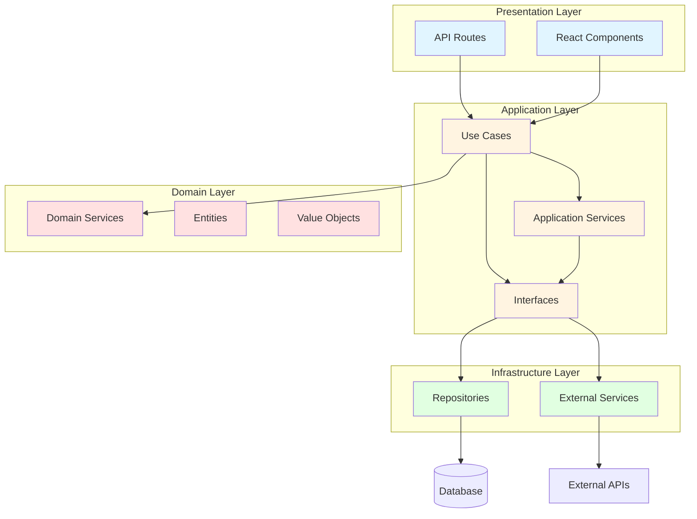

# Clean Architecture実装ガイド

このドキュメントは、Polisterプロジェクトでのクリーンアーキテクチャ実装のガイドラインです。

## 概要

Clean Architectureは、依存関係逆転の原則に基づいて、ビジネスロジックを外部の技術的詳細から独立させる設計パターンです。本プロジェクトでは、Repository Pattern、Service抽象化、Dependency Injectionを組み合わせて実装します。

## アーキテクチャ構造



### ディレクトリ構成

Next.js App Routerの特性を活かした機能別モジュール構成を採用します。

```text
src/
├── app/                              # Next.js App Router
│   ├── (auth)/                       # 認証が必要なルート
│   │   ├── dashboard/
│   │   └── settings/
│   ├── (public)/                     # 公開ルート
│   │   ├── map/                      # 地図表示
│   │   └── about/
│   ├── api/                          # API Routes（Presentation層）
│   │   ├── boards/
│   │   ├── verification/
│   │   └── import/
│   ├── _components/                  # ページ固有コンポーネント
│   ├── layout.tsx
│   └── page.tsx
├── features/                         # 機能別モジュール
│   ├── board/                        # 掲示板管理機能
│   │   ├── domain/                   # ドメインロジック
│   │   │   ├── entities/
│   │   │   ├── value-objects/
│   │   │   └── services/
│   │   ├── application/              # ユースケース
│   │   │   ├── usecases/
│   │   │   └── services/
│   │   ├── infrastructure/           # Repository実装
│   │   │   ├── repositories/
│   │   │   └── mappers/
│   │   └── ui/                       # UIコンポーネント
│   ├── verification/                 # 検証機能
│   │   ├── domain/
│   │   ├── application/
│   │   ├── infrastructure/
│   │   └── ui/
│   ├── import/                       # データインポート機能
│   │   ├── domain/
│   │   ├── application/
│   │   ├── infrastructure/
│   │   └── ui/
│   └── municipality/                 # 市区町村管理
│       ├── domain/
│       ├── application/
│       └── infrastructure/
├── shared/                           # 共有
│   ├── ui/                           # 共通UIコンポーネント
│   │   ├── Map/
│   │   ├── DataTable/
│   │   └── Form/
│   ├── lib/                          # ユーティリティ
│   │   ├── di/                       # Dependency Injection
│   │   ├── errors/                   # エラーハンドリング
│   │   └── utils/                    # ユーティリティ関数
│   └── types/                        # 共通型定義
└── infrastructure/                   # 共有インフラ
    ├── database/                     # Prisma設定
    │   ├── schema.prisma
    │   └── migrations/
    ├── external/                     # 外部APIクライアント
    │   ├── mapbox/
    │   ├── geocoding/
    │   └── action-board/
    └── repositories/                 # Repository基底クラス
        └── base/
```

### ディレクトリ構成の特徴

#### 1. **機能別モジュール（features/）**

各機能が独立したモジュールとして、ドメイン・アプリケーション・インフラ・UIを含みます。

**メリット**:

- 機能の追加・削除が容易
- チーム分担がしやすい
- 影響範囲が明確

#### 2. **Next.js App Routerの活用**

- `(auth)`: 認証が必要なページグループ
- `(public)`: 公開ページグループ
- Route Groupsでレイアウトを分離

#### 3. **共有リソースの分離**

- `shared/ui/`: 全機能で使う共通コンポーネント
- `shared/lib/`: DI、エラーハンドリング等
- `infrastructure/`: データベース、外部API等の共有インフラ

### 層の責任

#### Domain Layer（ドメイン層）

- **責任**: ビジネスルールとドメインロジック
- **場所**: `src/features/<feature>/domain/`
- **特徴**: 外部依存を持たない純粋なビジネスロジック
- **Polisterでの例**:
  - `features/board/domain/services/BoardValidationService`: 掲示板データのバリデーション
  - `features/verification/domain/services/TrustLevelService`: 信頼度レベルの計算
  - `features/verification/domain/services/VerificationRuleService`: 検証ルールの判定

#### Application Layer（アプリケーション層）

- **責任**: ユースケースの調整とワークフロー
- **場所**: `src/features/<feature>/application/`
- **特徴**: RepositoryとDomainServiceを組み合わせてビジネスユースケースを実現
- **Polisterでの例**:
  - `features/board/application/usecases/BoardManagementUseCase`: 掲示板データの登録・編集・削除
  - `features/verification/application/usecases/VerificationUseCase`: 地域ベース検証依頼と承認フロー
  - `features/import/application/usecases/DataImportUseCase`: CSV/KML一括インポート
  - `features/board/application/usecases/ActionBoardIntegrationUseCase`: アクションボード連携

#### Infrastructure Layer（インフラ層）

- **責任**: 外部システムとの統合とデータ永続化
- **場所**: `src/features/<feature>/infrastructure/` および `src/infrastructure/`（共有インフラ）
- **特徴**: データベース、外部API、ファイルシステムなどの技術的詳細
- **Polisterでの例**:
  - `features/board/infrastructure/repositories/BoardRepository`: 掲示板データの永続化（PostgreSQL + PostGIS）
  - `features/municipality/infrastructure/repositories/MunicipalityRepository`: 市区町村データ管理
  - `infrastructure/external/geocoding/GeocodingService`: 住所→緯度経度変換（外部API）
  - `infrastructure/external/mapbox/MapboxService`: 地図タイル配信
  - `infrastructure/external/action-board/ActionBoardApiClient`: アクションボードAPI連携

#### Presentation Layer（プレゼンテーション層）

- **責任**: ユーザーインターフェースとHTTPリクエスト処理
- **場所**: `src/app/` および `src/features/<feature>/ui/`
- **特徴**: Next.js App Router、React Components
- **Polisterでの例**:
  - `app/api/boards/`: 掲示板CRUD API
  - `app/api/verification/`: 検証・承認API
  - `app/api/import/`: データインポートAPI
  - `features/board/ui/`: 掲示板関連UIコンポーネント
  - `features/verification/ui/`: 検証関連UIコンポーネント
  - `shared/ui/Map/`: 共通地図コンポーネント

## 実装手順

### 1. インターフェース定義

新機能を実装する際は、まずインターフェースから定義します。

#### Repositoryインターフェース例

```typescript
// src/features/board/infrastructure/repositories/IBoardRepository.ts
import type { Board, BoardStatus, TrustLevel } from "@prisma/client";

export interface CreateBoardData {
  boardNumber: number;
  address: string;
  latitude: number;
  longitude: number;
  municipalityId: string;
  trustLevel?: TrustLevel;
  status?: BoardStatus;
}

export interface UpdateBoardData {
  boardNumber?: number;
  address?: string;
  latitude?: number;
  longitude?: number;
  trustLevel?: TrustLevel;
  status?: BoardStatus;
}

export interface BoardSearchFilters {
  municipalityId?: string;
  trustLevel?: TrustLevel;
  status?: BoardStatus;
  bounds?: {
    north: number;
    south: number;
    east: number;
    west: number;
  };
}

export interface IBoardRepository {
  create(data: CreateBoardData): Promise<Board>;
  findById(id: string): Promise<Board | null>;
  findByLocation(lat: number, lng: number, radius: number): Promise<Board[]>;
  findMany(filters: BoardSearchFilters): Promise<Board[]>;
  update(id: string, data: UpdateBoardData): Promise<Board>;
  delete(id: string): Promise<void>;
  exists(id: string): Promise<boolean>;
  countByTrustLevel(level: TrustLevel): Promise<number>;
}
```

### 2. Repository実装

```typescript
// src/features/board/infrastructure/repositories/BoardRepository.ts
import type { PrismaClient, Board } from "@prisma/client";
import { inject, injectable } from "tsyringe";

import { TOKENS } from "@/shared/lib/di/tokens";
import type {
  CreateBoardData,
  IBoardRepository,
  UpdateBoardData,
  BoardSearchFilters,
} from "./IBoardRepository";

@injectable()
export class BoardRepository implements IBoardRepository {
  constructor(@inject(TOKENS.PrismaClient) private prisma: PrismaClient) {}

  async create(data: CreateBoardData): Promise<Board> {
    return this.prisma.board.create({
      data: {
        boardNumber: data.boardNumber,
        address: data.address,
        location: {
          type: "Point",
          coordinates: [data.longitude, data.latitude],
        },
        municipalityId: data.municipalityId,
        trustLevel: data.trustLevel || "LEVEL_3",
        status: data.status || "PENDING",
      },
    });
  }

  async findByLocation(
    lat: number,
    lng: number,
    radius: number
  ): Promise<Board[]> {
    return this.prisma.$queryRaw`
      SELECT * FROM boards
      WHERE ST_DWithin(
        location::geography,
        ST_SetSRID(ST_MakePoint(${lng}, ${lat}), 4326)::geography,
        ${radius}
      )
    `;
  }

  async findMany(filters: BoardSearchFilters): Promise<Board[]> {
    const where = this.buildWhereClause(filters);
    return this.prisma.board.findMany({ where });
  }

  private buildWhereClause(filters: BoardSearchFilters) {
    const where: Record<string, unknown> = {};

    if (filters.municipalityId) {
      where.municipalityId = filters.municipalityId;
    }

    if (filters.trustLevel) {
      where.trustLevel = filters.trustLevel;
    }

    if (filters.status) {
      where.status = filters.status;
    }

    return where;
  }
}
```

### 3. Use Case実装

```typescript
// src/features/board/application/usecases/BoardManagementUseCase.ts
import { inject, injectable } from "tsyringe";

import { TOKENS } from "@/shared/lib/di/tokens";
import type { IBoardRepository } from "../../infrastructure/repositories/IBoardRepository";
import type { IGeocodingService } from "@/infrastructure/external/geocoding/IGeocodingService";
import {
  ValidationError,
  BoardNotFoundError,
} from "@/shared/lib/errors/DomainErrors";

export interface BoardCreationResult {
  success: boolean;
  boardId?: string;
  error?: string;
}

@injectable()
export class BoardManagementUseCase {
  constructor(
    @inject(TOKENS.BoardRepository)
    private boardRepository: IBoardRepository,
    @inject(TOKENS.GeocodingService)
    private geocodingService: IGeocodingService
  ) {}

  async createBoard(
    address: string,
    boardNumber: number,
    municipalityId: string,
    executorUserId: string
  ): Promise<BoardCreationResult> {
    try {
      // バリデーション
      if (!address || address.length < 3) {
        throw new ValidationError("address", [
          "住所は3文字以上で入力してください",
        ]);
      }

      // ジオコーディング
      const coords = await this.geocodingService.geocode(address);
      if (!coords) {
        return {
          success: false,
          error: "住所から位置情報を取得できませんでした",
        };
      }

      // 掲示板作成
      const board = await this.boardRepository.create({
        boardNumber,
        address,
        latitude: coords.lat,
        longitude: coords.lng,
        municipalityId,
        trustLevel: "LEVEL_3",
        status: "PENDING",
      });

      return {
        success: true,
        boardId: board.id,
      };
    } catch (error) {
      console.error("Error creating board:", error);
      return {
        success: false,
        error:
          error instanceof Error ? error.message : "掲示板の作成に失敗しました",
      };
    }
  }

  async verifyBoard(
    boardId: string,
    verifierId: string,
    hasPhoto: boolean,
    gpsAccuracy: number
  ): Promise<void> {
    const board = await this.boardRepository.findById(boardId);
    if (!board) {
      throw new BoardNotFoundError(boardId);
    }

    // 検証記録を作成
    // ...

    // 信頼度レベルの更新判定
    // ...
  }
}
```

### 4. DI設定

`src/shared/lib/di` に依存性注入の共通実装をまとめる。トークンは文字列定数で管理し、型安全性を保つためにマッピング型を定義する。

```typescript title="src/shared/lib/di/tokens.ts"
import type { PrismaClient } from "@prisma/client";

export interface AppLogger {
  debug(message: string, ...meta: unknown[]): void;
  info(message: string, ...meta: unknown[]): void;
  warn(message: string, ...meta: unknown[]): void;
  error(message: string | Error, ...meta: unknown[]): void;
}

export interface DateProvider {
  now(): Date;
}

export const TOKENS = {
  prismaClient: "di.prismaClient",
  logger: "di.logger",
  dateProvider: "di.dateProvider",
} as const;

export type Token = (typeof TOKENS)[keyof typeof TOKENS];

export type TokenMap = {
  [TOKENS.prismaClient]: PrismaClient;
  [TOKENS.logger]: AppLogger;
  [TOKENS.dateProvider]: DateProvider;
};

export type ResolveToken<T extends Token> = TokenMap[T];
```

```typescript title="src/shared/lib/di/container.ts"
import { PrismaClient } from "@prisma/client";
import "reflect-metadata";
import { DependencyContainer, container } from "tsyringe";

import { TOKENS } from "./tokens";
import type {
  AppLogger,
  DateProvider,
  ResolveToken,
  Token,
  TokenMap,
} from "./tokens";

class ConsoleLogger implements AppLogger {
  // ...
}

class SystemDateProvider implements DateProvider {
  // ...
}

const globalForPrisma = globalThis as typeof globalThis & {
  prismaClient?: PrismaClient;
};

const getPrismaClient = (): PrismaClient => {
  if (!globalForPrisma.prismaClient) {
    globalForPrisma.prismaClient = new PrismaClient();
  }

  return globalForPrisma.prismaClient;
};

const registerDefaults = (target: DependencyContainer): void => {
  if (!target.isRegistered(TOKENS.prismaClient)) {
    target.register<PrismaClient>(TOKENS.prismaClient, {
      useFactory: () => getPrismaClient(),
    });
  }

  if (!target.isRegistered(TOKENS.logger)) {
    target.registerSingleton<AppLogger>(TOKENS.logger, ConsoleLogger);
  }

  if (!target.isRegistered(TOKENS.dateProvider)) {
    target.registerSingleton<DateProvider>(
      TOKENS.dateProvider,
      SystemDateProvider
    );
  }
};

export const setupDI = (
  targetContainer: DependencyContainer = container
): DependencyContainer => {
  registerDefaults(targetContainer);

  return targetContainer;
};

export const resolve = <T extends Token>(token: T): ResolveToken<T> => {
  if (!container.isRegistered(token)) {
    setupDI(container);
  }

  return container.resolve<ResolveToken<T>>(token);
};
```

`reflect-metadata` は常に最上部で読み込み、1 行の空行で他の import と区切る。プロジェクトでは `prettier-plugin-organize-imports` を利用しており、この空行がないと自動整形時に順序が入れ替わるので注意する。

> **メモ**: E2E テストなどデータベース接続が不要な場合は環境変数 `DISABLE_PRISMA=true` を設定することで PrismaClient の初期化を抑止できる。Playwright の設定では自動で有効化される。

### 5. API Routeでの使用

各バウンデッドコンテキストは `features/<context>/di/tokens.ts` のようにローカルなトークンを定義し、必要に応じて共有コンテナへ登録する。例では掲示板コンテキストのトークン (`BOARD_TOKENS`) を解決している。

```typescript
// src/app/api/boards/route.ts
import { NextResponse } from "next/server";

import type { BoardManagementUseCase } from "@/features/board/application/usecases/BoardManagementUseCase";
import { TOKENS as BOARD_TOKENS } from "@/features/board/di/tokens";
import { resolve } from "@/shared/lib/di";

export async function POST(request: Request) {
  try {
    const data = await request.json();
    const useCase = resolve<BoardManagementUseCase>(
      BOARD_TOKENS.boardManagementUseCase
    );

    const result = await useCase.execute(data);

    if (!result.success) {
      return NextResponse.json({ error: result.error }, { status: 400 });
    }

    return NextResponse.json(result.value, { status: 201 });
  } catch (error) {
    console.error("API Error:", error);
    return NextResponse.json(
      { error: "Internal Server Error" },
      { status: 500 }
    );
  }
}
```

## 設計原則

### 1. 依存関係逆転の原則（DIP）

高レベルモジュール（Use Case）は低レベルモジュール（Repository、外部サービス）に依存せず、両方とも抽象（インターフェース）に依存します。

```typescript
// [NG] 悪い例：直接実装に依存
export class BadUseCase {
  constructor(
    private prisma: PrismaClient,
    private mapboxClient: MapboxClient
  ) {}
}

// [OK] 良い例：インターフェースに依存
export class GoodUseCase {
  constructor(
    private boardRepository: IBoardRepository,
    private mapService: IMapService
  ) {}
}
```

### 2. 単一責任の原則（SRP）

各クラスは1つの責任のみを持ちます。

- **Repository**: データアクセスのみ
- **Domain Service**: ビジネスルールのみ
- **Infrastructure Service**: 外部システム連携のみ
- **Use Case**: ワークフロー調整のみ

### 3. インターフェース分離の原則（ISP）

クライアントは使用しないメソッドへの依存を強制されません。

```typescript
// 大きすぎるインターフェースを分割
export interface IBoardReader {
  findById(id: string): Promise<Board | null>;
  findMany(filters: BoardSearchFilters): Promise<Board[]>;
}

export interface IBoardWriter {
  create(data: CreateBoardData): Promise<Board>;
  update(id: string, data: UpdateBoardData): Promise<Board>;
  delete(id: string): Promise<void>;
}

export interface IBoardRepository extends IBoardReader, IBoardWriter {}
```

## Polister固有の実装例

### 地域ベース検証システム

```typescript
// src/features/verification/application/usecases/RegionalVerificationUseCase.ts
@injectable()
export class RegionalVerificationUseCase {
  constructor(
    @inject(TOKENS.BoardRepository)
    private boardRepository: IBoardRepository,
    @inject(TOKENS.UserRepository)
    private userRepository: IUserRepository,
    @inject(TOKENS.NotificationService)
    private notificationService: INotificationService,
    @inject(TOKENS.VerificationRepository)
    private verificationRepository: IVerificationRepository
  ) {}

  async requestVerification(boardId: string): Promise<void> {
    const board = await this.boardRepository.findById(boardId);
    if (!board) throw new BoardNotFoundError(boardId);

    // 該当地域のユーザーを検索
    const localUsers = await this.userRepository.findByMunicipality(
      board.municipalityId
    );

    // プッシュ通知送信
    await Promise.all(
      localUsers.map((user) =>
        this.notificationService.sendVerificationRequest(user.id, boardId)
      )
    );
  }

  async submitVerification(
    boardId: string,
    userId: string,
    result: boolean,
    hasPhoto: boolean,
    gpsAccuracy: number
  ): Promise<void> {
    // 検証記録を保存
    await this.verificationRepository.create({
      boardId,
      userId,
      result,
      hasPhoto,
      gpsAccuracy,
    });

    // 自動承認判定
    const verifications =
      await this.verificationRepository.findByBoardId(boardId);

    if (this.shouldAutoApprove(verifications)) {
      await this.boardRepository.update(boardId, {
        trustLevel: "LEVEL_2",
        status: "VERIFIED",
      });
    }
  }

  private shouldAutoApprove(verifications: Verification[]): boolean {
    // 3人以上の確認があり、全員が一致している場合
    return verifications.length >= 3 && verifications.every((v) => v.result);
  }
}
```

### データインポートシステム

```typescript
// src/features/import/application/usecases/DataImportUseCase.ts
@injectable()
export class DataImportUseCase {
  constructor(
    @inject(TOKENS.BoardRepository)
    private boardRepository: IBoardRepository,
    @inject(TOKENS.GeocodingService)
    private geocodingService: IGeocodingService
  ) {}

  async importFromCSV(
    csvData: string,
    municipalityId: string,
    executorUserId: string
  ): Promise<ImportResult> {
    const rows = this.parseCSV(csvData);
    const results: ImportResult[] = [];

    for (const row of rows) {
      try {
        // 住所から緯度経度を取得
        const coords = await this.geocodingService.geocode(row.address);

        if (coords) {
          await this.boardRepository.create({
            boardNumber: row.boardNumber,
            address: row.address,
            latitude: coords.lat,
            longitude: coords.lng,
            municipalityId,
            trustLevel: "LEVEL_1", // 公式データ
          });

          results.push({ success: true, row: row.boardNumber });
        } else {
          results.push({
            success: false,
            row: row.boardNumber,
            error: "ジオコーディング失敗",
          });
        }
      } catch (error) {
        results.push({
          success: false,
          row: row.boardNumber,
          error: error instanceof Error ? error.message : "不明なエラー",
        });
      }
    }

    return {
      total: rows.length,
      success: results.filter((r) => r.success).length,
      failed: results.filter((r) => !r.success).length,
      details: results,
    };
  }

  async importFromKML(
    kmlData: string,
    municipalityId: string,
    executorUserId: string
  ): Promise<ImportResult> {
    const placemarks = this.parseKML(kmlData);
    // CSV同様の処理
  }

  private parseCSV(data: string): BoardRow[] {
    // CSV解析処理
  }

  private parseKML(data: string): PlacemarkData[] {
    // KML解析処理
  }
}
```

## ベストプラクティス

### 1. 命名規則

- **インターフェース**: `I` + サービス名（例: `IBoardRepository`）
- **実装クラス**: サービス名のみ（例: `BoardRepository`）
- **DIトークン**: サービス名（例: `TOKENS.BoardRepository`）

### 2. ファイル配置

- **インターフェース**: `interfaces/I{ServiceName}.ts`
- **実装**: `implementations/{ServiceName}.ts`
- **テスト**: `__tests__/{ServiceName}.test.ts`

### 3. エラーハンドリング

```typescript
export interface OperationResult<T = unknown> {
  success: boolean;
  data?: T;
  error?: string;
}

// Use Caseでの統一的なエラーハンドリング
async createBoard(data: BoardData): Promise<OperationResult<Board>> {
  try {
    const board = await this.boardRepository.create(data);
    return { success: true, data: board };
  } catch (error) {
    console.error('Error in createBoard:', error);
    return {
      success: false,
      error: error instanceof Error ? error.message : 'Unknown error',
    };
  }
}
```

### 4. 型安全性の確保

- **any型の禁止**: プロジェクト全体でany型は使用しない
- **インターフェース活用**: 全ての依存関係をインターフェースで定義
- **strict mode**: TypeScriptのstrictモードを有効化

### 5. Barrelファイルの使用禁止

- `index.ts`や`index.tsx`で再エクスポートのみを行うBarrelファイルは作成しない
- 直接的なインポートパスを用いて依存関係を明示し、不要な依存やカバレッジ欠落を防ぐ
- 共通モジュールが必要な場合でも、名前付きファイルを介して明示的にエクスポートを管理する

## 今後の実装計画

### Phase 1: MVP

- BoardRepository、MunicipalityRepository
- BoardManagementUseCase
- 基本的なCRUD API

### Phase 2: 検証機能

- VerificationRepository、UserLocationRepository
- RegionalVerificationUseCase
- 自動承認ワークフロー

### Phase 3: 外部連携

- ActionBoardApiClient
- ActionBoardIntegrationUseCase
- ポイント連携機能

---

最終更新: 2025年9月27日
