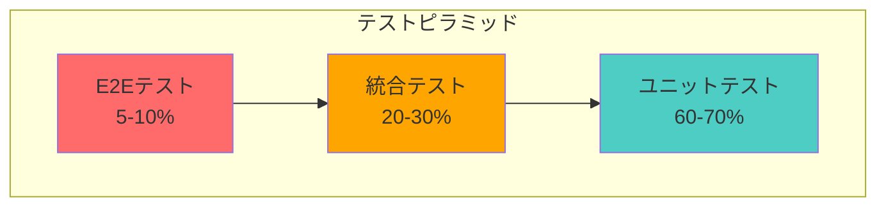

# Polister テスト戦略ガイド

**更新日**: 2025年10月17日
**目標カバレッジ**: 80%以上

## 概要

このガイドは、PolisterプロジェクトのClean Architecture実装に基づいたテスト戦略をまとめています。型安全性とテスタビリティを重視し、各層に応じた適切なテスト手法を提供します。

## 実績

**Municipality機能の実装で達成したカバレッジ**:

- ドメイン層（エンティティ・値オブジェクト）: **96.72% - 100%**
- アプリケーション層（UseCase）: **98.29%**
- インフラ層（Mapper）: **100%**
- インフラ層（Repository）: **89.62%**
- 合計: **52テスト**、すべて合格

**重要な知見**:

- `mockDeep<PrismaClient>()`を使用することで`as any`キャスト完全排除
- `as const`と適切な型定義で型安全性を確保
- Server Actionsはユニットテストではなく、E2Eテストでカバーするのが適切

## テストアーキテクチャ

### テストピラミッド



### 層別テスト戦略

| 層                       | テスト対象                | モック対象               | テスト重点            |
| ------------------------ | ------------------------- | ------------------------ | --------------------- |
| **Domain Layer**         | ドメインサービス          | なし                     | ビジネスルール検証    |
| **Application Layer**    | ユースケース、サービス    | Repository、外部サービス | ワークフロー、統合    |
| **Infrastructure Layer** | Repository実装            | PrismaClient、外部API    | データ永続化、API連携 |
| **Presentation Layer**   | APIルート、コンポーネント | ユースケース             | リクエスト/レスポンス |

## 基本原則

### 1. jest-mock-extendedによる完全型安全化（必須）

**重要**: Polisterでは`jest-mock-extended`の`mockDeep`を必須とします。

```typescript
import { mockDeep, mockReset } from "jest-mock-extended";
import type { PrismaClient } from "@prisma/client";

// ✅ 完全型安全なモック（as anyキャスト不要）
const mockPrisma = mockDeep<PrismaClient>();

// ネストしたプロパティも型安全にアクセス可能
mockPrisma.municipality.findUnique.mockResolvedValue(mockData);
mockPrisma.$queryRaw.mockResolvedValue([]);

// ❌ 従来の方法（使用禁止）
const badMockPrisma = {
  municipality: {
    findUnique: jest.fn() as any, // as anyが必要になる
  },
} as PrismaClient;
```

### 2. as anyを避ける型定義パターン（必須）

**Prisma Enumの使用**:

```typescript
import type { MunicipalityStatus, ContactStatus } from "@prisma/client";

// ✅ 良い例
const createMunicipality = (
  status: MunicipalityStatus = "NOT_STARTED",
  contactStatus: ContactStatus | null = null
): Municipality => {
  return new Municipality(
    "test-id",
    "千代田区",
    MunicipalityCode.create("13101"),
    "東京都",
    null,
    "MLIT",
    null,
    null,
    null,
    status,  // as anyなし
    contactStatus,  // as anyなし
    null,
    null,
    new Date(),
    new Date()
  );
};

// ❌ 悪い例
const badMunicipality = new Municipality(
  ...,
  "NOT_STARTED" as any,  // 使用禁止
  "RECEIVED" as any,  // 使用禁止
  ...
);
```

**as constの活用**:

```typescript
// ✅ モックデータにas constを使用
const createMockPrismaData = () =>
  ({
    id: "test-id",
    name: "千代田区",
    code: "13101",
    status: "COMPLETED",
    contactStatus: "RECEIVED",
    // ... その他
  }) as const;
```

### 3. 型安全なファクトリ関数パターン

```typescript
// [OK] 推奨：完全な型定義ファクトリ関数
const createMockBoard = (overrides: Partial<Board> = {}): Board => ({
  id: "board-123",
  boardNumber: "1",
  address: "東京都千代田区永田町1-7-1",
  location: {
    type: "Point",
    coordinates: [139.7453, 35.6762],
  },
  municipalityId: "municipality-123",
  trustLevel: "LEVEL_3",
  status: "PENDING",
  createdAt: new Date("2025-01-01"),
  updatedAt: new Date("2025-01-01"),
  ...overrides,
});

// [NG] 非推奨：不完全なオブジェクトリテラル
const badMockData = {
  id: "test",
  boardNumber: "1",
  // 他の必須フィールドが不足
};
```

### 3. mockResetによる状態管理

```typescript
beforeEach(() => {
  jest.clearAllMocks();
  mockReset(prismaMock);
  mockReset(boardRepositoryMock);
  mockReset(geocodingServiceMock);

  // デフォルト設定を再設定
  setupDefaultMocks();
});
```

## Clean Architecture層別テスト実装

### Domain Layer テスト

ドメイン層は外部依存がないため、モック不要でテスト可能です。

```typescript
// src/features/verification/domain/services/__tests__/TrustLevelService.test.ts
import type { Verification } from "@/features/verification/domain/entities/Verification";

import { TrustLevelService } from "../TrustLevelService";

describe("TrustLevelService", () => {
  let service: TrustLevelService;

  beforeEach(() => {
    service = new TrustLevelService();
  });

  describe("shouldAutoApprove", () => {
    it("3人以上が確認し全員一致の場合、自動承認すべき", () => {
      const verifications: Verification[] = [
        createMockVerification({ result: true }),
        createMockVerification({ result: true }),
        createMockVerification({ result: true }),
      ];

      const result = service.shouldAutoApprove(verifications);

      expect(result).toBe(true);
    });

    it("3人未満の場合、自動承認しない", () => {
      const verifications: Verification[] = [
        createMockVerification({ result: true }),
        createMockVerification({ result: true }),
      ];

      const result = service.shouldAutoApprove(verifications);

      expect(result).toBe(false);
    });

    it("不一致がある場合、自動承認しない", () => {
      const verifications: Verification[] = [
        createMockVerification({ result: true }),
        createMockVerification({ result: false }),
        createMockVerification({ result: true }),
      ];

      const result = service.shouldAutoApprove(verifications);

      expect(result).toBe(false);
    });
  });
});
```

### Application Layer テスト

ユースケースのテストでは、RepositoryとDomain Serviceをモックします。

```typescript
// src/features/board/application/usecases/__tests__/BoardManagementUseCase.test.ts
import { type DeepMockProxy, mockDeep, mockReset } from "jest-mock-extended";

import type { IBoardRepository } from "@/features/board/application/repositories/IBoardRepository";
import type { IGeocodingService } from "@/infrastructure/external/geocoding/IGeocodingService";

import { BoardManagementUseCase } from "../BoardManagementUseCase";

describe("BoardManagementUseCase", () => {
  let useCase: BoardManagementUseCase;
  let mockBoardRepository: DeepMockProxy<IBoardRepository>;
  let mockGeocodingService: DeepMockProxy<IGeocodingService>;

  beforeEach(() => {
    mockBoardRepository = mockDeep<IBoardRepository>();
    mockGeocodingService = mockDeep<IGeocodingService>();

    useCase = new BoardManagementUseCase(
      mockBoardRepository,
      mockGeocodingService
    );
  });

  describe("createBoard", () => {
    it("有効なデータで掲示板を作成できる", async () => {
      const address = "東京都千代田区永田町1-7-1";
      const boardNumber = "1";
      const municipalityId = "municipality-123";
      const userId = "user-123";

      // ジオコーディング成功をモック
      mockGeocodingService.geocode.mockResolvedValue({
        lat: 35.6762,
        lng: 139.7453,
      });

      // Repository成功をモック
      const mockBoard = createMockBoard({
        address,
        boardNumber,
        municipalityId,
      });
      mockBoardRepository.create.mockResolvedValue(mockBoard);

      const result = await useCase.createBoard(
        address,
        boardNumber,
        municipalityId,
        userId
      );

      expect(result.success).toBe(true);
      expect(result.boardId).toBe(mockBoard.id);
      expect(mockGeocodingService.geocode).toHaveBeenCalledWith(address);
      expect(mockBoardRepository.create).toHaveBeenCalledWith({
        boardNumber,
        address,
        latitude: 35.6762,
        longitude: 139.7453,
        municipalityId,
        trustLevel: "LEVEL_3",
        status: "PENDING",
      });
    });

    it("住所が3文字未満の場合、エラーを返す", async () => {
      const result = await useCase.createBoard("ab", 1, "muni-123", "user-123");

      expect(result.success).toBe(false);
      expect(result.error).toContain("3文字以上");
      expect(mockGeocodingService.geocode).not.toHaveBeenCalled();
      expect(mockBoardRepository.create).not.toHaveBeenCalled();
    });

    it("ジオコーディングが失敗した場合、エラーを返す", async () => {
      mockGeocodingService.geocode.mockResolvedValue(null);

      const result = await useCase.createBoard(
        "東京都千代田区",
        1,
        "muni-123",
        "user-123"
      );

      expect(result.success).toBe(false);
      expect(result.error).toContain("位置情報を取得できませんでした");
      expect(mockBoardRepository.create).not.toHaveBeenCalled();
    });
  });
});
```

### Infrastructure Layer テスト

Repository実装では、PrismaClientをモックします。

```typescript
// src/features/board/infrastructure/repositories/__tests__/BoardRepository.test.ts
import type { PrismaClient } from "@prisma/client";
import { mockDeep, mockReset } from "jest-mock-extended";

import { BoardRepository } from "../BoardRepository";

const prismaMock = mockDeep<PrismaClient>();

describe("BoardRepository", () => {
  let repository: BoardRepository;

  beforeEach(() => {
    mockReset(prismaMock);
    repository = new BoardRepository(prismaMock);
  });

  describe("create", () => {
    it("正常に掲示板を作成できる", async () => {
      const mockBoard = createMockBoard();

      prismaMock.board.create.mockResolvedValue(mockBoard);

      const result = await repository.create({
        boardNumber: "1",
        address: "東京都千代田区永田町1-7-1",
        latitude: 35.6762,
        longitude: 139.7453,
        municipalityId: "municipality-123",
      });

      expect(result).toEqual(mockBoard);
      expect(prismaMock.board.create).toHaveBeenCalledWith({
        data: {
          boardNumber: "1",
          address: "東京都千代田区永田町1-7-1",
          location: {
            type: "Point",
            coordinates: [139.7453, 35.6762],
          },
          municipalityId: "municipality-123",
          trustLevel: "LEVEL_3",
          status: "PENDING",
        },
      });
    });
  });

  describe("findByLocation", () => {
    it("指定範囲内の掲示板を取得できる", async () => {
      const mockBoards = [
        createMockBoard(),
        createMockBoard({ id: "board-2" }),
      ];

      prismaMock.$queryRaw.mockResolvedValue(mockBoards);

      const result = await repository.findByLocation(35.6762, 139.7453, 1000);

      expect(result).toEqual(mockBoards);
      expect(prismaMock.$queryRaw).toHaveBeenCalled();
    });
  });
});
```

### Presentation Layer テスト

API Routeのテストでは、Next.jsのRequest/Responseをモックします。

```typescript
// src/app/api/boards/__tests__/route.test.ts
import { type DeepMockProxy, mockDeep } from "jest-mock-extended";

import type { BoardManagementUseCase } from "@/features/board/application/usecases/BoardManagementUseCase";

import { POST } from "../route";

// DIコンテナをモック
jest.mock("@/shared/lib/di/container", () => ({
  resolve: jest.fn(),
}));

describe("/api/boards POST", () => {
  let mockUseCase: DeepMockProxy<BoardManagementUseCase>;

  beforeEach(() => {
    mockUseCase = mockDeep<BoardManagementUseCase>();
    const { resolve } = require("@/shared/lib/di/container");
    resolve.mockReturnValue(mockUseCase);
  });

  it("有効なデータで掲示板を作成できる", async () => {
    const requestData = {
      address: "東京都千代田区永田町1-7-1",
      boardNumber: "1",
      municipalityId: "municipality-123",
      userId: "user-123",
    };

    mockUseCase.createBoard.mockResolvedValue({
      success: true,
      boardId: "board-123",
    });

    const request = new Request("http://localhost:3000/api/boards", {
      method: "POST",
      headers: { "content-type": "application/json" },
      body: JSON.stringify(requestData),
    });

    const response = await POST(request);
    const data = await response.json();

    expect(response.status).toBe(201);
    expect(data.boardId).toBe("board-123");
    expect(mockUseCase.createBoard).toHaveBeenCalledWith(
      requestData.address,
      requestData.boardNumber,
      requestData.municipalityId,
      requestData.userId
    );
  });

  it("バリデーションエラーの場合、400を返す", async () => {
    mockUseCase.createBoard.mockResolvedValue({
      success: false,
      error: "住所は3文字以上で入力してください",
    });

    const request = new Request("http://localhost:3000/api/boards", {
      method: "POST",
      headers: { "content-type": "application/json" },
      body: JSON.stringify({
        address: "ab",
        boardNumber: "1",
        municipalityId: "muni-123",
        userId: "user-123",
      }),
    });

    const response = await POST(request);
    const data = await response.json();

    expect(response.status).toBe(400);
    expect(data.error).toContain("3文字以上");
  });
});
```

## テストツールとライブラリ

### 必須ライブラリ

```json
{
  "devDependencies": {
    "@testing-library/jest-dom": "^6.0.0",
    "@testing-library/react": "^16.0.0",
    "@types/jest": "^29.0.0",
    "jest": "^29.0.0",
    "jest-environment-jsdom": "^29.0.0",
    "jest-mock-extended": "^4.0.0",
    "ts-jest": "^29.0.0"
  }
}
```

### Jest設定

```typescript
// jest.config.ts
import type { Config } from "jest";

import nextJest from "next/jest";

const createJestConfig = nextJest({
  dir: "./",
});

const config: Config = {
  coverageProvider: "v8",
  testEnvironment: "jsdom",
  setupFilesAfterEnv: ["<rootDir>/jest.setup.ts"],
  moduleNameMapper: {
    "^@/(.*)$": "<rootDir>/src/$1",
  },
  collectCoverageFrom: [
    "src/**/*.{ts,tsx}",
    "!src/**/*.d.ts",
    "!src/**/*.stories.tsx",
    "!src/**/__tests__/**",
  ],
  coverageReporters: ["json", "lcov", "text-summary"],
  coverageThreshold: {
    global: {
      branches: 80,
      functions: 80,
      lines: 80,
      statements: 80,
    },
  },
};

export default createJestConfig(config);
```

## テスト実装ガイド

### ファクトリ関数の作成

各エンティティに対応するファクトリ関数を作成します。

```typescript
// src/features/board/infrastructure/repositories/__tests__/factories/board.factory.ts
import type { Board } from "@/features/board/domain/entities/Board";
import type { BoardStatus, TrustLevel } from "@/features/board/domain/types";

export const createMockBoard = (overrides: Partial<Board> = {}): Board => ({
  id: "board-123",
  boardNumber: "1",
  address: "東京都千代田区永田町1-7-1",
  location: {
    type: "Point",
    coordinates: [139.7453, 35.6762],
  },
  municipalityId: "municipality-123",
  trustLevel: "LEVEL_3" as TrustLevel,
  status: "PENDING" as BoardStatus,
  createdAt: new Date("2025-01-01"),
  updatedAt: new Date("2025-01-01"),
  deletedAt: null,
  ...overrides,
});

export const createMockVerification = (
  overrides: Partial<Verification> = {}
): Verification => ({
  id: "verification-123",
  boardId: "board-123",
  userId: "user-123",
  result: true,
  hasPhoto: true,
  gpsAccuracy: 10,
  comment: null,
  verifiedAt: new Date("2025-01-01"),
  createdAt: new Date("2025-01-01"),
  ...overrides,
});

// 注: Verification型もDomain層のエンティティとして定義
// import type { Verification } from "@/features/verification/domain/entities/Verification";
```

### テストの命名規則

日本語で明確にテストの意図を表現します。

```typescript
describe("BoardManagementUseCase", () => {
  describe("createBoard", () => {
    it("有効なデータで掲示板を作成できる", async () => {});
    it("住所が3文字未満の場合、エラーを返す", async () => {});
    it("ジオコーディングが失敗した場合、エラーを返す", async () => {});
    it("重複する掲示板番号の場合、エラーを返す", async () => {});
  });

  describe("verifyBoard", () => {
    it("有効な検証データを記録できる", async () => {});
    it("3人以上の確認で自動承認される", async () => {});
    it("不一致がある場合、手動レビューに回される", async () => {});
  });
});
```

### モックのセットアップパターン

```typescript
describe("RegionalVerificationUseCase", () => {
  let useCase: RegionalVerificationUseCase;
  let mockBoardRepository: DeepMockProxy<IBoardRepository>;
  let mockUserRepository: DeepMockProxy<IUserRepository>;
  let mockNotificationService: DeepMockProxy<INotificationService>;
  let mockVerificationRepository: DeepMockProxy<IVerificationRepository>;

  beforeEach(() => {
    mockBoardRepository = mockDeep<IBoardRepository>();
    mockUserRepository = mockDeep<IUserRepository>();
    mockNotificationService = mockDeep<INotificationService>();
    mockVerificationRepository = mockDeep<IVerificationRepository>();

    useCase = new RegionalVerificationUseCase(
      mockBoardRepository,
      mockUserRepository,
      mockNotificationService,
      mockVerificationRepository
    );
  });

  it("該当地域のユーザーに検証依頼を送信できる", async () => {
    const mockBoard = createMockBoard({ municipalityId: "tokyo-123" });
    const mockUsers = [
      createMockUser({ id: "user-1" }),
      createMockUser({ id: "user-2" }),
    ];

    mockBoardRepository.findById.mockResolvedValue(mockBoard);
    mockUserRepository.findByMunicipality.mockResolvedValue(mockUsers);
    mockNotificationService.sendVerificationRequest.mockResolvedValue(
      undefined
    );

    await useCase.requestVerification("board-123");

    expect(mockBoardRepository.findById).toHaveBeenCalledWith("board-123");
    expect(mockUserRepository.findByMunicipality).toHaveBeenCalledWith(
      "tokyo-123"
    );
    expect(
      mockNotificationService.sendVerificationRequest
    ).toHaveBeenCalledTimes(2);
  });
});
```

## テストカバレッジ目標

### 全体目標

- **総合カバレッジ**: 80%以上
- **ブランチカバレッジ**: 80%以上
- **関数カバレッジ**: 80%以上
- **行カバレッジ**: 80%以上

### 層別目標

| 層                       | 目標カバレッジ | 理由                     |
| ------------------------ | -------------- | ------------------------ |
| **Domain Layer**         | 90%以上        | ビジネスロジックの正確性 |
| **Application Layer**    | 85%以上        | ワークフローの網羅性     |
| **Infrastructure Layer** | 75%以上        | データアクセスの信頼性   |
| **Presentation Layer**   | 70%以上        | APIの動作保証            |

## テスト実行

### コマンド

```bash
# 全テスト実行
yarn test

# Watch モード
yarn test:watch

# カバレッジレポート
yarn test:coverage

# 特定ファイルのテスト
yarn test BoardRepository
```

### package.json設定

```json
{
  "scripts": {
    "test": "jest",
    "test:watch": "jest --watch",
    "test:coverage": "jest --coverage"
  }
}
```

## ベストプラクティス

### 1. AAA パターン（Arrange-Act-Assert）

```typescript
it("掲示板を作成できる", async () => {
  // Arrange: テストデータの準備
  const data = { address: "東京都", boardNumber: "1" };
  mockRepository.create.mockResolvedValue(createMockBoard());

  // Act: テスト対象の実行
  const result = await useCase.createBoard(data);

  // Assert: 結果の検証
  expect(result.success).toBe(true);
  expect(mockRepository.create).toHaveBeenCalledWith(data);
});
```

### 2. テストの独立性

各テストは独立して実行できるようにします。

```typescript
beforeEach(() => {
  // 各テスト前に状態をリセット
  mockReset(prismaMock);
  mockReset(boardRepositoryMock);
});

afterEach(() => {
  // テスト後のクリーンアップ
  jest.clearAllMocks();
});
```

### 3. エッジケースのテスト

```typescript
describe("境界値テスト", () => {
  it("緯度が-90度の場合でも正常に動作する", async () => {});
  it("緯度が90度の場合でも正常に動作する", async () => {});
  it("経度が-180度の場合でも正常に動作する", async () => {});
  it("経度が180度の場合でも正常に動作する", async () => {});
  it("空文字列の住所でエラーを返す", async () => {});
  it("null値でエラーを返す", async () => {});
});
```

### 4. 非同期テストの適切な処理

```typescript
// [OK] async/awaitを使用
it("非同期処理が完了する", async () => {
  const result = await useCase.createBoard(data);
  expect(result.success).toBe(true);
});

// [NG] Promiseを返さない
it("非同期処理が完了する", () => {
  useCase.createBoard(data); // テストが終了を待たない
});
```

## E2Eテスト

### Playwright設定

```typescript
// playwright.config.ts
import { defineConfig, devices } from "@playwright/test";

export default defineConfig({
  testDir: "./e2e",
  fullyParallel: true,
  forbidOnly: !!process.env.CI,
  retries: process.env.CI ? 2 : 0,
  workers: process.env.CI ? 1 : undefined,
  reporter: [["html", { open: "never" }]],
  use: {
    baseURL: "http://localhost:3000",
    trace: "on-first-retry",
  },
  projects: [
    {
      name: "chromium",
      use: { ...devices["Desktop Chrome"] },
    },
  ],
  webServer: {
    command: "yarn dev",
    url: "http://localhost:3000",
    reuseExistingServer: !process.env.CI,
    env: {
      DISABLE_PRISMA: "true",
    },
  },
});
```

> **メモ**: Playwright を初めて実行する前に `yarn playwright install --with-deps` を実行してブラウザをセットアップしてください。CI と同じランタイムが整い、ローカルでも安定して E2E テストを実行できます。

### E2Eテスト例

```typescript
// e2e/board-management.spec.ts
import { expect, test } from "@playwright/test";

test.describe("掲示板管理", () => {
  test("掲示板を地図上に表示できる", async ({ page }) => {
    await page.goto("/");

    // 地図が表示されることを確認
    const map = page.locator('[data-testid="map-container"]');
    await expect(map).toBeVisible();

    // マーカーが表示されることを確認
    const markers = page.locator('[data-testid="board-marker"]');
    await expect(markers).toHaveCount(await markers.count());
  });

  test("掲示板を新規登録できる", async ({ page }) => {
    await page.goto("/dashboard");

    // 新規登録ボタンをクリック
    await page.click('[data-testid="add-board-button"]');

    // フォームに入力
    await page.fill('[name="address"]', "東京都千代田区永田町1-7-1");
    await page.fill('[name="boardNumber"]', "1");

    // 送信
    await page.click('[data-testid="submit-button"]');

    // 成功メッセージを確認
    await expect(page.locator('text="登録しました"')).toBeVisible();
  });
});
```

## CI/CD統合

### GitHub Actionsでのテスト実行

```yaml
# .github/workflows/test.yml
name: Test

on:
  pull_request:
    branches:
      - develop
      - main

jobs:
  test:
    runs-on: ubuntu-latest
    steps:
      - uses: actions/checkout@v4
      - uses: actions/setup-node@v4
        with:
          node-version: "20"
          cache: "yarn"
      - run: yarn install --frozen-lockfile
      - run: yarn test:coverage
      - name: Upload coverage to Codecov
        uses: codecov/codecov-action@v4
        with:
          files: ./coverage/coverage-final.json
          token: ${{ secrets.CODECOV_TOKEN }}
          fail_ci_if_error: true
```

## まとめ

このテスト戦略により、以下を実現します：

1. **高いテスタビリティ**: mockDeepによる型安全なテスト
2. **品質保証**: カバレッジ80%以上の目標
3. **保守性**: 明確なテスト構造とファクトリパターン
4. **CI/CD統合**: 自動テスト実行とカバレッジ計測

今後のテスト実装は、このガイドに従って型安全で網羅的なテストを作成してください。

---

最終更新: 2025年10月17日

**参考実装**: Municipality機能のテストコード

- `src/features/municipality/domain/**/__tests__/`
- `src/features/municipality/application/**/__tests__/`
- `src/features/municipality/infrastructure/**/__tests__/`
