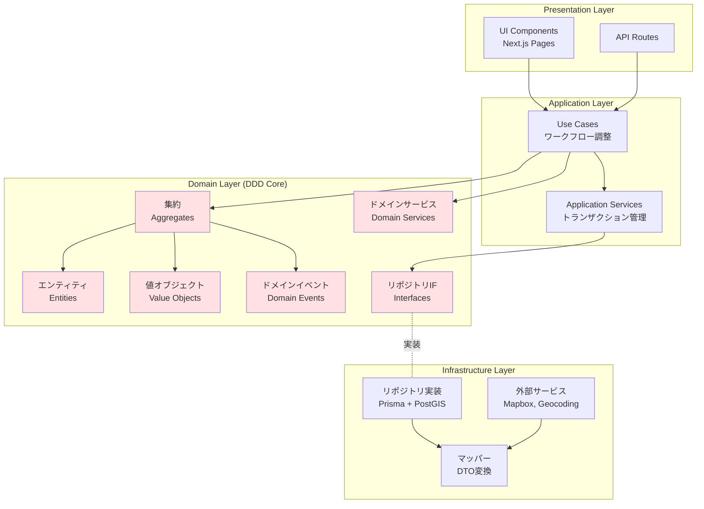

# Polisterアーキテクチャドキュメント

<!-- markdownlint-disable MD013 -->

## 概要

Polisterは、**Clean Architecture**と**Domain-Driven Design (DDD)**を組み合わせた設計アプローチを採用しています。このドキュメントでは、プロジェクト全体のアーキテクチャ方針と実装ガイドラインを提供します。

## アーキテクチャ方針

### Clean Architecture + DDD統合

Polisterでは、Clean Architectureの層構造にDDDの戦術的パターンを組み合わせることで、以下を実現します：

1. **ビジネスロジックの中心化**: ドメイン層にビジネスルールを集約
2. **技術的詳細からの独立**: インフラ層への依存を排除
3. **ユビキタス言語の徹底**: ドメイン専門家と開発者で共通の語彙を使用
4. **バウンデッドコンテキストの明確化**: 機能ごとに独立したモジュール構造



### 層の責務とDDD要素の配置

| 層                 | Clean Architectureの責務 | DDD要素                                                                              | 配置場所                                        |
| ------------------ | ------------------------ | ------------------------------------------------------------------------------------ | ----------------------------------------------- |
| **Domain**         | ビジネスルール           | 集約、エンティティ、値オブジェクト、ドメインサービス、ドメインイベント、リポジトリIF | `features/*/domain/`                            |
| **Application**    | ユースケース調整         | アプリケーションサービス、ユースケース、DTO                                          | `features/*/application/`                       |
| **Infrastructure** | 技術的詳細               | リポジトリ実装、マッパー、外部API                                                    | `features/*/infrastructure/`, `infrastructure/` |
| **Presentation**   | UI/API                   | React Component、API Routes                                                          | `app/`, `features/*/ui/`                        |

## システム全体の概要

### バウンデッドコンテキスト

Polisterは以下の主要なバウンデッドコンテキストで構成されます：

| コンテキスト | ディレクトリ            | 主な責務             | 集約ルート   |
| ------------ | ----------------------- | -------------------- | ------------ |
| 掲示場管理   | `features/board`        | 掲示場の位置情報管理 | Board        |
| 検証管理     | `features/verification` | 検証依頼と承認フロー | Verification |
| インポート   | `features/import`       | 外部データ取り込み   | ImportJob    |
| 自治体管理   | `features/municipality` | 市区町村情報管理     | Municipality |

各コンテキストは独立したドメインモデルを持ち、コンテキスト間の連携はアプリケーション層で調停します。

## 利用可能なドキュメント

### 📚 ガイドライン

アーキテクチャの実装ガイドラインを提供します：

- **[Clean Architecture実装ガイド](./guidelines/clean-architecture-guide.md)**
  - 層構造とディレクトリ構成
  - Repository Pattern、DI、Use Case実装
  - Polister固有の実装例

- **[DDD導入ガイド](./guidelines/ddd-guide.md)**
  - ユビキタス言語とバウンデッドコンテキスト
  - 集約、値オブジェクト、ドメインサービス
  - ドメインイベントとテスト戦略

- **[コーディング規約](./guidelines/coding-conventions.md)**
  - TypeScript、命名規則、フォーマット
  - コーディングスタイルの統一

- **[テストガイドライン](./guidelines/testing-guide.md)**
  - ユニットテスト、統合テスト戦略
  - ドメイン層のテスト方針

### 📊 図表

- [アーキテクチャ図表](./diagrams.md)

## 技術スタック

### フロントエンド

- **Framework**: Next.js 15 (App Router)
- **UI Library**: React 19, Material UI 7
- **Language**: TypeScript 5 (strict mode)
- **Styling**: Emotion
- **Map**: Mapbox GL JS 3

### バックエンド

- **API**: Next.js API Routes
- **Database**: PostgreSQL + PostGIS
- **ORM**: Prisma 6
- **DI Container**: tsyringe

### 開発ツール

- **Linter**: ESLint
- **Formatter**: Prettier (import自動整理)
- **Testing**: Jest, React Testing Library, Playwright
- **CI/CD**: GitHub Actions
- **Code Review**: CodeRabbit

## アーキテクチャ原則

### 1. ドメイン駆動設計（DDD）

- **ユビキタス言語**: ドメイン専門家と開発者が同じ語彙を使用
- **バウンデッドコンテキスト**: 機能ごとに独立したモデルを持つ
- **集約**: 不変条件を守る責任境界を明確化
- **ドメインイベント**: 副作用を分離し、疎結合を実現

### 2. Clean Architecture

- **依存性の逆転**: 上位レイヤーが下位レイヤーに依存しない
- **関心の分離**: 各レイヤーが明確な責務を持つ
- **テスト可能性**: すべてのコンポーネントが単体テスト可能
- **保守性**: コードの変更が他の部分に影響を与えない

### 3. SOLID原則

- **Single Responsibility**: 各クラスは1つの責任のみ
- **Open/Closed**: 拡張に開き、修正に閉じる
- **Liskov Substitution**: インターフェースの一貫性を保つ
- **Interface Segregation**: 必要なメソッドのみを公開
- **Dependency Inversion**: 抽象に依存し、具象に依存しない

### 4. 実装原則

- **any型の禁止**: TypeScript strict modeで型安全性を確保
- **Barrelファイルの禁止**: 直接的なインポートで依存関係を明示
- **インターフェース駆動**: すべての外部依存をインターフェース経由で扱う
- **ドメイン層の独立性**: 外部ライブラリへの依存を排除

## ディレクトリ構造の概要

```text
src/
├── app/                              # Next.js App Router
│   ├── (auth)/                       # 認証が必要なルート
│   ├── (public)/                     # 公開ルート
│   └── api/                          # API Routes (Presentation層)
├── features/                         # 機能別モジュール（バウンデッドコンテキスト）
│   ├── board/                        # 掲示場管理コンテキスト
│   │   ├── domain/                   # ドメイン層（DDD Core）
│   │   │   ├── aggregates/          # 集約ルート
│   │   │   ├── entities/            # エンティティ
│   │   │   ├── value-objects/       # 値オブジェクト
│   │   │   ├── services/            # ドメインサービス
│   │   │   ├── events/              # ドメインイベント
│   │   │   └── repositories/        # リポジトリIF
│   │   ├── application/              # アプリケーション層
│   │   │   ├── usecases/            # ユースケース
│   │   │   └── services/            # アプリケーションサービス
│   │   ├── infrastructure/           # インフラ層
│   │   │   ├── repositories/        # リポジトリ実装
│   │   │   └── mappers/             # DTO変換
│   │   └── ui/                       # UIコンポーネント
│   ├── verification/                 # 検証管理コンテキスト
│   ├── import/                       # インポートコンテキスト
│   └── municipality/                 # 自治体管理コンテキスト
├── shared/                           # 共有リソース
│   ├── ui/                           # 共通UIコンポーネント
│   ├── lib/                          # ユーティリティ
│   │   ├── di/                       # Dependency Injection
│   │   ├── errors/                   # エラーハンドリング
│   │   └── utils/                    # ユーティリティ関数
│   └── types/                        # 共通型定義
└── infrastructure/                   # 共有インフラ
    ├── database/                     # Prisma設定
    │   ├── schema.prisma
    │   └── migrations/
    └── external/                     # 外部APIクライアント
        ├── mapbox/
        └── geocoding/
```

詳細は[Clean Architecture実装ガイド](./guidelines/clean-architecture-guide.md)を参照してください。

## クイックスタート

1. **要件定義を確認**: [プロジェクト概要](/requirements/project-overview)でユビキタス言語を理解
2. **アーキテクチャガイドを読む**: [Clean Architecture実装ガイド](./guidelines/clean-architecture-guide.md)と[DDD導入ガイド](./guidelines/ddd-guide.md)
3. **コーディング規約を確認**: [コーディング規約](./guidelines/coding-conventions.md)
4. **実装を開始**: 既存のfeatureモジュールを参考に新機能を実装

## 参考リンク

- **内部ドキュメント**
  - [開発ガイド](../development/index.md)
  - [データベース設計](../development/database/schema.md)
  - [テストガイド](./guidelines/testing-guide.md)

- **外部リソース**
  - [Clean Architecture (Uncle Bob)](https://blog.cleancoder.com/uncle-bob/2012/08/13/the-clean-architecture.html)
  - [Domain-Driven Design Reference](https://www.domainlanguage.com/ddd/reference/)
- [Next.js App Router](https://nextjs.org/docs/app)

---

<!-- markdownlint-restore -->

最終更新: 2025年10月
