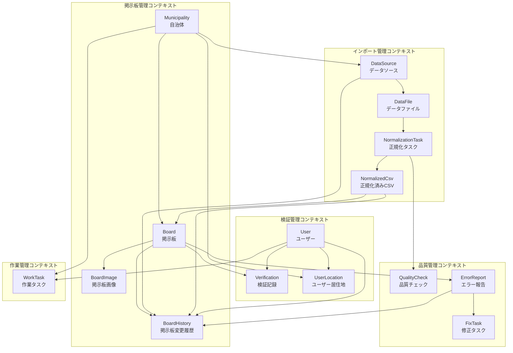
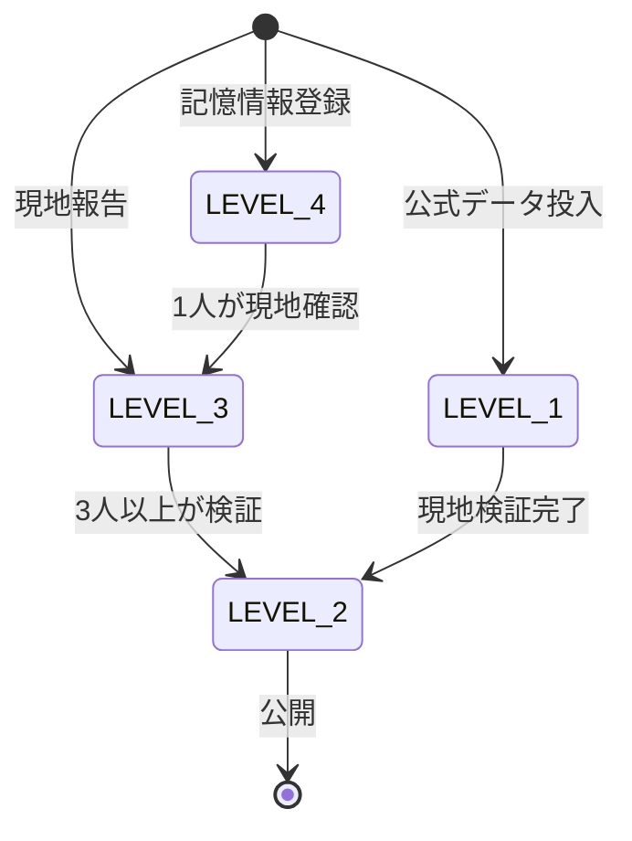
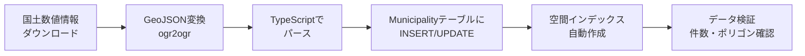
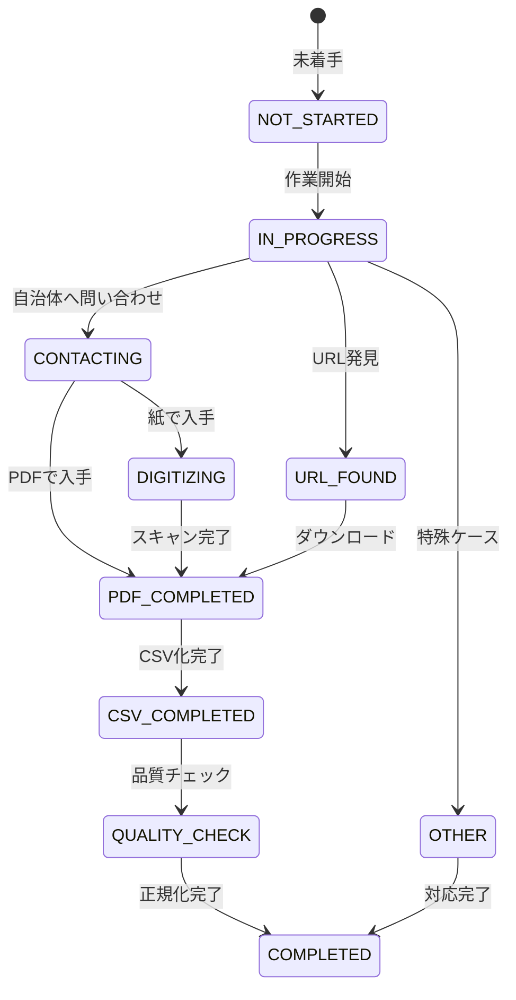
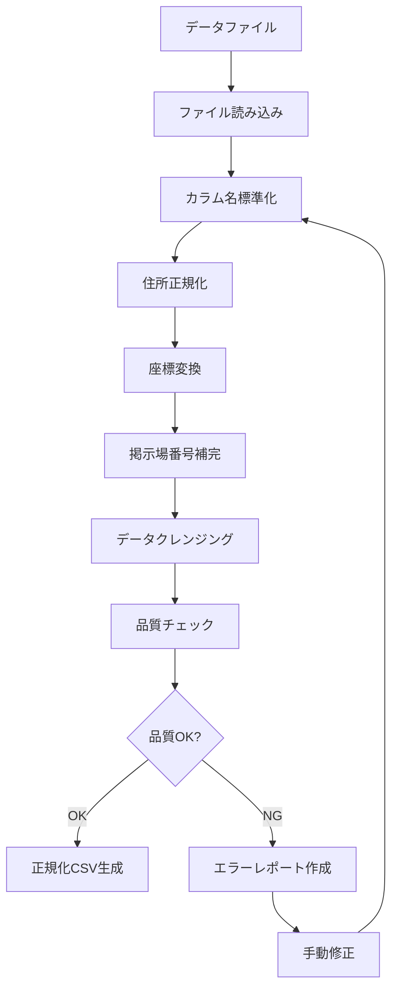
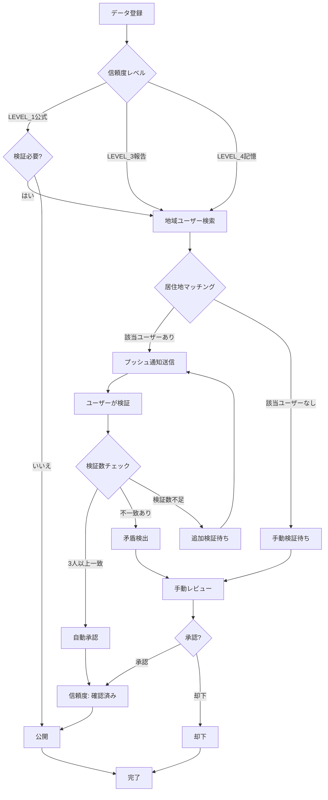
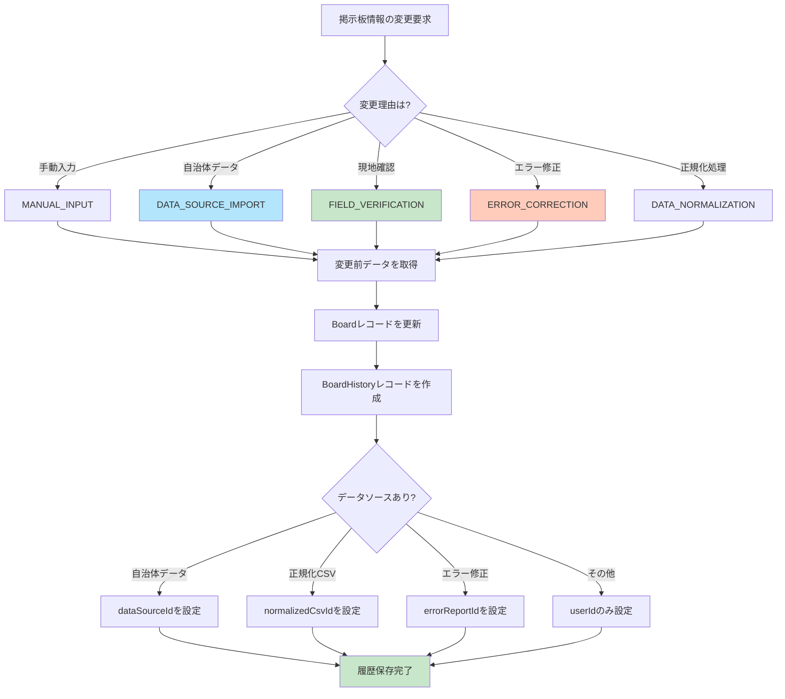

# データベースドメイン設計

## 概要

このドキュメントでは、Polisterのデータベース設計について、業務要件とドメインモデルの観点から詳細に説明します。

## 背景と目的

### プロジェクトの二つの柱

Polisterは以下の二つの主要な機能を提供します：

1. **掲示板位置管理** - 選挙ポスター掲示板の位置情報をデジタル化し、オープンデータとして提供
2. **データ正規化作業の効率化** - 自治体から提供される多様な形式のデータを統一フォーマットに変換

### 過去の実績

チームみらいは参議院選挙において、全国721自治体のポスター掲示場データを手作業で収集・正規化した実績があります。この経験から以下の課題が明らかになりました：

- **データ形式の多様性**: CSV、Excel、PDF、KML、紙の地図など自治体ごとに異なる
- **品質のばらつき**: 緯度経度の精度、住所表記ゆれ、掲示場番号の欠損
- **作業の属人化**: 100人以上のサポーターによる分散作業の進捗管理
- **エラーの追跡**: 実地作業中に発見されたエラーの体系的な管理

## ドメインモデル全体像

### バウンデッドコンテキスト

Polisterは以下の主要なバウンデッドコンテキストで構成されます：



## コアドメインモデル

### 1. 掲示板管理コンテキスト

#### Board（掲示板）

**責務**: 選挙ポスター掲示板の位置情報と基本データを管理

**属性**:

- `id`: 一意識別子
- `boardNumber`: 掲示場番号
- `name`: 掲示場名称（例: "第1投票区第1号"）
- `address`: 住所
- `location`: 位置情報（PostGIS POINT型）
- `municipalityId`: 所属市区町村
- `normalizedCsvId`: 元となった正規化CSVファイル
- `trustLevel`: 信頼度レベル（4段階）
- `status`: ステータス（未検証/検証済み/却下）
- `note`: 備考（例: "緯度経度は怪しい"）

**TrustLevel（信頼度レベル）**:

- `LEVEL_1` - 公式: 自治体から提供された公式データ
- `LEVEL_2` - 確認済み: 現地確認・写真付きで検証されたデータ
- `LEVEL_3` - 報告: 協力者からの報告（未検証）
- `LEVEL_4` - 記憶: 過去の記憶や伝聞（要検証）

**信頼度の遷移**:



#### Municipality（市区町村）

**責務**: 国土数値情報から取得した市区町村データと、データ収集の進捗管理

**基本属性（国土数値情報から取得）**:

- `id`: 一意識別子
- `name`: 市区町村名（国土数値情報のN03_004）
- `code`: 市区町村コード（国土数値情報のN03_007、5桁、ユニーク）
- `prefecture`: 都道府県名（国土数値情報のN03_001）
- `polygon`: 行政区域ポリゴン（PostGIS MULTIPOLYGON型）
- `source`: データソース（デフォルト: "MLIT" - 国土交通省）

**国土数値情報との対応**:

| Municipalityフィールド | 国土数値情報フィールド | 説明                          |
| ---------------------- | ---------------------- | ----------------------------- |
| prefecture             | N03_001                | 都道府県名                    |
| name                   | N03_004                | 市区町村名（政令市の区含む）  |
| code                   | N03_007                | 全国地方公共団体コード（5桁） |
| polygon                | geometry               | 行政区域境界（MULTIPOLYGON）  |
| source                 | -                      | 固定値 "MLIT"                 |

**行政区域コードの構造**:

```
01101
├─ 01: 都道府県コード（北海道）
└─ 101: 市区町村コード（札幌市中央区）

例:
- 13101: 東京都千代田区
- 27128: 大阪府大阪市北区
- 01101: 北海道札幌市中央区
```

**データ収集管理属性（Polister独自）**:

- `url`: 選挙管理委員会URL
- `boardCount`: 掲示場数
- `dataVersion`: データ版（例: "2025参院選版"）
- `status`: 作業ステータス（11種類）
- `contactStatus`: 選管対応ステータス
- `notes`: 備考
- `folderId`: Google DriveフォルダID

**データインポートの流れ**:



**MunicipalityStatus（作業ステータス）**:



**ContactStatus（選管対応ステータス）**:

- `NOT_CONTACTED` - 未問い合わせ
- `WAITING_RESPONSE` - 回答待ち
- `RECEIVED` - データ受領
- `DIRECT_TO_CANDIDATE` - 候補者へ直接提供
- `STOPPED` - 問い合わせ停止（北海道、福岡県等）

### 2. インポート管理コンテキスト

#### DataSource（データソース）

**責務**: 自治体から提供されたデータの情報を管理

**属性**:

- `id`: 一意識別子
- `municipalityId`: 自治体ID
- `sourceType`: ソース種別（Excel/PDF/CSV/Web/KML/紙/メール等）
- `description`: 詳細説明
- `receivedAt`: 受領日時

**SourceType（ソース種別）**:

- `EXCEL` - Excelファイル
- `PDF` - PDFファイル
- `CSV` - CSVファイル
- `WEB` - Webサイト公開
- `KML` - Googleマイマップ（KML/KMZ）
- `PAPER` - 紙媒体
- `EMAIL` - メール添付
- `VISIT` - 窓口受取
- `INDIVIDUAL` - 個別対応
- `OTHER` - その他

#### DataFile（データファイル）

**責務**: 実際のファイル情報を管理

**属性**:

- `id`: 一意識別子
- `dataSourceId`: データソースID
- `fileType`: ファイル形式（PDF/CSV/KML/Excel/Image）
- `filePath`: ファイルパス
- `fileSize`: ファイルサイズ（バイト）
- `version`: 版情報（例: "2025参院選版"、"過去の版"）
- `hasAll`: 全部あり/一部あり
- `uploadedAt`: アップロード日時

**データ形式の処理難易度**:

| 形式        | 難易度 | データ品質期待値 | 所要時間 |
| ----------- | ------ | ---------------- | -------- |
| KML/KMZ     | ★★☆☆☆  | 98%              | 20分     |
| CSV         | ★☆☆☆☆  | 95%              | 5分      |
| Excel       | ★☆☆☆☆  | 95%              | 10分     |
| PDF表形式   | ★★☆☆☆  | 80%              | 30分     |
| PDFテキスト | ★★★☆☆  | 70%              | 1時間    |
| PDF画像     | ★★★★☆  | 60%              | 2時間    |
| 紙          | ★★★★★  | 50%              | 3時間    |

#### NormalizationTask（正規化タスク）

**責務**: データファイルの正規化処理を管理

**属性**:

- `id`: 一意識別子
- `dataFileId`: データファイルID
- `userId`: 処理ユーザーID
- `status`: ステータス（未処理/処理中/完了/失敗）
- `config`: 正規化設定（JSON）
  - 座標検証モード（国土地理院優先/Google優先/Googleのみ）
  - 掲示場番号生成方法（連番/行番号/元データ）
  - 住所フォーマット（都道府県から/市区町村から）
- `startedAt`: 開始日時
- `completedAt`: 完了日時

**正規化処理フロー**:



#### NormalizedCsv（正規化済みCSV）

**責務**: 正規化されたCSVファイルの情報を管理

**属性**:

- `id`: 一意識別子
- `normalizationTaskId`: 正規化タスクID
- `filePath`: ファイルパス
- `boardCount`: 掲示場数
- `errorCount`: エラー数
- `qualityStatus`: 品質ステータス（未検証/S/A/B/C/Dランク）

**QualityStatus（品質ランク）**:

```
品質スコア = 完全性(40点) + 正確性(40点) + 一貫性(15点) + 適時性(5点)

- S_RANK: 90-100点 - そのまま使用可能
- A_RANK: 75-89点 - 軽微な修正のみ
- B_RANK: 60-74点 - 中程度の修正必要
- C_RANK: 40-59点 - 大幅な修正必要
- D_RANK: 0-39点 - 再取得推奨
```

### 3. 品質管理コンテキスト

#### QualityCheck（品質チェック）

**責務**: データ品質の自動チェック結果を記録

**属性**:

- `id`: 一意識別子
- `normalizationTaskId`: 正規化タスクID
- `checkType`: チェック種別
- `result`: チェック結果（合格/警告/失敗）
- `details`: 詳細情報
- `checkedAt`: チェック日時

**CheckType（チェック種別）**:

- `REQUIRED_COLUMNS` - 必須カラム存在
- `MISSING_VALUES` - 必須項目欠損
- `COORDINATE_RANGE` - 座標範囲（緯度33-46度、経度128-146度）
- `COORDINATE_ACCURACY` - 座標精度（距離チェック200m）
- `DUPLICATE_DATA` - 重複データ
- `GEOGRAPHIC_VALIDITY` - 地理的妥当性（海上・国外チェック）
- `SEQUENTIAL_NUMBERS` - 掲示場番号連番

#### ErrorReport（エラー報告）

**責務**: 実地作業中に発見されたエラーを管理

**属性**:

- `id`: 一意識別子
- `boardId`: 掲示場ID
- `errorType`: エラー種別
- `description`: エラー詳細説明
- `reporter`: 報告者
- `status`: 対応状況（未対応/対応中/対応完了/わからない）
- `reportedAt`: 報告日時

**ErrorType（エラー種別）**:

- `LOCATION_MISMATCH` - 位置ずれ（発生率45%）
- `NUMBER_MISMATCH` - 番号違い（発生率25%）
- `ADDRESS_MISMATCH` - 住所違い（発生率15%）
- `NOT_FOUND` - 掲示場が見つからない（発生率10%）
- `DUPLICATE` - 重複（発生率5%）
- `OTHER` - その他

**エラー修正の優先度**:

| 優先度 | エラー種別                         | 対応期限   | 理由                         |
| ------ | ---------------------------------- | ---------- | ---------------------------- |
| 最高   | 必須項目欠損、座標が海上・国外     | 即時       | ポスター貼り作業に致命的影響 |
| 高     | 位置ずれ50m以上、掲示場不在        | 24時間以内 | 現地で掲示場を見つけられない |
| 中     | 位置ずれ10-50m、番号違い、住所違い | 1週間以内  | 現地で探せば見つかるが手間   |
| 低     | 位置ずれ10m未満、重複              | 随時       | 実害は少ない                 |

#### FixTask（修正タスク）

**責務**: エラー修正作業を管理

**属性**:

- `id`: 一意識別子
- `errorReportId`: エラー報告ID
- `userId`: 修正ユーザーID
- `status`: ステータス（未着手/対応中/完了）
- `fixDescription`: 修正内容説明
- `fixedAt`: 修正日時

### 4. 検証管理コンテキスト

#### User（ユーザー）

**責務**: ユーザー情報と信頼度スコアを管理

**基本属性**:

- `id`: 一意識別子
- `email`: メールアドレス（ユニーク）
- `name`: 表示名
- `slackName`: Slackアカウント名
- `image`: プロフィール画像URL
- `role`: 役割（閲覧者/編集者/地域コーディネーター/管理者）

**信頼度管理属性**:

- `trustScore`: 信頼度スコア（0.0-1.0）
- `verificationCount`: 検証実施回数

**論理削除の重要性**:

ユーザーを物理削除すると、以下のデータ整合性の問題が発生します：

1. **検証履歴の喪失**: 過去の検証記録から検証者情報が失われる
2. **信頼度の低下**: 誰が検証したか不明になり、データの信頼度が判断できない
3. **監査証跡の欠損**: データ品質管理の履歴が追跡できない

そのため、ユーザーは論理削除し、検証記録・画像データは保持します。

#### Verification（検証記録）

**責務**: 掲示板の検証履歴を記録

**属性**:

- `id`: 一意識別子
- `boardId`: 掲示場ID
- `userId`: ユーザーID
- `result`: 検証結果（正しい/誤り）
- `hasPhoto`: 写真添付有無
- `gpsAccuracy`: GPS精度（メートル）
- `comment`: コメント
- `verifiedAt`: 検証日時

**地域ベース検証フロー**:



#### UserLocation（ユーザー居住地）

**責務**: ユーザーの活動地域を管理し、地域ベース検証依頼に使用

**属性**:

- `id`: 一意識別子
- `userId`: ユーザーID
- `municipalityId`: 市区町村ID
- `isPrimary`: 主要居住地フラグ

**用途**:

- 地域ベース検証依頼の送信先決定
- 居住地周辺の未検証データを優先的に通知
- ユーザーの活動エリア管理

### 5. 作業管理コンテキスト

#### WorkTask（作業タスク）

**責務**: サポーターへの作業割り当てを管理

**属性**:

- `id`: 一意識別子
- `municipalityId`: 自治体ID
- `userId`: ユーザーID
- `status`: ステータス（未着手/作業中/完了/保留）
- `assignedAt`: 割り当て日時
- `completedAt`: 完了日時

**用途**:

- サポーターへの作業割り当て
- 作業負荷の可視化
- 進捗管理の効率化

### 6. 変更履歴管理コンテキスト

#### BoardHistory（掲示板変更履歴）

**責務**: 掲示板情報の変更履歴を記録し、監査証跡を提供

掲示板の位置、番号、名前、住所などの情報は日々変更される可能性があります。これらの変更を詳細に記録することで、以下を実現します：

- **データの信頼性向上**: 変更理由とソースを明確にすることで、データの信頼性を担保
- **監査証跡の確保**: 誰がいつ何を変更したかを追跡可能
- **エラー分析**: どのフィールドがよく変更されるかを分析し、データ品質向上に活用
- **トラブルシューティング**: 問題発生時に変更履歴から原因を特定

**属性**:

- `id`: 一意識別子
- `boardId`: 掲示場ID
- `beforeData`: 変更前の値（JSON形式）
- `afterData`: 変更後の値（JSON形式）
- `changeReason`: 変更理由（Enum）
- `dataSourceId`: データソースID（自治体データの場合）
- `normalizedCsvId`: 正規化CSVID（インポートの場合）
- `errorReportId`: エラー報告ID（エラー修正の場合）
- `userId`: 変更者ID
- `comment`: コメント
- `changedAt`: 変更日時

**ChangeReason（変更理由）**:

- `MANUAL_INPUT` - 手動入力: ユーザーが直接入力
- `DATA_SOURCE_IMPORT` - 自治体データインポート: 自治体から提供されたデータの取り込み
- `FIELD_VERIFICATION` - 現地確認による修正: 実地確認に基づく修正
- `ERROR_CORRECTION` - エラー修正: エラー報告に基づく修正
- `DATA_NORMALIZATION` - データ正規化: 正規化処理による自動修正
- `GEOCODING_UPDATE` - ジオコーディング更新: 座標変換APIの更新
- `MIGRATION` - データマイグレーション: システム移行時の一括変更
- `SYSTEM_UPDATE` - システムによる自動更新: 自動処理による更新
- `OTHER` - その他

**beforeDataとafterDataの構造例**:

```typescript
// 変更前のデータ
{
  "boardNumber": 44,
  "name": "県道給父西枇杷島線富塚信号西",
  "address": "あま市富塚七反地53番地1",
  "location": {
    "lat": 35.199806,
    "lng": 136.805573
  },
  "trustLevel": "LEVEL_3",
  "status": "PENDING",
  "note": "緯度経度は怪しい"
}

// 変更後のデータ
{
  "boardNumber": 45,
  "name": "県道給父西枇杷島線富塚信号西",
  "address": "あま市冨塚郷1",
  "location": {
    "lat": 35.199850,
    "lng": 136.805600
  },
  "trustLevel": "LEVEL_2",
  "status": "VERIFIED",
  "note": "実地確認により番号と住所を修正"
}
```

**変更履歴の記録フロー**:



**ユースケース例**:

1. **自治体データインポート時**:

   ```typescript
   changeReason: ChangeReason.DATA_SOURCE_IMPORT;
   normalizedCsvId: "csv-uuid-xxx";
   comment: "2025参院選版データより更新";
   ```

2. **現地確認による修正**:

   ```typescript
   changeReason: ChangeReason.FIELD_VERIFICATION;
   userId: "user-uuid-xxx";
   comment: "実地確認により位置が50mずれていることを確認";
   ```

3. **エラー報告に基づく修正**:
   ```typescript
   changeReason: ChangeReason.ERROR_CORRECTION;
   errorReportId: "error-uuid-xxx";
   userId: "user-uuid-xxx";
   comment: "エラー報告ID: #123に基づき番号を修正";
   ```

**変更履歴の活用**:

- **タイムライン表示**: 掲示板詳細画面で変更履歴をタイムライン形式で表示
- **差分表示**: 変更前後の値を並べて比較表示
- **フィールド別分析**: どのフィールドがよく変更されるかを分析
- **ユーザー別統計**: ユーザーごとの変更回数や信頼性を評価
- **データソース別分析**: どのデータソースの品質が高いかを評価
- **ロールバック**: 必要に応じて過去の状態に戻す

**リレーション**:

- Board（掲示板） - 変更の対象
- User（ユーザー） - 変更者
- DataSource（データソース） - 自治体データの場合の参照元
- NormalizedCsv（正規化CSV） - インポート元の正規化ファイル
- ErrorReport（エラー報告） - エラー修正の場合の報告元

## PostGIS空間データの活用

### 座標系（SRID）

全ての空間データはSRID 4326（WGS84）を使用します。

- **SRID 4326**: GPS等で使用される世界測地系
- **緯度**: -90〜90度（日本: 約33-46度）
- **経度**: -180〜180度（日本: 約128-146度）

### 空間インデックス（GIST）

空間検索のパフォーマンス向上のため、GISTインデックスを使用：

```sql
-- boards.location（掲示板位置）
CREATE INDEX idx_boards_location ON boards USING GIST(location);

-- municipalities.polygon（市区町村境界）
CREATE INDEX idx_municipalities_polygon ON municipalities USING GIST(polygon);
```

### 空間クエリの例

```typescript
// 特定地点から半径1km以内の掲示板を検索
const nearbyBoards = await prisma.$queryRaw`
  SELECT *
  FROM boards
  WHERE ST_DWithin(
    location,
    ST_SetSRID(ST_MakePoint(${lng}, ${lat}), 4326)::geography,
    1000
  )
  AND deleted_at IS NULL
`;

// 市区町村内の掲示板を検索
const boardsInMunicipality = await prisma.$queryRaw`
  SELECT b.*
  FROM boards b
  JOIN municipalities m ON b.municipality_id = m.id
  WHERE ST_Within(b.location::geometry, m.polygon::geometry)
  AND b.deleted_at IS NULL
`;
```

## データ整合性とカスケード設計

### カスケード削除の方針

| 親テーブル   | 子テーブル   | カスケード動作 | 理由                                 |
| ------------ | ------------ | -------------- | ------------------------------------ |
| Board        | BoardImage   | CASCADE        | 掲示板が削除されたら画像も不要       |
| Board        | Verification | CASCADE        | 掲示板が削除されたら検証記録も不要   |
| Board        | ErrorReport  | CASCADE        | 掲示板が削除されたらエラー報告も不要 |
| User         | Account      | CASCADE        | ユーザー削除時に認証情報も削除       |
| User         | Session      | CASCADE        | ユーザー削除時にセッションも削除     |
| User         | Verification | **保持**       | 検証履歴は監査証跡として保持         |
| User         | BoardImage   | **保持**       | 証拠写真は監査証跡として保持         |
| User         | UserLocation | CASCADE        | ユーザー削除時に居住地情報も削除     |
| Municipality | Board        | **制約**       | 掲示板が存在する自治体は削除不可     |

### 論理削除の適用

| モデル       | 論理削除 | 理由                             |
| ------------ | -------- | -------------------------------- |
| User         | ✅       | 検証履歴・画像データの保全のため |
| Board        | ✅       | 削除履歴の追跡のため             |
| Municipality | ❌       | マスターデータのため削除しない   |
| DataFile     | ❌       | ファイルは物理削除               |

## 段階的な実装ロードマップ

### Phase 1: 基本機能の強化（現在 → 1-2ヶ月）

**目標**: 自治体からのデータ収集状況を追跡できるようにする

**実装項目**:

- ✅ Municipalityモデルの拡張
  - status、contactStatus、url、boardCount等のフィールド追加
  - MunicipalityStatus、ContactStatusのEnum追加
- ✅ Boardモデルへのname、noteフィールド追加
- ✅ UserモデルへのslackNameフィールド追加

**マイグレーション**:

- 既存のMunicipalityレコードに対してデフォルト値を設定
- 既存のBoardレコードに対してnameをnullableで追加

### Phase 2: データインポート機能（2-3ヶ月）

**目標**: CSV/KML/PDFからのデータ取り込みフローを管理

**実装項目**:

- ✅ DataSourceモデルの追加
- ✅ DataFileモデルの追加
- ✅ NormalizationTaskモデルの追加（基本機能）
- ✅ NormalizedCsvモデルの追加（基本機能）
- ✅ BoardモデルへのnormalizedCsvIdリレーション追加

**機能実装**:

- CSVインポート機能
- KMLインポート機能
- 住所正規化（ジオコーディング）
- 座標検証（国土地理院API + Google Maps API）

### Phase 3: 品質管理機能（2-3ヶ月）

**目標**: データ品質の自動チェックとエラー管理

**実装項目**:

- ✅ QualityCheckモデルの追加
- ✅ ErrorReportモデルの追加
- ✅ FixTaskモデルの追加
- ✅ NormalizationTaskの品質チェック機能拡張

**機能実装**:

- 自動品質チェック（必須項目、座標範囲、重複等）
- エラー報告フォーム
- エラー修正ワークフロー
- 品質レポート生成

### Phase 4: 作業管理機能（1-2ヶ月）

**目標**: サポーターへの作業割り当てと進捗管理

**実装項目**:

- ✅ WorkTaskモデルの追加

**機能実装**:

- タスク割り当て機能
- 進捗ダッシュボード
- サポーター別作業量の可視化

## 参照

- [データベーススキーマ](./schema.md) - Prismaスキーマの詳細
- [空間データ](./spatial.md) - PostGISの使用方法
- [プロジェクト概要](/requirements/project-overview) - 要件定義
- [アーキテクチャガイド](/architecture/index) - Clean Architecture + DDD

---

最終更新: 2025年10月
