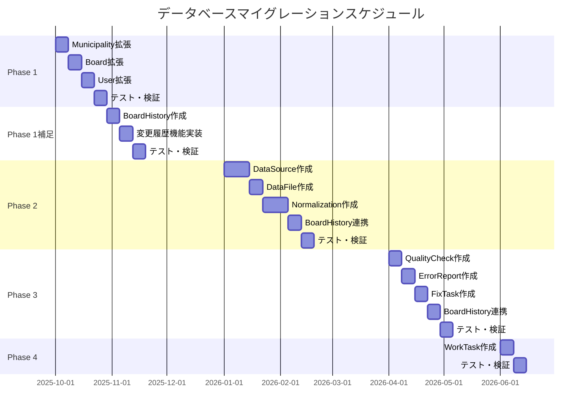

# データベースマイグレーション計画

## 概要

このドキュメントでは、Polisterのデータベーススキーマを段階的に拡張していくためのマイグレーション計画を示します。

## マイグレーション方針

### 基本原則

1. **無停止マイグレーション**: 既存機能を維持しながら新機能を追加
2. **後方互換性**: 既存のクエリが動作し続けることを保証
3. **段階的なロールアウト**: Phase 1 → Phase 2 → Phase 3 → Phase 4の順で実装
4. **ロールバック可能**: 各マイグレーションは必要に応じて元に戻せる

### マイグレーション実行環境

```bash
# 開発環境
yarn db:push          # スキーマを即座に反映（開発中）
yarn db:generate      # Prismaクライアント生成
yarn db:studio        # データ確認

# 本番環境
npx prisma migrate dev --name <説明>    # マイグレーションファイル作成
npx prisma migrate deploy              # 本番適用
```

## Phase 1: 基本機能の強化（最優先）

### 目標

自治体からのデータ収集状況を追跡できるようにする。

### 対象テーブル

#### 1. Municipalityモデルの拡張

**追加フィールド**:

```prisma
model Municipality {
  // 既存フィールド
  // ...

  // 追加フィールド
  url            String?                @db.Text
  boardCount     Int?                   @map("board_count")
  dataVersion    String?                @map("data_version")
  status         MunicipalityStatus     @default(NOT_STARTED)
  contactStatus  ContactStatus?         @map("contact_status")
  notes          String?                @db.Text
  folderId       String?                @map("folder_id")
}

enum MunicipalityStatus {
  NOT_STARTED
  IN_PROGRESS
  CONTACTING
  DIGITIZING
  PDF_COMPLETED
  CSV_COMPLETED
  COMPLETED
  QUALITY_CHECK
  URL_FOUND
  OTHER
  OUT_OF_SCOPE
}

enum ContactStatus {
  NOT_CONTACTED
  WAITING_RESPONSE
  RECEIVED
  DIRECT_TO_CANDIDATE
  STOPPED
}
```

**マイグレーションSQL**:

```sql
-- Enumの追加
CREATE TYPE "MunicipalityStatus" AS ENUM (
  'NOT_STARTED',
  'IN_PROGRESS',
  'CONTACTING',
  'DIGITIZING',
  'PDF_COMPLETED',
  'CSV_COMPLETED',
  'COMPLETED',
  'QUALITY_CHECK',
  'URL_FOUND',
  'OTHER',
  'OUT_OF_SCOPE'
);

CREATE TYPE "ContactStatus" AS ENUM (
  'NOT_CONTACTED',
  'WAITING_RESPONSE',
  'RECEIVED',
  'DIRECT_TO_CANDIDATE',
  'STOPPED'
);

-- カラムの追加
ALTER TABLE "municipalities"
  ADD COLUMN "url" TEXT,
  ADD COLUMN "board_count" INTEGER,
  ADD COLUMN "data_version" VARCHAR(50),
  ADD COLUMN "status" "MunicipalityStatus" NOT NULL DEFAULT 'NOT_STARTED',
  ADD COLUMN "contact_status" "ContactStatus",
  ADD COLUMN "notes" TEXT,
  ADD COLUMN "folder_id" VARCHAR(255);

-- インデックスの追加
CREATE INDEX "idx_municipalities_status" ON "municipalities"("status");

-- 既存データへのデフォルト値設定
UPDATE "municipalities"
SET
  "status" = 'NOT_STARTED',
  "contact_status" = 'NOT_CONTACTED'
WHERE "status" IS NULL;
```

**影響範囲**:

- ✅ 既存のMunicipalityレコードは影響を受けない（nullable or default値）
- ✅ 既存のクエリは動作し続ける
- ⚠️ 新しいフィールドを使用する機能は追加実装が必要

**ロールバック**:

```sql
-- Enumの削除前にカラムを削除
ALTER TABLE "municipalities"
  DROP COLUMN "url",
  DROP COLUMN "board_count",
  DROP COLUMN "data_version",
  DROP COLUMN "status",
  DROP COLUMN "contact_status",
  DROP COLUMN "notes",
  DROP COLUMN "folder_id";

-- インデックスの削除
DROP INDEX IF EXISTS "idx_municipalities_status";

-- Enumの削除
DROP TYPE "MunicipalityStatus";
DROP TYPE "ContactStatus";
```

#### 2. Boardモデルの拡張

**追加フィールド**:

```prisma
model Board {
  // 既存フィールド
  // ...

  // 追加フィールド
  name String?
  note String? @db.Text
}
```

**マイグレーションSQL**:

```sql
-- カラムの追加
ALTER TABLE "boards"
  ADD COLUMN "name" VARCHAR(255),
  ADD COLUMN "note" TEXT;
```

**影響範囲**:

- ✅ 既存のBoardレコードは影響を受けない（nullable）
- ✅ 既存のクエリは動作し続ける

**ロールバック**:

```sql
ALTER TABLE "boards"
  DROP COLUMN "name",
  DROP COLUMN "note";
```

#### 3. Userモデルの拡張

**追加フィールド**:

```prisma
model User {
  // 既存フィールド
  // ...

  // 追加フィールド
  slackName String? @map("slack_name")
}
```

**マイグレーションSQL**:

```sql
-- カラムの追加
ALTER TABLE "users"
  ADD COLUMN "slack_name" VARCHAR(255);
```

**影響範囲**:

- ✅ 既存のUserレコードは影響を受けない（nullable）
- ✅ 既存のクエリは動作し続ける

**ロールバック**:

```sql
ALTER TABLE "users"
  DROP COLUMN "slack_name";
```

### Phase 1マイグレーション実行手順

1. **事前準備**

   ```bash
   # データベースのバックアップ
   pg_dump -U postgres -d polister > backup_before_phase1.sql

   # 開発環境でテスト
   yarn db:push
   yarn db:generate
   ```

2. **マイグレーションファイル作成**

   ```bash
   npx prisma migrate dev --name phase1_municipality_board_user_extensions
   ```

3. **本番適用**

   ```bash
   # ステージング環境でテスト
   npx prisma migrate deploy

   # 問題なければ本番環境で適用
   npx prisma migrate deploy
   ```

4. **動作確認**
   - 既存のBoardレコードが正常に取得できるか
   - 既存のMunicipalityレコードが正常に取得できるか
   - 新しいフィールドが正常に保存・取得できるか

## Phase 1補足: 変更履歴管理（Phase 1完了後すぐ）

### 目標

掲示場情報の変更履歴を記録し、監査証跡を提供する。

### 新規テーブル

#### BoardHistoryテーブル

**責務**: 掲示場の位置、番号、名前、住所などの変更履歴を詳細に記録

```prisma
model BoardHistory {
  id              String       @id @default(uuid())
  boardId         String       @map("board_id")

  // 変更前後の値（JSON形式）
  beforeData      Json?        @map("before_data")
  afterData       Json         @map("after_data")

  // 変更理由
  changeReason    ChangeReason @map("change_reason")

  // データソース関連（どこから来た情報か）
  dataSourceId      String?         @map("data_source_id")
  normalizedCsvId   String?         @map("normalized_csv_id")
  errorReportId     String?         @map("error_report_id")

  // 変更者情報
  userId          String?      @map("user_id")
  comment         String?      @db.Text

  // 変更日時
  changedAt       DateTime     @default(now()) @map("changed_at")

  // リレーション
  board           Board           @relation(fields: [boardId], references: [id], onDelete: Restrict)
  user            User?           @relation(fields: [userId], references: [id], onDelete: SetNull)
  dataSource      DataSource?     @relation(fields: [dataSourceId], references: [id])
  normalizedCsv   NormalizedCsv?  @relation(fields: [normalizedCsvId], references: [id])
  errorReport     ErrorReport?    @relation(fields: [errorReportId], references: [id])

  @@index([boardId])
  @@index([userId])
  @@index([changeReason])
  @@index([changedAt])
  @@map("board_histories")
}

enum ChangeReason {
  MANUAL_INPUT          // 手動入力
  DATA_SOURCE_IMPORT    // 自治体データインポート
  FIELD_VERIFICATION    // 現地確認による修正
  ERROR_CORRECTION      // エラー修正
  DATA_NORMALIZATION    // データ正規化
  GEOCODING_UPDATE      // ジオコーディング更新
  MIGRATION             // データマイグレーション
  SYSTEM_UPDATE         // システムによる自動更新
  OTHER                 // その他
}
```

**マイグレーションSQL**:

```sql
-- Enumの追加
CREATE TYPE "ChangeReason" AS ENUM (
  'MANUAL_INPUT',
  'DATA_SOURCE_IMPORT',
  'FIELD_VERIFICATION',
  'ERROR_CORRECTION',
  'DATA_NORMALIZATION',
  'GEOCODING_UPDATE',
  'MIGRATION',
  'SYSTEM_UPDATE',
  'OTHER'
);

-- テーブルの作成
CREATE TABLE "board_histories" (
  "id" UUID PRIMARY KEY DEFAULT gen_random_uuid(),
  "board_id" UUID NOT NULL,
  "before_data" JSONB,
  "after_data" JSONB NOT NULL,
  "change_reason" "ChangeReason" NOT NULL,
  "data_source_id" UUID,
  "normalized_csv_id" UUID,
  "error_report_id" UUID,
  "user_id" UUID,
  "comment" TEXT,
  "changed_at" TIMESTAMP NOT NULL DEFAULT CURRENT_TIMESTAMP,

  CONSTRAINT "fk_board_histories_board"
    FOREIGN KEY ("board_id") REFERENCES "boards"("id") ON DELETE RESTRICT,
  CONSTRAINT "fk_board_histories_user"
    FOREIGN KEY ("user_id") REFERENCES "users"("id") ON DELETE SET NULL,
  CONSTRAINT "fk_board_histories_data_source"
    FOREIGN KEY ("data_source_id") REFERENCES "data_sources"("id") ON DELETE SET NULL,
  CONSTRAINT "fk_board_histories_normalized_csv"
    FOREIGN KEY ("normalized_csv_id") REFERENCES "normalized_csvs"("id") ON DELETE SET NULL,
  CONSTRAINT "fk_board_histories_error_report"
    FOREIGN KEY ("error_report_id") REFERENCES "error_reports"("id") ON DELETE SET NULL
);

-- インデックスの作成
CREATE INDEX "idx_board_histories_board_id" ON "board_histories"("board_id");
CREATE INDEX "idx_board_histories_user_id" ON "board_histories"("user_id");
CREATE INDEX "idx_board_histories_change_reason" ON "board_histories"("change_reason");
CREATE INDEX "idx_board_histories_changed_at" ON "board_histories"("changed_at");
```

**影響範囲**:

- ✅ 既存のBoardレコードは影響を受けない
- ✅ 既存のクエリは動作し続ける
- ⚠️ Phase 2以降のテーブル（DataSource、NormalizedCsv、ErrorReport）へのリレーションは、それらのテーブルが作成されるまで未使用

**段階的な実装アプローチ**:

1. **Phase 1補足（今すぐ）**:
   - BoardHistoryテーブルを作成
   - Board、Userへのリレーションのみ有効
   - 手動入力、現地確認による変更履歴を記録開始

2. **Phase 2以降**:
   - DataSource、NormalizedCsv、ErrorReportテーブル作成後に外部キー制約を有効化
   - データインポートやエラー修正時の変更履歴も記録

**ロールバック**:

```sql
-- テーブルの削除
DROP TABLE IF EXISTS "board_histories";

-- Enumの削除
DROP TYPE IF EXISTS "ChangeReason";
```

### Phase 1補足マイグレーション実行手順

1. **事前準備**

   ```bash
   # データベースのバックアップ
   pg_dump -U postgres -d polister > backup_before_board_history.sql

   # 開発環境でテスト
   yarn db:push
   yarn db:generate
   ```

2. **マイグレーションファイル作成**

   ```bash
   npx prisma migrate dev --name phase1_supplement_board_history
   ```

3. **本番適用**

   ```bash
   # ステージング環境でテスト
   npx prisma migrate deploy

   # 問題なければ本番環境で適用
   npx prisma migrate deploy
   ```

4. **動作確認**
   - Boardレコードの更新時に変更履歴が正常に記録されるか
   - 変更履歴の取得が正常に動作するか
   - 変更前後のデータが正しくJSON形式で保存されるか

### データ例

**beforeData（変更前）**:

```json
{
  "boardNumber": "44",
  "name": "県道給父西枇杷島線富塚信号西",
  "address": "あま市富塚七反地53番地1",
  "location": {
    "lat": 35.199806,
    "lng": 136.805573
  },
  "trustLevel": "LEVEL_3",
  "status": "PENDING",
  "note": "緯度経度は怪しい"
}
```

**afterData（変更後）**:

```json
{
  "boardNumber": "45",
  "name": "県道給父西枇杷島線富塚信号西",
  "address": "あま市冨塚郷1",
  "location": {
    "lat": 35.19985,
    "lng": 136.8056
  },
  "trustLevel": "LEVEL_2",
  "status": "VERIFIED",
  "note": "実地確認により番号と住所を修正"
}
```

### リレーション追加

**Boardモデル**:

```prisma
model Board {
  // 既存フィールド
  // ...

  histories BoardHistory[]
}
```

**Userモデル**:

```prisma
model User {
  // 既存フィールド
  // ...

  boardHistories BoardHistory[]
}
```

**Phase 2以降で追加予定のリレーション**:

- DataSource → BoardHistory[]
- NormalizedCsv → BoardHistory[]
- ErrorReport → BoardHistory[]

## Phase 2: データインポート機能（2-3ヶ月後）

### 目標

CSV/KML/PDFからのデータ取り込みフローを管理する。

### 新規テーブル

#### 1. DataSourceテーブル

```prisma
model DataSource {
  id             String     @id @default(uuid())
  municipalityId String     @map("municipality_id")
  sourceType     SourceType @map("source_type")
  description    String?    @db.Text
  receivedAt     DateTime?  @map("received_at")
  createdAt      DateTime   @default(now()) @map("created_at")

  municipality Municipality @relation(fields: [municipalityId], references: [id])
  dataFiles    DataFile[]

  @@index([municipalityId])
  @@map("data_sources")
}

enum SourceType {
  EXCEL
  PDF
  CSV
  WEB
  KML
  PAPER
  EMAIL
  VISIT
  INDIVIDUAL
  OTHER
}
```

#### 2. DataFileテーブル

```prisma
model DataFile {
  id           String     @id @default(uuid())
  dataSourceId String     @map("data_source_id")
  fileType     FileType   @map("file_type")
  filePath     String     @map("file_path")
  fileSize     BigInt?    @map("file_size")
  version      String?
  hasAll       Boolean    @default(true) @map("has_all")
  uploadedAt   DateTime   @default(now()) @map("uploaded_at")
  createdAt    DateTime   @default(now()) @map("created_at")

  dataSource         DataSource           @relation(fields: [dataSourceId], references: [id])
  normalizationTasks NormalizationTask[]

  @@index([dataSourceId])
  @@map("data_files")
}

enum FileType {
  PDF
  CSV
  KML
  EXCEL
  IMAGE
}
```

#### 3. NormalizationTaskテーブル

```prisma
model NormalizationTask {
  id          String                  @id @default(uuid())
  dataFileId  String                  @map("data_file_id")
  userId      String?                 @map("user_id")
  status      NormalizationStatus     @default(PENDING)
  config      Json?
  startedAt   DateTime?               @map("started_at")
  completedAt DateTime?               @map("completed_at")
  createdAt   DateTime                @default(now()) @map("created_at")

  dataFile       DataFile        @relation(fields: [dataFileId], references: [id])
  user           User?           @relation(fields: [userId], references: [id])
  normalizedCsvs NormalizedCsv[]
  qualityChecks  QualityCheck[]

  @@index([dataFileId])
  @@index([userId])
  @@index([status])
  @@map("normalization_tasks")
}

enum NormalizationStatus {
  PENDING
  PROCESSING
  COMPLETED
  FAILED
}
```

#### 4. NormalizedCsvテーブル

```prisma
model NormalizedCsv {
  id                  String        @id @default(uuid())
  normalizationTaskId String        @map("normalization_task_id")
  filePath            String        @map("file_path")
  boardCount          Int           @map("board_count")
  errorCount          Int           @default(0) @map("error_count")
  qualityStatus       QualityStatus @default(UNVERIFIED) @map("quality_status")
  createdAt           DateTime      @default(now()) @map("created_at")

  normalizationTask NormalizationTask @relation(fields: [normalizationTaskId], references: [id])
  boards            Board[]           @relation("NormalizedCsvBoards")

  @@index([normalizationTaskId])
  @@map("normalized_csvs")
}

enum QualityStatus {
  UNVERIFIED
  S_RANK
  A_RANK
  B_RANK
  C_RANK
  D_RANK
}
```

#### 5. Boardテーブルへのリレーション追加

```prisma
model Board {
  // 既存フィールド
  // ...

  // 追加リレーション
  normalizedCsvId String?       @map("normalized_csv_id")
  normalizedCsv   NormalizedCsv? @relation("NormalizedCsvBoards", fields: [normalizedCsvId], references: [id])

  @@index([normalizedCsvId])
}
```

### Phase 2マイグレーション実行手順

1. **Municipalityモデルへのリレーション追加**

   ```prisma
   model Municipality {
     // 既存フィールド
     // ...

     dataSources DataSource[]
   }
   ```

2. **Userモデルへのリレーション追加**

   ```prisma
   model User {
     // 既存フィールド
     // ...

     normalizationTasks NormalizationTask[]
   }
   ```

3. **マイグレーション実行**

   ```bash
   npx prisma migrate dev --name phase2_data_import_functionality
   ```

4. **動作確認**
   - DataSourceレコードの作成・取得
   - DataFileのアップロード・管理
   - NormalizationTaskの実行・状態管理
   - BoardとNormalizedCsvのリレーション

## Phase 3: 品質管理機能（4-6ヶ月後）

### 新規テーブル

#### 1. QualityCheckテーブル

```prisma
model QualityCheck {
  id                  String      @id @default(uuid())
  normalizationTaskId String      @map("normalization_task_id")
  checkType           CheckType   @map("check_type")
  result              CheckResult
  details             String?     @db.Text
  checkedAt           DateTime    @default(now()) @map("checked_at")

  normalizationTask NormalizationTask @relation(fields: [normalizationTaskId], references: [id])

  @@index([normalizationTaskId])
  @@map("quality_checks")
}

enum CheckType {
  REQUIRED_COLUMNS
  MISSING_VALUES
  COORDINATE_RANGE
  COORDINATE_ACCURACY
  DUPLICATE_DATA
  GEOGRAPHIC_VALIDITY
  SEQUENTIAL_NUMBERS
}

enum CheckResult {
  PASS
  WARNING
  FAIL
}
```

#### 2. ErrorReportテーブル

```prisma
model ErrorReport {
  id          String      @id @default(uuid())
  boardId     String      @map("board_id")
  errorType   ErrorType   @map("error_type")
  description String?     @db.Text
  reporter    String?
  status      ErrorStatus @default(NOT_FIXED)
  reportedAt  DateTime    @default(now()) @map("reported_at")
  createdAt   DateTime    @default(now()) @map("created_at")

  board    Board     @relation(fields: [boardId], references: [id])
  fixTasks FixTask[]

  @@index([boardId])
  @@index([status])
  @@map("error_reports")
}

enum ErrorType {
  LOCATION_MISMATCH
  NUMBER_MISMATCH
  ADDRESS_MISMATCH
  NOT_FOUND
  DUPLICATE
  OTHER
}

enum ErrorStatus {
  NOT_FIXED
  IN_PROGRESS
  FIXED
  UNKNOWN
}
```

#### 3. FixTaskテーブル

```prisma
model FixTask {
  id             String    @id @default(uuid())
  errorReportId  String    @map("error_report_id")
  userId         String?   @map("user_id")
  status         FixStatus @default(NOT_STARTED)
  fixDescription String?   @db.Text @map("fix_description")
  fixedAt        DateTime? @map("fixed_at")
  createdAt      DateTime  @default(now()) @map("created_at")

  errorReport ErrorReport @relation(fields: [errorReportId], references: [id])
  user        User?       @relation(fields: [userId], references: [id])

  @@index([errorReportId])
  @@index([userId])
  @@index([status])
  @@map("fix_tasks")
}

enum FixStatus {
  NOT_STARTED
  IN_PROGRESS
  COMPLETED
}
```

### Phase 3マイグレーション実行手順

1. **Boardモデルへのリレーション追加**

   ```prisma
   model Board {
     // 既存フィールド
     // ...

     errorReports ErrorReport[]
   }
   ```

2. **Userモデルへのリレーション追加**

   ```prisma
   model User {
     // 既存フィールド
     // ...

     fixTasks FixTask[]
   }
   ```

3. **マイグレーション実行**
   ```bash
   npx prisma migrate dev --name phase3_quality_management
   ```

## Phase 4: 作業管理機能（6-8ヶ月後）

### 新規テーブル

#### WorkTaskテーブル

```prisma
model WorkTask {
  id             String         @id @default(uuid())
  municipalityId String         @map("municipality_id")
  userId         String?        @map("user_id")
  status         WorkTaskStatus @default(NOT_STARTED)
  assignedAt     DateTime?      @map("assigned_at")
  completedAt    DateTime?      @map("completed_at")
  createdAt      DateTime       @default(now()) @map("created_at")

  municipality Municipality @relation(fields: [municipalityId], references: [id])
  user         User?        @relation(fields: [userId], references: [id])

  @@index([municipalityId])
  @@index([userId])
  @@index([status])
  @@map("work_tasks")
}

enum WorkTaskStatus {
  NOT_STARTED
  IN_PROGRESS
  COMPLETED
  ON_HOLD
}
```

### Phase 4マイグレーション実行手順

1. **Municipalityモデルへのリレーション追加**

   ```prisma
   model Municipality {
     // 既存フィールド
     // ...

     workTasks WorkTask[]
   }
   ```

2. **Userモデルへのリレーション追加**

   ```prisma
   model User {
     // 既存フィールド
     // ...

     workTasks WorkTask[]
   }
   ```

3. **マイグレーション実行**
   ```bash
   npx prisma migrate dev --name phase4_work_task_management
   ```

## トラブルシューティング

### マイグレーションエラーの対処

#### エラー: "Relation fields cannot be nullable"

**原因**: Prismaのリレーションフィールドはnullableにできない

**解決策**:

```prisma
// ❌ 間違い
normalizedCsv NormalizedCsv? @relation(...)

// ✅ 正しい（外部キーをnullableにする）
normalizedCsvId String? @map("normalized_csv_id")
normalizedCsv   NormalizedCsv? @relation(..., fields: [normalizedCsvId], references: [id])
```

#### エラー: "Enum type already exists"

**原因**: Enumが既に存在している

**解決策**:

```sql
-- 既存のEnumを確認
SELECT typname FROM pg_type WHERE typtype = 'e';

-- 必要に応じて削除
DROP TYPE IF EXISTS "MunicipalityStatus";
```

#### エラー: "Foreign key constraint fails"

**原因**: 外部キー制約の違反

**解決策**:

1. 参照先のレコードが存在することを確認
2. カスケード設定を確認
3. 必要に応じてON DELETE CASCADEまたはON DELETE SET NULLを設定

### データ整合性の確認

```sql
-- 孤立したBoardレコードの確認
SELECT * FROM boards
WHERE municipality_id NOT IN (SELECT id FROM municipalities);

-- 孤立したVerificationレコードの確認
SELECT * FROM verifications
WHERE board_id NOT IN (SELECT id FROM boards);

-- 削除されたユーザーの検証記録を確認
SELECT v.*, u.deleted_at
FROM verifications v
JOIN users u ON v.user_id = u.id
WHERE u.deleted_at IS NOT NULL;
```

## マイグレーションスケジュール



## 参照

- [ドメイン設計](./domain-design.md) - ドメインモデルの詳細
- [データベーススキーマ](./schema.md) - Prismaスキーマの詳細
- [Prisma Migrate](https://www.prisma.io/docs/concepts/components/prisma-migrate) - 公式ドキュメント

---

最終更新: 2025年10月
