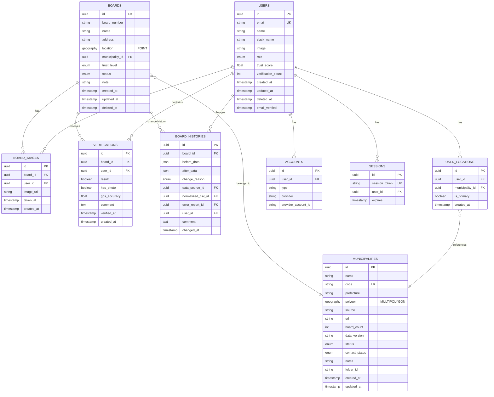
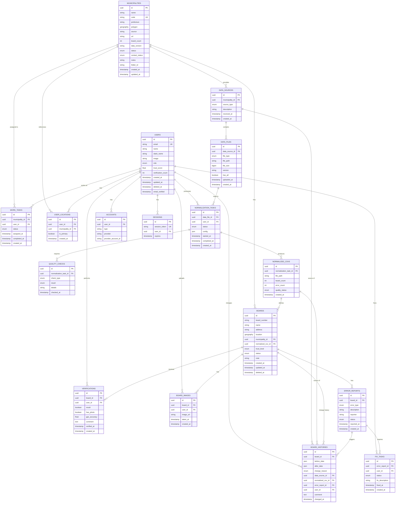

# データベーススキーマ

## 概要

Polisterのデータベーススキーマは、PostgreSQL 17 + PostGIS 3.5を使用し、掲示板の位置情報を空間データとして管理します。

## ER図

### 現在の実装（Phase 1）



### 将来の拡張計画（Phase 2-4）

Phase 2以降で実装予定のデータインポート・品質管理機能を含む完全なER図：



## 主要テーブル

### boards（掲示板）

掲示板の位置情報と基本データを管理します。

| カラム名          | 型               | 説明                                     |
| ----------------- | ---------------- | ---------------------------------------- |
| id                | UUID             | 主キー                                   |
| board_number      | Text             | 掲示板番号（例: `01-2`）。空の場合はNULL |
| name              | String           | 掲示場名称（例: "第1投票区第1号"）       |
| address           | String           | 住所                                     |
| location          | Geography(POINT) | 位置情報（緯度経度）                     |
| municipality_id   | UUID             | 市区町村ID（外部キー）                   |
| normalized_csv_id | UUID             | 正規化CSVID（外部キー、Phase 2+）        |
| trust_level       | TrustLevel       | 信頼度レベル                             |
| status            | BoardStatus      | ステータス                               |
| note              | Text             | 備考（例: "緯度経度は怪しい"）           |
| created_at        | Timestamp        | 作成日時                                 |
| updated_at        | Timestamp        | 更新日時                                 |
| deleted_at        | Timestamp        | 削除日時（論理削除）                     |

**インデックス**:

- location（空間インデックス - GIST）
- municipality_id
- trust_level
- status

**リレーション**:

- Municipality（所属市区町村）
- BoardImage[]（関連画像）
- Verification[]（検証記録）

### municipalities（市区町村）

国土数値情報から取得した市区町村データを管理します。

**基本属性**:

| カラム名   | 型                      | 説明                               |
| ---------- | ----------------------- | ---------------------------------- |
| id         | UUID                    | 主キー                             |
| name       | String                  | 市区町村名                         |
| code       | String                  | 市区町村コード（ユニーク）         |
| prefecture | String                  | 都道府県名                         |
| polygon    | Geography(MULTIPOLYGON) | 行政区域ポリゴン                   |
| source     | String                  | データソース（デフォルト: "MLIT"） |
| created_at | Timestamp               | 作成日時                           |
| updated_at | Timestamp               | 更新日時                           |

**データ収集管理属性（Phase 1で追加）**:

| カラム名       | 型                 | 説明                           |
| -------------- | ------------------ | ------------------------------ |
| url            | String             | 選挙管理委員会URL              |
| board_count    | Integer            | 掲示場数                       |
| data_version   | String             | データ版（例: "2025参院選版"） |
| status         | MunicipalityStatus | 作業ステータス（11種類）       |
| contact_status | ContactStatus      | 選管対応ステータス             |
| notes          | Text               | 備考                           |
| folder_id      | String             | Google DriveフォルダID         |

**インデックス**:

- code（ユニーク）
- polygon（空間インデックス - GIST）

**リレーション**:

- Board[]（所属掲示板）
- UserLocation[]（ユーザー居住地）

### users（ユーザー）

ユーザー情報と信頼度スコアを管理します。

| カラム名           | 型        | 説明                       |
| ------------------ | --------- | -------------------------- |
| id                 | UUID      | 主キー                     |
| email              | String    | メールアドレス（ユニーク） |
| name               | String    | 表示名                     |
| slack_name         | String    | Slackアカウント名          |
| image              | String    | プロフィール画像URL        |
| role               | UserRole  | 役割                       |
| trust_score        | Float     | 信頼度スコア（0.0-1.0）    |
| verification_count | Integer   | 検証実施回数               |
| created_at         | Timestamp | 作成日時                   |
| updated_at         | Timestamp | 更新日時                   |
| deleted_at         | Timestamp | 削除日時（論理削除）       |
| email_verified     | Timestamp | メール認証日時             |

**インデックス**:

- email（ユニーク）
- role

**リレーション**:

- Account[]（OAuth認証情報）
- Session[]（セッション）
- Verification[]（検証記録）
- BoardImage[]（アップロード画像）
- UserLocation[]（居住地）

### verifications（検証記録）

掲示板の検証履歴を記録します。

| カラム名     | 型        | 説明                    |
| ------------ | --------- | ----------------------- |
| id           | UUID      | 主キー                  |
| board_id     | UUID      | 掲示板ID（外部キー）    |
| user_id      | UUID      | ユーザーID（外部キー）  |
| result       | Boolean   | 検証結果（正しい/誤り） |
| has_photo    | Boolean   | 写真添付有無            |
| gps_accuracy | Float     | GPS精度（メートル）     |
| comment      | Text      | コメント                |
| verified_at  | Timestamp | 検証日時                |
| created_at   | Timestamp | 作成日時                |

**インデックス**:

- board_id
- user_id

**用途**:

- 複数人による検証結果の集約
- 自動承認の判定材料
- 検証履歴の追跡

### board_images（掲示板画像）

掲示板の写真を管理します。

| カラム名   | 型        | 説明                               |
| ---------- | --------- | ---------------------------------- |
| id         | UUID      | 主キー                             |
| board_id   | UUID      | 掲示板ID（外部キー）               |
| user_id    | UUID      | アップロードユーザーID（外部キー） |
| image_url  | String    | 画像URL                            |
| taken_at   | Timestamp | 撮影日時                           |
| created_at | Timestamp | 作成日時                           |

**用途**:

- 現地確認時の証拠写真
- データ信頼度向上

### board_histories（掲示板変更履歴）

**Phase 1補足で追加予定**

掲示板情報の変更履歴を記録し、監査証跡を提供します。

| カラム名          | 型           | 説明                                 |
| ----------------- | ------------ | ------------------------------------ |
| id                | UUID         | 主キー                               |
| board_id          | UUID         | 掲示板ID（外部キー）                 |
| before_data       | JSONB        | 変更前の値（JSON形式）               |
| after_data        | JSONB        | 変更後の値（JSON形式）               |
| change_reason     | ChangeReason | 変更理由                             |
| data_source_id    | UUID         | データソースID（外部キー、Phase 2+） |
| normalized_csv_id | UUID         | 正規化CSVID（外部キー、Phase 2+）    |
| error_report_id   | UUID         | エラー報告ID（外部キー、Phase 3+）   |
| user_id           | UUID         | 変更者ID（外部キー）                 |
| comment           | Text         | コメント                             |
| changed_at        | Timestamp    | 変更日時                             |

**インデックス**:

- board_id
- user_id
- change_reason
- changed_at

**リレーション**:

- Board（変更対象の掲示板）
- User（変更者）
- DataSource（自治体データの場合の参照元、Phase 2+）
- NormalizedCsv（インポート元の正規化ファイル、Phase 2+）
- ErrorReport（エラー修正の場合の報告元、Phase 3+）

**用途**:

- **データの信頼性向上**: 変更理由とソースを明確にすることで、データの信頼性を担保
- **監査証跡の確保**: 誰がいつ何を変更したかを追跡可能
- **エラー分析**: どのフィールドがよく変更されるかを分析し、データ品質向上に活用
- **トラブルシューティング**: 問題発生時に変更履歴から原因を特定
- **タイムライン表示**: 掲示板詳細画面で変更履歴をタイムライン形式で表示
- **差分表示**: 変更前後の値を並べて比較表示
- **ロールバック**: 必要に応じて過去の状態に戻す

**ChangeReason（変更理由）**:

| 値                 | 名称                   | 説明                                 |
| ------------------ | ---------------------- | ------------------------------------ |
| MANUAL_INPUT       | 手動入力               | ユーザーが直接入力                   |
| DATA_SOURCE_IMPORT | 自治体データインポート | 自治体から提供されたデータの取り込み |
| FIELD_VERIFICATION | 現地確認による修正     | 実地確認に基づく修正                 |
| ERROR_CORRECTION   | エラー修正             | エラー報告に基づく修正               |
| DATA_NORMALIZATION | データ正規化           | 正規化処理による自動修正             |
| GEOCODING_UPDATE   | ジオコーディング更新   | 座標変換APIの更新                    |
| MIGRATION          | データマイグレーション | システム移行時の一括変更             |
| SYSTEM_UPDATE      | システムによる自動更新 | 自動処理による更新                   |
| OTHER              | その他                 | 上記以外の理由                       |

**beforeDataとafterDataのJSON形式例**:

```json
// before_data
{
  "boardNumber": "44",
  "name": "県道給父西枇杷島線富塚信号西",
  "address": "あま市富塚七反地53番地1",
  "location": {"lat": 35.199806, "lng": 136.805573},
  "trustLevel": "LEVEL_3",
  "status": "PENDING",
  "note": "緯度経度は怪しい"
}

// after_data
{
  "boardNumber": "45",
  "name": "県道給父西枇杷島線富塚信号西",
  "address": "あま市冨塚郷1",
  "location": {"lat": 35.199850, "lng": 136.805600},
  "trustLevel": "LEVEL_2",
  "status": "VERIFIED",
  "note": "実地確認により番号と住所を修正"
}
```

**カスケード削除**:

- Board削除時: BoardHistoryは削除を制限（RESTRICT）- 監査証跡として保持
- User削除時: BoardHistoryのuser_idをNULLに設定（SET NULL）
- DataSource、NormalizedCsv、ErrorReport削除時: BoardHistoryの該当IDをNULLに設定（SET NULL）

### user_locations（ユーザー居住地）

ユーザーの活動地域を管理し、地域ベース検証依頼に使用します。

| カラム名        | 型        | 説明                   |
| --------------- | --------- | ---------------------- |
| id              | UUID      | 主キー                 |
| user_id         | UUID      | ユーザーID（外部キー） |
| municipality_id | UUID      | 市区町村ID（外部キー） |
| is_primary      | Boolean   | 主要居住地フラグ       |
| created_at      | Timestamp | 作成日時               |

**用途**:

- 地域ベース検証依頼の送信先決定
- ユーザーの活動エリア管理

## Enum定義

### TrustLevel（信頼度レベル）

データの信頼度を4段階で管理します。

| 値      | 名称     | 説明                                 |
| ------- | -------- | ------------------------------------ |
| LEVEL_1 | 公式     | 自治体から提供された公式データ       |
| LEVEL_2 | 確認済み | 現地確認・写真付きで検証されたデータ |
| LEVEL_3 | 報告     | 協力者からの報告（未検証）           |
| LEVEL_4 | 記憶     | 過去の記憶や伝聞（要検証）           |

**遷移**:

- LEVEL_4 → LEVEL_3: 1人が現地確認
- LEVEL_3 → LEVEL_2: 3人以上が検証
- LEVEL_1 → LEVEL_2: 現地検証完了

### BoardStatus（掲示板ステータス）

| 値       | 名称     | 説明                         |
| -------- | -------- | ---------------------------- |
| PENDING  | 未検証   | 検証待ち状態                 |
| VERIFIED | 検証済み | 検証が完了し承認された       |
| REJECTED | 却下     | 検証の結果、誤りと判断された |

### UserRole（ユーザー役割）

| 値          | 名称                 | 説明                 | 権限                                   |
| ----------- | -------------------- | -------------------- | -------------------------------------- |
| VIEWER      | 閲覧者               | データ閲覧のみ       | データ閲覧                             |
| EDITOR      | 編集者               | データ登録・編集可能 | 閲覧、登録、編集、検証報告             |
| COORDINATOR | 地域コーディネーター | 承認権限あり         | 全て（承認・却下含む）                 |
| ADMIN       | 管理者               | システム管理者       | 全て（ユーザー管理、システム設定含む） |

### MunicipalityStatus（自治体作業ステータス）

**Phase 1で追加予定**

| 値            | 名称                         | 説明                         |
| ------------- | ---------------------------- | ---------------------------- |
| NOT_STARTED   | 未着手                       | まだ手がついていない自治体   |
| IN_PROGRESS   | 作業中                       | 現在作業中                   |
| CONTACTING    | 自治体へ問い合わせ中         | 選管へ問い合わせ中           |
| DIGITIZING    | 紙で入手したのでデジタル化中 | スキャン作業中               |
| PDF_COMPLETED | PDFを作ったので後はお願い    | PDF化完了、CSV化待ち         |
| CSV_COMPLETED | CSVを作ったので後はお願い    | CSV化完了、正規化待ち        |
| COMPLETED     | 完了(CSV正規化済み)          | 全作業完了                   |
| QUALITY_CHECK | データの不備を確認・調整中   | データ品質チェック中         |
| URL_FOUND     | URL見つけたので後はお願い    | URL発見、ダウンロード待ち    |
| OTHER         | その他                       | 特殊なケース（備考欄に補足） |
| OUT_OF_SCOPE  | 対象外地域                   | 立候補者が出ていない地域など |

### ContactStatus（選管対応ステータス）

**Phase 1で追加予定**

| 値                  | 名称             | 説明                               |
| ------------------- | ---------------- | ---------------------------------- |
| NOT_CONTACTED       | 未問い合わせ     | まだ問い合わせていない             |
| WAITING_RESPONSE    | 回答待ち         | 問い合わせ済み、回答待ち           |
| RECEIVED            | データ受領       | データを受領済み                   |
| DIRECT_TO_CANDIDATE | 候補者へ直接提供 | 候補者へ直接提供される（運営対応） |
| STOPPED             | 問い合わせ停止   | 問い合わせ停止（北海道、福岡県等） |

### ChangeReason（変更理由）

**Phase 1補足で追加予定**

掲示板情報の変更理由を示します。

| 値                 | 名称                   | 説明                                 |
| ------------------ | ---------------------- | ------------------------------------ |
| MANUAL_INPUT       | 手動入力               | ユーザーが直接入力                   |
| DATA_SOURCE_IMPORT | 自治体データインポート | 自治体から提供されたデータの取り込み |
| FIELD_VERIFICATION | 現地確認による修正     | 実地確認に基づく修正                 |
| ERROR_CORRECTION   | エラー修正             | エラー報告に基づく修正               |
| DATA_NORMALIZATION | データ正規化           | 正規化処理による自動修正             |
| GEOCODING_UPDATE   | ジオコーディング更新   | 座標変換APIの更新                    |
| MIGRATION          | データマイグレーション | システム移行時の一括変更             |
| SYSTEM_UPDATE      | システムによる自動更新 | 自動処理による更新                   |
| OTHER              | その他                 | 上記以外の理由                       |

## PostGIS空間データ

### 座標系（SRID）

全ての空間データはSRID 4326（WGS84）を使用します。

- **SRID 4326**: GPS等で使用される世界測地系
- **緯度**: -90〜90度
- **経度**: -180〜180度

### 空間データ型

#### POINT（掲示板位置）

```sql
-- boards.location
geography(POINT, 4326)

-- 例: 東京都千代田区永田町1-7-1
-- 緯度: 35.6762, 経度: 139.7453
POINT(139.7453 35.6762)
```

#### MULTIPOLYGON（市区町村境界）

```sql
-- municipalities.polygon
geography(MULTIPOLYGON, 4326)

-- 複数のポリゴンで複雑な行政区域を表現
```

### 空間インデックス（GIST）

空間検索のパフォーマンス向上のため、GISTインデックスを使用：

```sql
CREATE INDEX idx_boards_location ON boards USING GIST(location);
CREATE INDEX idx_municipalities_polygon ON municipalities USING GIST(polygon);
```

## データ整合性

### カスケード削除

関連データの整合性を保つため、適切なカスケード設定：

- **Board削除時**:
  - BoardImage、Verificationは削除（CASCADE）
  - BoardHistory、ErrorReportは削除を制限（RESTRICT）- 監査証跡として保持
- **User削除時**:
  - **物理削除は行わない**（論理削除を使用）
  - Account、Sessionのみカスケード削除
  - Verification、BoardImage、BoardHistoryは保持（検証履歴・監査証跡の保全）
    - BoardHistoryのuser_idはNULLに設定（SET NULL）
  - UserLocationはカスケード削除
- **Municipality削除時**:
  - 参照整合性エラー（先にBoardを削除する必要あり）
- **DataSource、NormalizedCsv、ErrorReport削除時**（Phase 2+）:
  - BoardHistoryの該当IDをNULLに設定（SET NULL）

### ソフトデリート（論理削除）

Board、Userテーブルは論理削除（`deleted_at`）をサポート：

```typescript
// Boardの論理削除
await prisma.board.update({
  where: { id },
  data: { deletedAt: new Date() },
});

// Userの論理削除
await prisma.user.update({
  where: { id },
  data: { deletedAt: new Date() },
});

// 削除済みを除外
await prisma.board.findMany({
  where: { deletedAt: null },
});

await prisma.user.findMany({
  where: { deletedAt: null },
});
```

**Userの論理削除の重要性**:

ユーザーを物理削除すると、以下のデータ整合性の問題が発生します：

1. **検証履歴の喪失**: 過去の検証記録から検証者情報が失われる
2. **信頼度の低下**: 誰が検証したか不明になり、データの信頼度が判断できない
3. **監査証跡の欠損**: データ品質管理の履歴が追跡できない
4. **変更履歴の追跡不能**: 誰が掲示板情報を変更したかが不明になる

そのため、ユーザーは論理削除し、検証記録・画像データ・変更履歴は保持します。GDPR等の削除要求には、個人情報（email、name、image）のみを匿名化して対応します。

**Boardの論理削除と変更履歴**:

Boardを論理削除した場合でも、BoardHistoryは保持されます。これにより：

1. **削除前の状態を追跡**: 掲示板がいつ削除されたか、なぜ削除されたかを記録
2. **誤削除のロールバック**: 必要に応じて削除前の状態に復元可能
3. **データ品質分析**: 削除された掲示板の傾向を分析（撤去された掲示場の統計など）

```typescript
// GDPR対応の匿名化
await prisma.user.update({
  where: { id },
  data: {
    email: `deleted-${id}@deleted.local`,
    name: "削除されたユーザー",
    image: null,
    deletedAt: new Date(),
  },
});
```

## パフォーマンス考慮事項

### インデックス戦略

1. **空間インデックス**: location、polygon（GIST）
2. **外部キー**: municipality_id、user_id、board_id
3. **検索頻度の高いカラム**: trust_level、status、role

### クエリ最適化

- **N+1問題の回避**: Prismaの`include`で関連データを一括取得
- **ページネーション**: `take`と`skip`の使用
- **空間クエリ**: 適切なバウンディングボックスで検索範囲を限定

## NextAuth統合

### NextAuth用テーブル

NextAuth.js v5に対応したテーブル構成：

- **accounts**: OAuth認証情報
- **sessions**: セッション管理
- **verification_tokens**: メール認証トークン

詳細は[NextAuth.js Prisma Adapter](https://authjs.dev/getting-started/adapters/prisma)を参照。

---

最終更新: 2025年10月17日
