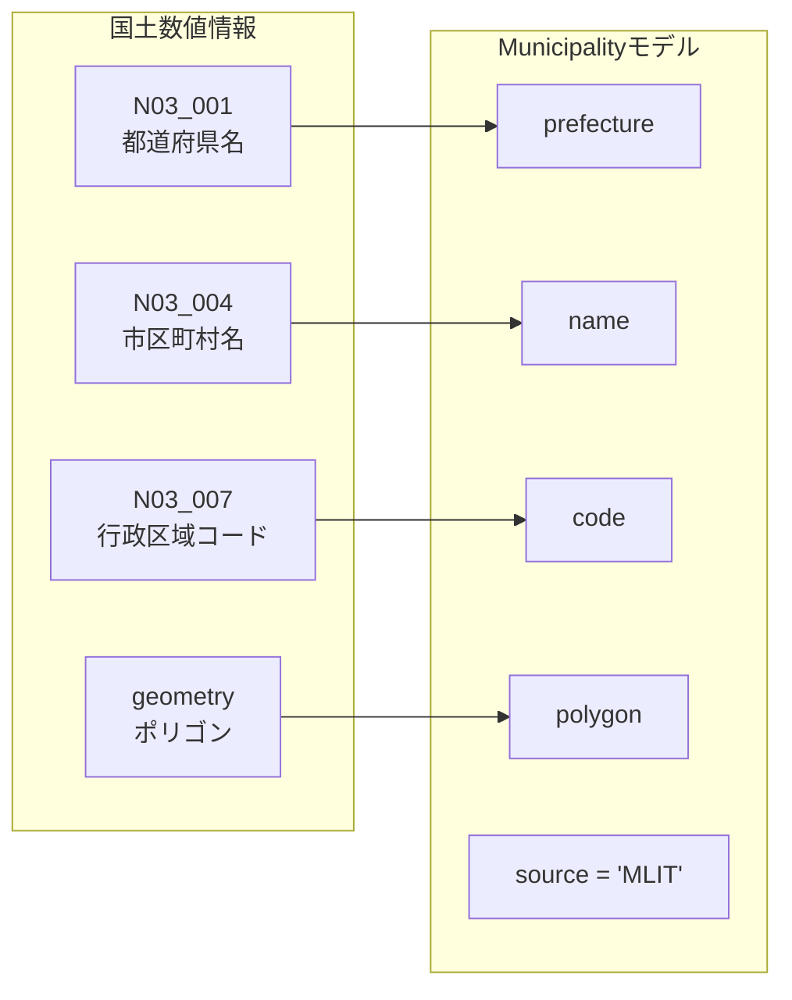
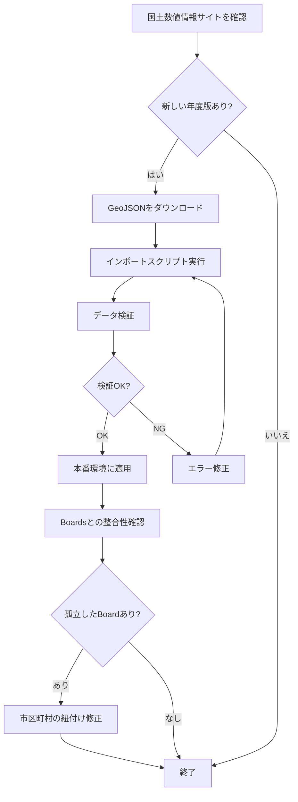

# PostGIS空間データガイド

## 概要

Polisterでは、PostGISを使用して掲示板の位置情報や市区町村の境界データを管理します。

## 座標系

### SRID 4326（WGS84）

全ての空間データは**SRID 4326（WGS84）**を使用します。

- **用途**: GPS、Google Maps、Mapbox等で標準的に使用される座標系
- **単位**: 度（degree）
- **緯度範囲**: -90〜90度（日本: 約33-46度）
- **経度範囲**: -180〜180度（日本: 約128-146度）

```sql
-- 座標系の確認
SELECT ST_SRID(location) FROM boards LIMIT 1;
-- 結果: 4326
```

### JGD2011（世界測地系）との互換性

国土数値情報の行政区域データはJGD2011（世界測地系）を使用していますが、これはWGS84とほぼ同等です（誤差は数cm程度）。そのため、SRID 4326として扱うことができます。

- **国土数値情報**: JGD2011（EPSG:6668）
- **Polister**: WGS84（EPSG:4326）
- **変換**: 必要に応じてST_Transform関数で変換

```sql
-- JGD2011からWGS84への変換
ST_Transform(geometry, 4326)
```

## 空間データ型

### POINT（点）

掲示板の位置を表現します。

```sql
-- POINTの作成
ST_SetSRID(ST_MakePoint(経度, 緯度), 4326)

-- 例: 東京都千代田区永田町1-7-1
ST_SetSRID(ST_MakePoint(139.7453, 35.6762), 4326)
```

**注意**: PostGISでは**経度, 緯度**の順序です（一般的な緯度, 経度とは逆）。

### MULTIPOLYGON（複数ポリゴン）

市区町村の境界を表現します。

```sql
-- MULTIPOLYGONの例
geography(MULTIPOLYGON, 4326)
```

## 基本的な空間クエリ

### 距離計算

```sql
-- 2点間の距離を計算（メートル単位）
SELECT ST_Distance(
  ST_SetSRID(ST_MakePoint(139.7453, 35.6762), 4326)::geography,
  location::geography
) as distance_meters
FROM boards;
```

### 範囲検索

```sql
-- 特定地点から半径1km以内の掲示板を検索
SELECT * FROM boards
WHERE ST_DWithin(
  location::geography,
  ST_SetSRID(ST_MakePoint(139.7453, 35.6762), 4326)::geography,
  1000  -- メートル
);
```

### バウンディングボックス検索

```sql
-- 地図の表示範囲内の掲示板を検索
SELECT * FROM boards
WHERE ST_Within(
  location,
  ST_MakeEnvelope(
    139.70, 35.65,  -- 南西（経度, 緯度）
    139.80, 35.70,  -- 北東（経度, 緯度）
    4326
  )
);
```

### ポリゴン内判定

```sql
-- 掲示板が市区町村ポリゴン内にあるか判定
SELECT b.*, m.name as municipality_name
FROM boards b
JOIN municipalities m ON ST_Within(b.location, m.polygon)
WHERE m.id = 'municipality-id';
```

## Prismaでの空間クエリ

### Repository実装例

```typescript
// src/features/board/infrastructure/repositories/BoardRepository.ts
import { injectable, inject } from "tsyringe";
import type { PrismaClient } from "@prisma/client";
import { TOKENS } from "@/shared/lib/di/tokens";

@injectable()
export class BoardRepository {
  constructor(@inject(TOKENS.PrismaClient) private prisma: PrismaClient) {}

  // 半径検索
  async findByLocation(
    lat: number,
    lng: number,
    radiusMeters: number
  ): Promise<Board[]> {
    return this.prisma.$queryRaw`
      SELECT * FROM boards
      WHERE ST_DWithin(
        location::geography,
        ST_SetSRID(ST_MakePoint(${lng}, ${lat}), 4326)::geography,
        ${radiusMeters}
      )
      AND deleted_at IS NULL
    `;
  }

  // バウンディングボックス検索
  async findByBounds(
    swLat: number,
    swLng: number,
    neLat: number,
    neLng: number
  ): Promise<Board[]> {
    return this.prisma.$queryRaw`
      SELECT * FROM boards
      WHERE ST_Within(
        location,
        ST_MakeEnvelope(${swLng}, ${swLat}, ${neLng}, ${neLat}, 4326)
      )
      AND deleted_at IS NULL
      ORDER BY created_at DESC
      LIMIT 1000
    `;
  }

  // 市区町村内の掲示板を検索
  async findByMunicipality(municipalityId: string): Promise<Board[]> {
    return this.prisma.$queryRaw`
      SELECT b.* FROM boards b
      JOIN municipalities m ON b.municipality_id = m.id
      WHERE m.id = ${municipalityId}::uuid
      AND b.deleted_at IS NULL
    `;
  }
}
```

### 型安全性の注意

`$queryRaw`を使用する場合、戻り値の型を明示的に指定します：

```typescript
interface BoardWithDistance extends Board {
  distance_meters: number;
}

async findNearby(lat: number, lng: number): Promise<BoardWithDistance[]> {
  return this.prisma.$queryRaw<BoardWithDistance[]>`
    SELECT *,
      ST_Distance(
        location::geography,
        ST_SetSRID(ST_MakePoint(${lng}, ${lat}), 4326)::geography
      ) as distance_meters
    FROM boards
    WHERE deleted_at IS NULL
    ORDER BY distance_meters
    LIMIT 10
  `;
}
```

## 空間インデックスの活用

### GISTインデックス

PostGISの空間検索にはGISTインデックスを使用します。

```sql
-- インデックス作成（Prismaスキーマで自動作成）
CREATE INDEX idx_boards_location ON boards USING GIST(location);

-- インデックス使用確認
EXPLAIN ANALYZE
SELECT * FROM boards
WHERE ST_DWithin(
  location::geography,
  ST_SetSRID(ST_MakePoint(139.7453, 35.6762), 4326)::geography,
  1000
);
```

### パフォーマンス Tips

1. **geography型を使用**: 距離計算が正確（メートル単位）
2. **バウンディングボックスで絞り込み**: 空間インデックスが効率的に動作
3. **LIMIT句**: 大量データの場合は結果件数を制限

## よく使う空間関数

### 距離・範囲

| 関数        | 説明             | 例                                |
| ----------- | ---------------- | --------------------------------- |
| ST_Distance | 2点間の距離      | `ST_Distance(point1, point2)`     |
| ST_DWithin  | 指定距離内か判定 | `ST_DWithin(point, center, 1000)` |
| ST_Within   | ポリゴン内か判定 | `ST_Within(point, polygon)`       |

### 作成・変換

| 関数            | 説明       | 例                                              |
| --------------- | ---------- | ----------------------------------------------- |
| ST_MakePoint    | 点を作成   | `ST_MakePoint(lng, lat)`                        |
| ST_SetSRID      | SRIDを設定 | `ST_SetSRID(geom, 4326)`                        |
| ST_MakeEnvelope | 矩形を作成 | `ST_MakeEnvelope(xmin, ymin, xmax, ymax, 4326)` |

### 情報取得

| 関数         | 説明              | 例                   |
| ------------ | ----------------- | -------------------- |
| ST_X         | 経度を取得        | `ST_X(point)`        |
| ST_Y         | 緯度を取得        | `ST_Y(point)`        |
| ST_AsGeoJSON | GeoJSON形式で出力 | `ST_AsGeoJSON(geom)` |

## トラブルシューティング

### 経度と緯度の順序間違い

```typescript
// ❌ 間違い: 緯度, 経度
ST_MakePoint(35.6762, 139.7453);

// ✅ 正しい: 経度, 緯度
ST_MakePoint(139.7453, 35.6762);
```

### geography型とgeometry型の違い

- **geography**: 地球を球体として扱う、距離計算が正確（メートル単位）
- **geometry**: 平面として扱う、計算が高速だが距離が不正確

Polisterでは**geography型を推奨**します。

### 空間インデックスが使われない

```sql
-- ❌ インデックスが使われない
WHERE ST_Distance(location, point) < 1000

-- ✅ インデックスが使われる
WHERE ST_DWithin(location, point, 1000)
```

## 国土数値情報の行政区域データ

### 概要

Polisterでは、国土交通省が提供する[国土数値情報 行政区域データ](https://nlftp.mlit.go.jp/ksj/gml/datalist/KsjTmplt-N03-2025.html)を使用して、市区町村の境界ポリゴンと基本情報を取得します。

### データの特徴

**提供元**: 国土交通省 国土数値情報ダウンロードサービス

**データ形式**:

- GML形式（JPGIS2014準拠）
- **GeoJSON形式**（推奨）
- Shapefile形式

**座標系**: JGD2011（世界測地系）

**更新頻度**: 年1回程度

**提供形態**:

- 全国版（全市区町村を一括）
- 都道府県別版（47都道府県ごと）
- 地方ブロック単位

### 属性情報

国土数値情報の行政区域データには以下の属性が含まれます：

| 属性名         | フィールド名 | 説明                           | Municipalityモデルのマッピング |
| -------------- | ------------ | ------------------------------ | ------------------------------ |
| 都道府県名     | N03_001      | 都道府県名                     | prefecture                     |
| 振興局名       | N03_002      | 北海道の振興局名               | -                              |
| 郡名           | N03_003      | 郡名（該当する場合）           | -                              |
| 市区町村名     | N03_004      | 市区町村名（政令市の区含む）   | name                           |
| 行政区域コード | N03_007      | 全国地方公共団体コード（5桁）  | code                           |
| ポリゴン       | geometry     | 行政区域の境界（MULTIPOLYGON） | polygon                        |

### データ取得とインポート

#### 1. GeoJSONファイルのダウンロード

```bash
# 全国版（2025年度）をダウンロード
curl -O https://nlftp.mlit.go.jp/ksj/gml/data/N03/N03-2025/N03-20250101_GML.zip

# 解凍
unzip N03-20250101_GML.zip

# GeoJSONに変換（GDAL/ogr2ogrを使用）
ogr2ogr -f GeoJSON -t_srs EPSG:4326 municipalities.geojson N03-20250101.shp
```

#### 2. GeoJSONからMunicipalityテーブルへのインポート

**TypeScript実装例**:

```typescript
// src/scripts/import-municipalities.ts
import { PrismaClient } from "@prisma/client";
import * as fs from "fs";

interface GeoJSONFeature {
  type: "Feature";
  properties: {
    N03_001: string; // 都道府県名
    N03_004: string; // 市区町村名
    N03_007: string; // 行政区域コード
  };
  geometry: {
    type: "MultiPolygon" | "Polygon";
    coordinates: number[][][][];
  };
}

interface GeoJSON {
  type: "FeatureCollection";
  features: GeoJSONFeature[];
}

async function importMunicipalities() {
  const prisma = new PrismaClient();

  // GeoJSONファイルを読み込み
  const geojson: GeoJSON = JSON.parse(
    fs.readFileSync("municipalities.geojson", "utf-8")
  );

  console.log(`Processing ${geojson.features.length} municipalities...`);

  for (const feature of geojson.features) {
    const { N03_001, N03_004, N03_007 } = feature.properties;

    // 市区町村名がない場合はスキップ（都道府県レベルのデータ）
    if (!N03_004) {
      continue;
    }

    // GeoJSON形式のポリゴンをWKTに変換
    const wkt = convertGeoJSONToWKT(feature.geometry);

    try {
      await prisma.$executeRaw`
        INSERT INTO municipalities (id, name, code, prefecture, polygon, source)
        VALUES (
          gen_random_uuid(),
          ${N03_004},
          ${N03_007},
          ${N03_001},
          ST_GeomFromText(${wkt}, 4326)::geography,
          'MLIT'
        )
        ON CONFLICT (code) DO UPDATE SET
          name = EXCLUDED.name,
          prefecture = EXCLUDED.prefecture,
          polygon = EXCLUDED.polygon,
          updated_at = CURRENT_TIMESTAMP
      `;

      console.log(`✓ ${N03_001} ${N03_004} (${N03_007})`);
    } catch (error) {
      console.error(`✗ ${N03_001} ${N03_004}:`, error);
    }
  }

  await prisma.$disconnect();
}

function convertGeoJSONToWKT(geometry: GeoJSONFeature["geometry"]): string {
  // GeoJSONのgeometryをWKT形式に変換
  // 実装は省略（またはライブラリを使用）
  // 例: wellknown, @mapbox/wellknown等
  const wellknown = require("wellknown");
  return wellknown.stringify(geometry);
}

importMunicipalities().catch(console.error);
```

#### 3. シェルスクリプトでの一括インポート

**ogr2ogr + psql を使用した方法**:

```bash
#!/bin/bash
# scripts/import-municipalities.sh

# 1. GeoJSONをPostGISに直接インポート
ogr2ogr -f PostgreSQL \
  PG:"host=localhost dbname=polister user=postgres password=password" \
  -nln municipalities_temp \
  -t_srs EPSG:4326 \
  municipalities.geojson

# 2. 一時テーブルからMunicipalitiesテーブルにマージ
psql -h localhost -U postgres -d polister <<EOF
INSERT INTO municipalities (id, name, code, prefecture, polygon, source)
SELECT
  gen_random_uuid(),
  n03_004 as name,
  n03_007 as code,
  n03_001 as prefecture,
  ST_Transform(wkb_geometry, 4326)::geography as polygon,
  'MLIT' as source
FROM municipalities_temp
WHERE n03_004 IS NOT NULL
ON CONFLICT (code) DO UPDATE SET
  name = EXCLUDED.name,
  prefecture = EXCLUDED.prefecture,
  polygon = EXCLUDED.polygon,
  updated_at = CURRENT_TIMESTAMP;

-- 一時テーブルを削除
DROP TABLE municipalities_temp;
EOF
```

### データの検証

#### インポート後の確認

```sql
-- 件数確認（約1,900件）
SELECT COUNT(*) FROM municipalities;

-- 都道府県別の件数確認
SELECT prefecture, COUNT(*) as count
FROM municipalities
GROUP BY prefecture
ORDER BY prefecture;

-- ポリゴンの有無確認
SELECT
  COUNT(*) as total,
  COUNT(polygon) as with_polygon,
  COUNT(*) - COUNT(polygon) as without_polygon
FROM municipalities;

-- サンプルデータの確認
SELECT id, name, code, prefecture, ST_AsText(polygon::geometry) as polygon_wkt
FROM municipalities
LIMIT 5;
```

#### 空間クエリのテスト

```sql
-- 東京都千代田区のポリゴンを取得
SELECT name, code, prefecture, ST_AsGeoJSON(polygon::geometry) as geojson
FROM municipalities
WHERE name = '千代田区';

-- 特定の地点が含まれる市区町村を検索（国会議事堂の位置）
SELECT name, code, prefecture
FROM municipalities
WHERE ST_Within(
  ST_SetSRID(ST_MakePoint(139.7453, 35.6762), 4326),
  polygon::geometry
);
-- 結果: 千代田区
```

### Municipalityモデルとのマッピング



### 行政区域コード（5桁）の構造

```
全国地方公共団体コード: 01101
├─ 01: 都道府県コード（北海道）
└─ 101: 市区町村コード（札幌市中央区）
```

**例**:

- `13101`: 東京都千代田区
- `27128`: 大阪府大阪市北区
- `01101`: 北海道札幌市中央区

### データの定期更新

#### 更新フロー



#### 年次更新時の注意点

市区町村の合併・分割があった場合：

1. **合併**: 新しいcodeが追加され、旧codeは削除される
   - 影響するBoardレコードのmunicipalityIdを更新

2. **分割**: 複数の新しいcodeが追加される
   - Boardの位置を基に適切な新municipalityIdを割り当て

```sql
-- 市区町村の変更による影響を確認
SELECT b.*, m.name, m.code
FROM boards b
LEFT JOIN municipalities m ON b.municipality_id = m.id
WHERE m.id IS NULL;
-- 孤立したBoardレコードを検出

-- 位置情報から適切な市区町村を割り当て直す
UPDATE boards b
SET municipality_id = m.id
FROM municipalities m
WHERE b.municipality_id IS NULL
  AND ST_Within(b.location::geometry, m.polygon::geometry);
```

### GeoJSONエクスポート

Municipalityデータを外部サービスで利用するためのエクスポート：

```typescript
// src/features/municipality/application/usecases/export-geojson.usecase.ts
import { injectable, inject } from "tsyringe";
import type { PrismaClient } from "@prisma/client";
import { TOKENS } from "@/shared/lib/di/tokens";

@injectable()
export class ExportMunicipalitiesAsGeoJSONUseCase {
  constructor(@inject(TOKENS.PrismaClient) private prisma: PrismaClient) {}

  async execute(prefecture?: string): Promise<GeoJSON.FeatureCollection> {
    const municipalities = await this.prisma.$queryRaw<
      Array<{
        id: string;
        name: string;
        code: string;
        prefecture: string;
        geojson: string;
      }>
    >`
      SELECT
        id,
        name,
        code,
        prefecture,
        ST_AsGeoJSON(polygon::geometry) as geojson
      FROM municipalities
      WHERE ${prefecture ? this.prisma.$queryRaw`prefecture = ${prefecture}` : this.prisma.$queryRaw`TRUE`}
      ORDER BY code
    `;

    return {
      type: "FeatureCollection",
      features: municipalities.map((m) => ({
        type: "Feature",
        id: m.id,
        properties: {
          name: m.name,
          code: m.code,
          prefecture: m.prefecture,
        },
        geometry: JSON.parse(m.geojson),
      })),
    };
  }
}
```

### パフォーマンス最適化

#### ポリゴンの簡略化

市区町村のポリゴンは詳細すぎる場合があり、表示パフォーマンスに影響します。適度に簡略化することを推奨：

```sql
-- ポリゴンを簡略化（0.0001度 ≈ 10m）
UPDATE municipalities
SET polygon = ST_SimplifyPreserveTopology(polygon::geometry, 0.0001)::geography
WHERE polygon IS NOT NULL;

-- 簡略化前後のサイズ比較
SELECT
  name,
  ST_NPoints(polygon::geometry) as points_before,
  ST_NPoints(ST_SimplifyPreserveTopology(polygon::geometry, 0.0001)) as points_after
FROM municipalities
LIMIT 10;
```

#### 空間インデックスの確認

```sql
-- GISTインデックスが使用されているか確認
EXPLAIN ANALYZE
SELECT * FROM municipalities
WHERE ST_Within(
  ST_SetSRID(ST_MakePoint(139.7453, 35.6762), 4326),
  polygon::geometry
);
-- Index Scan using idx_municipalities_polygon が表示されればOK
```

### Mapbox GL JSでの表示

GeoJSONとして取得したMunicipalityデータをMapbox GL JSで表示：

```typescript
// src/features/municipality/ui/components/MunicipalityLayer.tsx
import { useEffect } from "react";
import { useMap } from "react-map-gl";

export function MunicipalityLayer({ prefecture }: { prefecture?: string }) {
  const { current: map } = useMap();

  useEffect(() => {
    if (!map) return;

    // Municipalityデータを取得
    fetch(`/api/municipalities/geojson?prefecture=${prefecture || ""}`)
      .then((res) => res.json())
      .then((geojson) => {
        // ソースを追加
        map.addSource("municipalities", {
          type: "geojson",
          data: geojson,
        });

        // レイヤーを追加（塗りつぶし）
        map.addLayer({
          id: "municipalities-fill",
          type: "fill",
          source: "municipalities",
          paint: {
            "fill-color": "#088",
            "fill-opacity": 0.1,
          },
        });

        // レイヤーを追加（境界線）
        map.addLayer({
          id: "municipalities-line",
          type: "line",
          source: "municipalities",
          paint: {
            "line-color": "#088",
            "line-width": 2,
          },
        });
      });

    return () => {
      if (map.getLayer("municipalities-fill")) {
        map.removeLayer("municipalities-fill");
      }
      if (map.getLayer("municipalities-line")) {
        map.removeLayer("municipalities-line");
      }
      if (map.getSource("municipalities")) {
        map.removeSource("municipalities");
      }
    };
  }, [map, prefecture]);

  return null;
}
```

### トラブルシューティング

#### ポリゴンが複雑すぎてパフォーマンスが悪い

**対策**:

- ST_SimplifyPreserveTopologyで簡略化
- ズームレベルに応じて詳細度を変える
- タイル形式でのキャッシュ（Mapbox Tiling Service等）

#### 市区町村の合併・分割

**対策**:

- 年次更新時に変更履歴を確認
- 既存のBoardレコードのmunicipalityIdを適切に更新
- マイグレーションスクリプトで自動的に紐付けを修正

#### 座標系の不一致

**対策**:

- 常にSRID 4326に統一
- ST_Transform関数で変換
- インポート時に座標系を確認

```sql
-- 座標系を確認
SELECT ST_SRID(polygon::geometry) FROM municipalities LIMIT 1;

-- SRID 6668（JGD2011）の場合は変換
UPDATE municipalities
SET polygon = ST_Transform(polygon::geometry, 4326)::geography
WHERE ST_SRID(polygon::geometry) = 6668;
```

## 参考リンク

- [PostGIS公式ドキュメント](https://postgis.net/docs/)
- [PostGIS空間関数リファレンス](https://postgis.net/docs/reference.html)
- [Prisma PostGIS](https://www.prisma.io/docs/orm/prisma-schema/data-model/unsupported-database-features)
- [国土数値情報 行政区域データ](https://nlftp.mlit.go.jp/ksj/gml/datalist/KsjTmplt-N03-2025.html)
- [GDAL/OGR](https://gdal.org/) - 地理空間データ変換ツール

---

最終更新: 2025年10月17日
