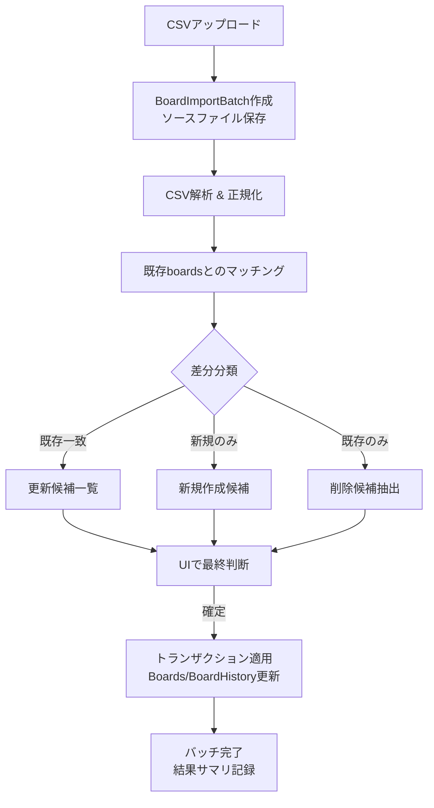

# 自治体掲示板CSV比較インポート要件

## 1. 背景と目的

- 各自治体から取得した正規化済みCSV（例: `tmp/川崎市_normalized.csv`）をPolisterに取り込み、既存掲示板データと付き合わせて最新状態へ更新したい。
- インポートしたCSVと処理結果を監査できるよう、データソースファイルと解析結果を永続化する必要がある。
- 取り込み後の確認作業を地図と表で行い、新規・既存・削除候補を運営が明示的に判定できるUIを提供する。

## 2. 対象スコープ

- 対象自治体を指定しての掲示板CSVインポート機能（対象は既存の`boards`テーブルのデータ）。
- CSV解析からDB反映までのバックエンド処理および監査用データ保存。
- 運営向け管理UI（自治体単位の比較・差分調整・反映）。
- ストレージ（S3等）へのソースファイル保存とダウンロード導線。
- 既存掲示板との比較に基づく差分更新・新規作成・論理削除の実行。

## 3. CSV仕様（前提）

- 入力フォーマット（暫定）：`prefecture, city, number, address, name, lat, long, note`
  - `number`: 自治体内での掲示板番号。`01-2` のような数字＋ハイフン形式、または数字のみの文字列を想定し、欠損時は差分検証対象外として扱う。
  - `lat/long`: WGS84座標。数値で提供されることを前提とする（文字列の場合は正規化処理が必要）。
  - `note`: 任意列。空文字許容。
- インポート対象自治体の掲示板を網羅したCSV（全件）であることを必須条件とする。部分的なCSVは受け付けず、全件取り込みを前提に差分判定を行う。
- 列ヘッダー名称・並びは将来拡張を想定し、マッピング定義で柔軟に対応できるようにする。
- 文字コードはUTF-8（BOMなし）を必須とし、前処理で検証する。

## 4. システム要件

### 4.1 データ保存

- **BoardImportBatch（新規）**
  - `id`, `municipalityId`, `status`（`UPLOADED`/`REVIEWING`/`APPLIED`/`CANCELLED`）
  - ファイルメタデータ：`sourceFileName`, `storagePath`, `fileSize`, `checksum`
  - 統計：`totalRows`, `matchedCount`, `newCount`, `missingCount`, `updatedCount`, `duplicateCount`
  - 操作情報：`uploadedBy`, `uploadedAt`, `confirmedBy`, `confirmedAt`, `notes`
- **BoardImportRow（新規）**
  - インポートCSV 1行ごとの正規化データ（prefecture, city, boardNumber, address, name, latitude, longitude, note, rawJson）
  - マッチング結果：`matchedBoardId`, `matchConfidence`（`HIGH`/`MEDIUM`/`LOW`/`NONE`）、`distanceMeter`
  - 差分情報：`diff`（JSONで属性ごとの差異を保持）、`suggestedAction`（`KEEP`/`UPDATE`/`CREATE`/`SKIP`）
  - ユーザー操作：`finalDecision`（`UPDATE`/`CREATE`/`IGNORE`）、`assignee`, `comment`
- **BoardImportMissing（新規）**
  - インポートCSVに存在しない既存掲示板の候補リスト
  - `boardId`, `batchId`, `reason`（`NOT_IN_SOURCE`/`OUT_OF_SCOPE`など）、`finalDecision`（`KEEP`/`SOFT_DELETE`/`FOLLOW_UP`）
- ソースファイルはオブジェクトストレージへ保存（例: `board-imports/{municipalityCode}/{batchId}/source.csv`）。URIを`BoardImportBatch`に保持し、後日ダウンロードできるようにする。
- 反映時は、更新された`Board`に`BoardHistory`を残し、`BoardImportBatch`との関連を保存（例: `board_histories.import_batch_id`カラム追加）。

### 4.2 インポート処理フロー

### 4.3 マッチングロジック

- 優先キー：同一自治体内での`boardNumber`一致（完全一致 → `HIGH`判定）。
- 座標距離（例: 25m以内）を閾値にした位置補正マッチ。距離に応じて信頼度を下げる。
- 住所/名称の類似度評価（例: ひらがな化してLevenshtein距離）を組み合わせ、閾値以下は人手確認へ回す。
- マッチング結果はUIで編集可能にし、ユーザーが手動で紐付け直せるようにする。
- 同一番号で複数行が来た場合は重複として警告し、決着が付くまで確定できないようブロックする。

### 4.4 反映ルール

- `finalDecision`が`CREATE`の行のみ新規`Board`を作成。`createdBy`は操作ユーザーで記録。
- `UPDATE`決定時は差分がある属性のみ更新し、変更点を`BoardHistory`へ記録。位置変更は必ず距離ログを記録。
- 削除候補のうち`SOFT_DELETE`に確定したものは`deletedAt`を設定し、履歴を残す。
- 反映処理は単一トランザクションで行い、失敗時はロールバックする。
- 反映後は`BoardImportBatch.status`を`APPLIED`に更新し、サマリに適用件数を記録。

### 4.5 監査・再現性

- バッチごとに差分サマリ（JSON）を保存し、将来の検証に備える。
- 過去のバッチは一覧表示・フィルタリング・CSV再ダウンロードが可能でなければならない。
- 取り込み失敗やキャンセル時も`BoardImportBatch`を残し、エラーメッセージ／取消理由を記録する。

## 5. UI要件

- **アクセス制御**: 管理者(Admin)と地域コーディネーター(Coordinator)のみ利用可能。
- **画面構成**
  1. バッチ一覧：自治体・ステータス・日付でフィルタ。各バッチのサマリ（新規/更新/削除候補件数、確認進捗）を表示。
  2. バッチ詳細：タブ切り替えで「一覧」「マップ」「削除候補」「エラー」を表示。
     - **一覧タブ**: テーブルで取り込み行を表示。左列にCSV情報、右列に既存掲示板情報を並べ、差分はハイライト。行ごとに最終決定ドロップダウンとコメント欄。
     - **マップタブ**: 既存掲示板と取り込み行をレイヤーで表示。マッチ済みは線で接続し、未マッチや削除候補は色で区別。クリックで詳細サイドパネル表示。
     - **削除候補タブ**: `BoardImportMissing`の一覧。理由と最終決定を入力。
     - **エラータブ**: CSVパース不可行、必須列欠損、重複等のエラーと対処方法を表示。
  3. 確定ダイアログ：適用件数サマリを表示し、最終確認に`チェックボックス`で同意を取得。
- **補助機能**
  - 検索（番号・住所・名称）／フィルタ（決定状態・信頼度・変化タイプ）。
  - 差分種別アイコン（位置差分・名称差分など）を表示。
  - バルク操作（複数行を選択して一括決定）を提供。ただし更新・削除は慎重に確認できるよう警告表示。
  - 差分ごとのコメント記録と履歴閲覧。
- **操作ログ**
  - 決定者・決定時刻・変更内容を監査ログに記録。UIから参照可能にする。

## 6. 非機能要件

- **性能**: 1バッチ最大5,000行を想定。行ごとステータス更新はリアルタイム応答（<500ms）を目標。
- **冪等性**: 同一CSVの再インポートで既存バッチを再利用、または別バッチとして重複登録しない仕組みを検討（checksum利用）。
- **セキュリティ**: ソースファイルは署名付きURLでのみダウンロード可。個人情報が含まれる場合のアクセス制御ポリシーを明文化。
- **可観測性**: フロー全体のメトリクス（解析時間、マッチ率、エラー件数）を計測し、ダッシュボードで把握できるようにする。
- **バックアップ**: ストレージとDBに保存したインポート情報は日次バックアップ対象とする。

## 7. 未決事項・フォローアップ

- CSV列定義が自治体によって変動する場合のカスタムマッピングUI（将来対応）。
- マッチングの閾値パラメータを環境値で調整可能にする方法。
- 既存掲示板との紐付けが不確実なケースに対する現地確認依頼フロー連携。
- インポート前後でのRoute計画等、他機能との連携要件定義。
