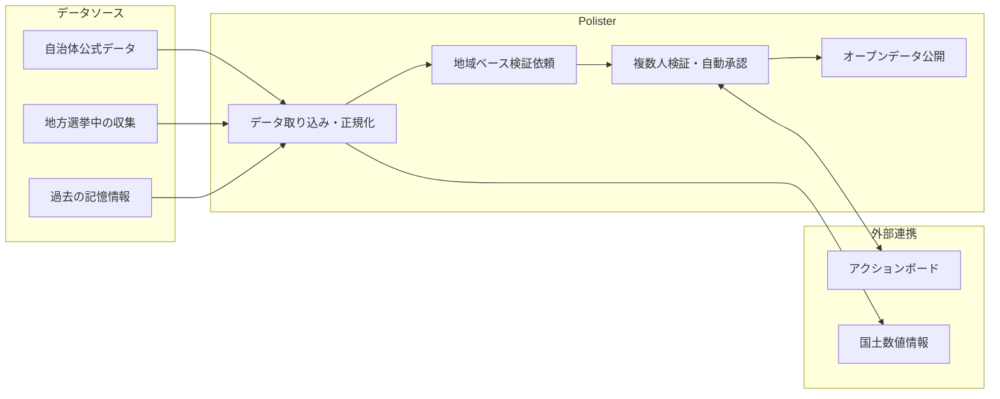
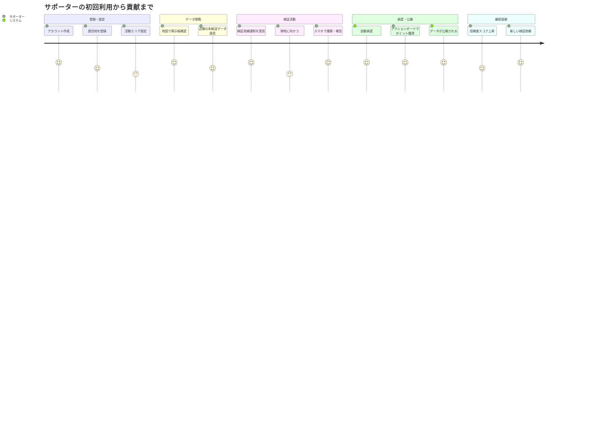
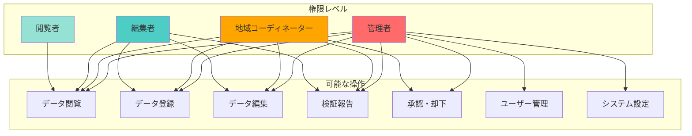
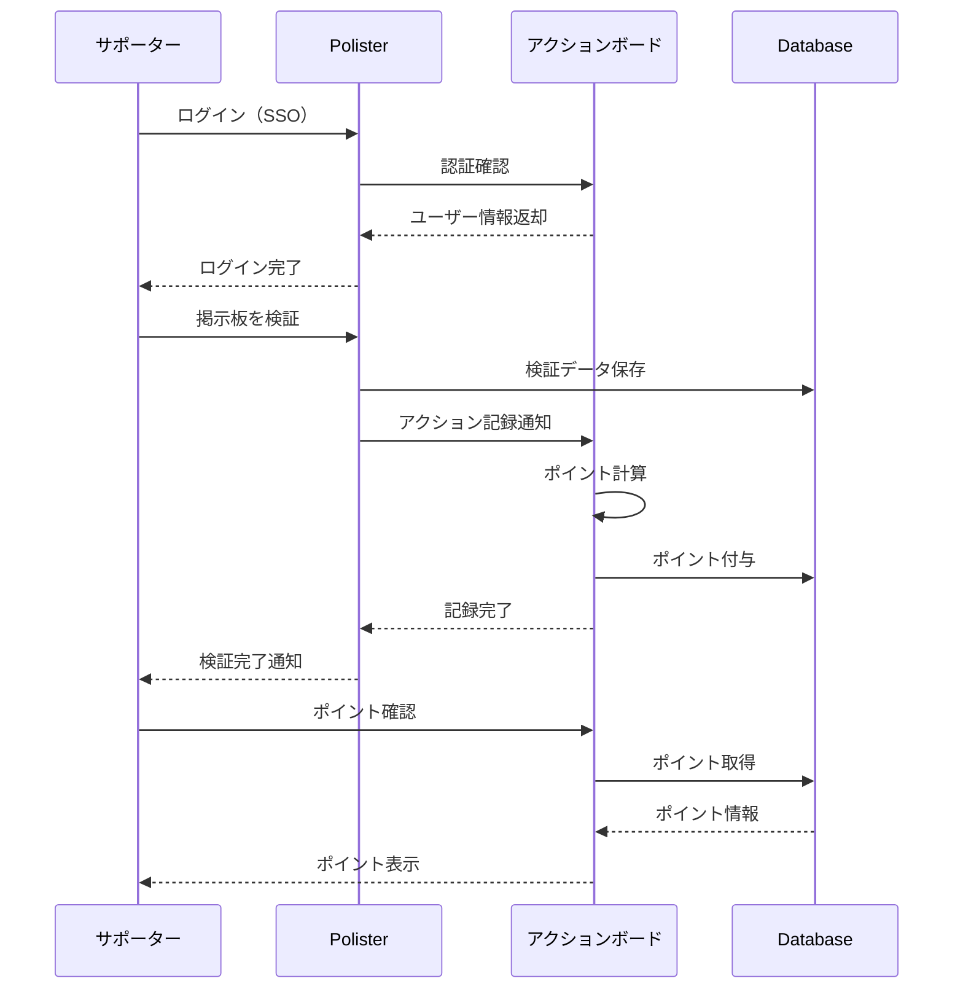
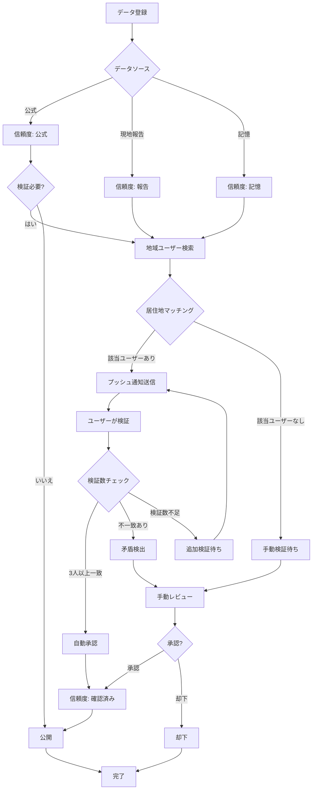
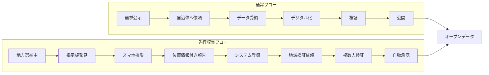
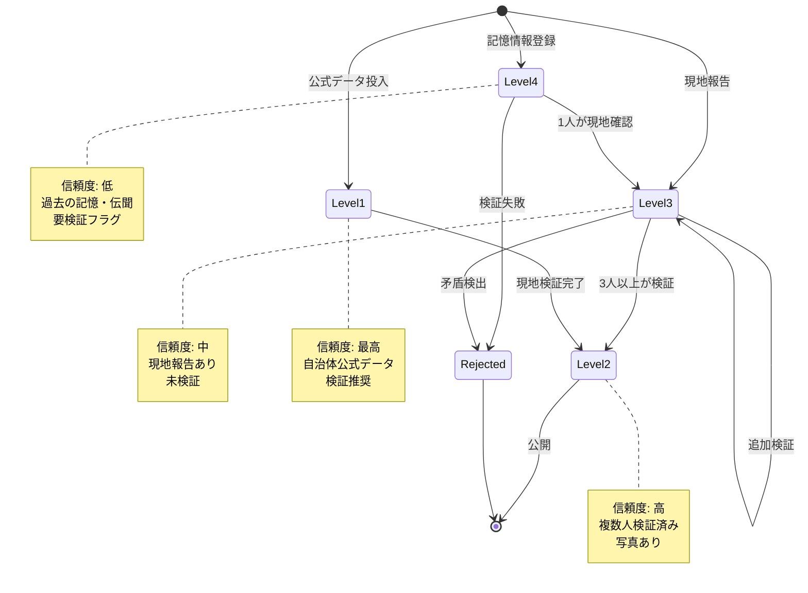
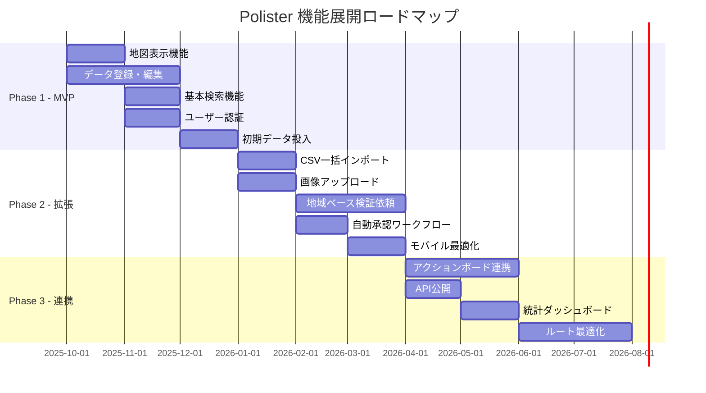

# Polisterプロジェクト要件定義書

## 1. プロジェクト概要

### 1.1 プロジェクト名

**Polister** (Politics + Poster) - 選挙ポスター掲示板位置管理サービス

### 1.2 プロジェクトの目的

選挙時のポスター掲示板の位置情報をデジタル化し、オープンデータとして提供することで、選挙活動の効率化と透明性の向上を図る。

**背景**:
チームみらいは参議院選挙において、全国の自治体から提供された掲示板情報を手作業でCSV化・正規化した実績がある。この経験から、統一的なプラットフォームの必要性と、データ正規化のノウハウを蓄積している。

### 1.3 背景・課題

- **課題1：情報の分散と非標準化**
  - 自治体ごとに提供される掲示板情報の形式が異なる（デジタルデータ、紙の地図、口頭など）
  - 統一的なデータベースが存在せず、候補者や支援者が個別に情報収集する必要がある

- **課題2：情報の正確性と最新性**
  - 提供された情報が古かったり、現地の実態と異なることがある
  - 掲示板の位置変更や撤去の情報が反映されていない

- **課題3：アクセシビリティの欠如**
  - 紙の地図では現地での確認が困難
  - デジタル化されていないため、効率的なルート計画が立てられない

- **課題4：国政選挙における事前準備の困難さ**
  - 国政選挙の掲示板情報は選挙公示後に提供されることが多く、事前準備が難しい
  - 地方選挙と国政選挙で同じ掲示板が使われるケースがあり、地方選挙中のデータ収集が有効
  - 過去の記憶や目撃情報など、非公式な情報源の活用が必要

### 1.4 解決方針

- **方針1：統一的なデジタルプラットフォーム**
  - 全国の選挙ポスター掲示板情報を一元管理するWebサービスを構築
  - 地図上で視覚的に掲示板の位置を確認できるインターフェース

- **方針2：クラウドソーシングによるデータ収集と検証**
  - サポーターや協力者が現地確認を行い、データの正確性を検証
  - 地方選挙中に国政選挙用の掲示板情報を収集（スマホ撮影、位置情報記録）
  - 過去の記憶や目撃情報も含めた多様な情報源の活用
  - コミュニティ主導での情報更新・修正機能

- **方針3：オープンデータとしての公開**
  - 収集したデータをオープンデータとして公開
  - API提供により他のサービスやアプリケーションとの連携を可能に

### 1.5 システム概要図

## 2. ステークホルダー分析

### 2.1 プライマリユーザー

- **政党サポーター（チームみらい）**
  - ポスター貼り作業を行う主要なユーザー
  - データの検証・修正を行うコントリビューター

- **選挙運動関係者**
  - 候補者や選挙事務所スタッフ
  - ポスター貼りの計画立案者

### 2.1.1 サポーターユーザージャーニー

### 2.2 セカンダリユーザー

- **自治体選挙管理委員会**
  - データの提供元
  - 公式情報の確認・監修

- **一般市民・研究者**
  - オープンデータの利用者
  - 選挙に関する調査・研究を行う人々

### 2.3 運営組織

- **開発チーム**: チームみらい技術サポーター
- **運営チーム**: チームみらいサポーター
- **データ管理チーム**: 地域コーディネーター

### 2.3.1 ユーザーロールと権限

### 2.4 関連サービス

#### アクションボード

チームみらいが運営するサポーター向け政治活動・選挙活動支援ツール。

**主な機能**:

- サポーターの活動に対してポイントを付与
- 選挙中のポスター掲示板地図の提供
- ポスター貼り付けの報告機能

**Polisterとの連携計画**:

- 将来的にアカウント連携を実施
- Polisterでの活動（データ登録、現地確認など）をアクションボードのアクションとしてカウント
- ポイント付与による貢献者のモチベーション向上
- 両サービス間でのデータ共有・相互利用

#### 2.4.1 アクションボード連携シーケンス

### 2.5 過去の実績（参議院選挙での経験）

#### 2.5.1 実施内容

チームみらいは参議院選挙において、以下の作業を実施した：

1. **全国自治体からの掲示板情報の収集**
   - 各自治体から提供された掲示板情報を収集
   - 提供形式は自治体ごとに異なる（CSV、Excel、PDF、KML、紙の地図など様々）

2. **データの手作業での正規化**
   - 各自治体から提供された様々な形式のデータを統一フォーマットのCSVに変換
   - 住所表記の統一（全角/半角、番地表記の違いなど）
   - 緯度経度情報の付与（ジオコーディング）

#### 2.5.2 得られた知見

- **自治体対応の多様性**:
  - 提供形式が自治体ごとに大きく異なる
  - デジタルデータ、PDF、紙の地図など様々な形式が混在

- **データ品質のばらつき**:
  - 住所表記の不統一（番地の有無、建物名の記載など）
  - 掲示板番号の採番ルールの違い
  - データ項目の違い（自治体によって記載内容が異なる）

- **作業負荷**:
  - 手作業での正規化に膨大な時間が必要
  - 人的ミスのリスク

#### 2.5.3 本プロジェクトへの活用

この経験とノウハウを活かし、データ正規化プロセスの効率化とデータ品質向上を図る。

### 2.6 ユビキタス言語（初版）

DDD導入ガイドと連携するため、主要用語の初期定義を以下にまとめる。命名の変更や追加が発生した場合は本節とDDD導入ガイドの双方を更新すること。

| 用語                                | 定義                                                                     | 補足                                                         |
| ----------------------------------- | ------------------------------------------------------------------------ | ------------------------------------------------------------ |
| 掲示板（Board）                     | 自治体が設置する選挙ポスター掲示板。掲示板番号、所在地、設置状況を持つ。 | `features/board` コンテキストの集約ルート候補。              |
| 検証依頼（Verification Request）    | サポーターに対して掲示板の現地確認を求める依頼。                         | `features/verification` コンテキストのユースケースで生成。   |
| 信頼度レベル（Trust Level）         | データの信頼度を示す評価指標。公式データ／現地確認済み等の区分を持つ。   | ドメインサービスで算出し、承認フローに影響。                 |
| インポートジョブ（Import Job）      | CSV / KML など外部データを取り込む一連の処理単位。                       | `features/import` における集約。状態遷移とエラーログを持つ。 |
| 地域コーディネーター（Coordinator） | 特定地域のデータ承認やサポーター管理を担当するロール。                   | 権限モデルとワークフローの判断基準となる。                   |

追加の用語はIssueまたはPRで合意を得たうえで本表へ反映し、`docs/docs/architecture/guidelines/ddd-guide.md` の該当箇所から参照する。

## 3. 機能要件

### 3.1 核心機能

#### 3.1.1 掲示板位置管理

- **地図表示機能（Mapbox GL JS）**
  - 地図上にポスター掲示板の位置をマーカーで表示
  - 地図のズーム、パン操作
  - 衛星写真・地図の切り替え
  - **カスタム地図スタイル**:
    - ポスター掲示板の視認性を最優先にした配色設計
    - 道路、建物、公共施設などのランドマークを明確に表示
    - 掲示板マーカーが地図上で目立つような配色とデザイン
    - ズームレベルに応じた情報の出し分け（詳細度の調整）
  - マーカークラスタリング（大量のデータでも快適に表示）
  - 現在地表示とナビゲーション支援

- **掲示板情報表示**
  - 掲示板番号、住所、設置場所の詳細
  - 写真の添付・表示
  - 最終確認日時と確認者情報

- **検索・フィルター機能**
  - 住所、掲示板番号での検索
  - 自治体、地域での絞り込み（国土数値情報の市区町村データを利用）
  - 確認状態（未確認、確認済み、要修正）での絞り込み
  - 市区町村ポリゴン表示による行政区域の可視化

#### 3.1.2 データ登録・編集機能

- **データインポート**
  - CSV、Excel形式でのデータ一括登録
  - **KML形式でのデータ一括登録**
    - Google Earth等で提供される地理情報形式
    - Placemark情報の自動抽出
    - GeoJSONへの変換対応
  - 住所から緯度経度への自動変換（ジオコーディング）
  - 自治体提供データの取り込み（選挙公示前後に提供される公式データ）
    - 提供形式: CSV、Excel、PDF、KML、紙の地図など
  - PDFや紙の地図からの手動データ化支援
  - チームみらいの参議院選挙での実績に基づくデータ正規化プロセス
    - 各自治体の異なる形式のデータを統一フォーマットに変換
    - 住所表記の正規化（全角/半角、番地表記の統一など）
    - 必須項目の抽出と補完

- **手動データ登録**
  - 地図上でのクリックによる位置登録
  - フォーム入力による詳細情報登録
  - 写真のアップロード

- **データ編集・修正**
  - 既存データの位置修正（ドラッグ＆ドロップ）
  - 情報の追加・更新
  - 修正履歴の記録

#### 3.1.3 検証・承認機能

- **現地確認機能**
  - モバイル端末からの確認報告
  - 写真付き確認レポート（スマホカメラから直接アップロード）
  - GPS位置情報の自動記録
  - 地方選挙中の国政選挙用掲示板の先行収集
  - 過去の目撃情報・記憶に基づく情報提供
  - 情報の信頼度レベル管理（公式データ、現地確認済み、目撃情報など）

- **修正提案機能**
  - サポーターによる修正提案
  - 修正理由のコメント
  - 修正前後の比較表示

- **地域ベース検証依頼システム**
  - ユーザーの居住地（市区町村レベル）を登録
  - 居住地周辺の未検証データを優先的に通知
  - モバイルアプリでの検証依頼プッシュ通知
  - 複数ユーザーによる検証結果の集約
  - 一定数の確認が得られた場合の自動承認
  - 検証依頼の優先度付け（信頼度レベル、データの古さなど）

- **承認ワークフロー**
  - **自動承認**:
    - 同一市区町村内の複数ユーザー（例: 3人以上）が確認した場合
    - 信頼度の高いユーザーによる確認の場合
    - 公式データとの一致確認
  - **手動承認**:
    - 地域コーディネーターによる最終承認
    - 自動承認基準に満たないデータ
    - 矛盾や疑義があるデータ
  - 修正履歴の管理
  - ステータス管理（提案中、検証中、承認済み、却下）

### 3.2 サポート機能

#### 3.2.1 ユーザー管理

- **認証・認可**
  - ユーザー登録・ログイン
  - 役割ベースのアクセス制御（閲覧者、編集者、管理者）
  - OAuth連携（Google、LINEなど）

- **プロフィール管理**
  - ユーザー情報の編集
  - **居住地登録**（市区町村レベル）
    - 地域ベース検証依頼の送信先として活用
    - プライバシーに配慮した粒度（市区町村まで）
    - 複数地域の登録可能（活動エリアの設定）
  - 活動履歴の表示
  - 貢献度の可視化（検証数、データ登録数など）
  - ユーザー信頼度スコア（検証精度に基づく）

#### 3.2.2 コミュニケーション機能

- **コメント機能**
  - 掲示板ごとのコメント投稿
  - 質問・回答のやり取り
  - メンション通知

- **通知機能**
  - **地域ベース検証依頼通知**:
    - 居住地周辺の未検証データの通知
    - モバイルアプリへのプッシュ通知
    - 検証依頼の優先度表示
    - 検証可能なデータ件数の表示
  - 担当地域の更新通知
  - 修正提案の承認通知
  - システムからのお知らせ

### 3.2.4 地域ベース検証の仕組み

#### 3.2.3 データエクスポート

- **オープンデータ公開**
  - CSV、JSON形式でのダウンロード
  - REST API による データアクセス
  - データライセンスの明示（CC BY 4.0など）

- **レポート生成**
  - 地域別の掲示板数統計
  - 確認状況のサマリー
  - 活動レポートのエクスポート

### 3.3 データ収集ワークフロー

#### 3.3.1 通常フロー（自治体公式データ利用）

1. **選挙公示前後**: 自治体選挙管理委員会に掲示板情報を依頼
2. **データ受領**: CSV、Excel、PDF、KML、紙の地図など様々な形式で提供される
3. **デジタル化**: 提供された情報をシステムに登録
4. **検証**: サポーターによる現地確認
5. **公開**: 検証済みデータをオープンデータとして公開

#### 3.3.2 先行収集フロー（国政選挙の事前準備）

1. **地方選挙中の収集**:
   - 協力者が地方選挙中に掲示板を発見・撮影
   - スマホアプリから位置情報付きで報告
   - 「ここで国政選挙の掲示板を見た」という情報を記録

2. **過去情報の活用**:
   - 「以前この場所に掲示板があった」という記憶ベースの情報
   - 信頼度を低めに設定し、要検証フラグを付与

3. **段階的な精度向上**:
   - 複数人による確認で信頼度を向上
   - 公式データ提供後に突き合わせて検証
   - 差分があれば現地確認を実施

#### 3.3.2.1 データ収集フロー比較図

#### 3.3.3 データ品質管理

- **信頼度レベルの定義**:
  - **Level 1（公式）**: 自治体から提供された公式データ
  - **Level 2（確認済み）**: 現地確認・写真付きで検証されたデータ
  - **Level 3（報告）**: 協力者からの報告（未検証）
  - **Level 4（記憶）**: 過去の記憶や伝聞（要検証）

- **検証プロセス**:
  - **地域ベース検証**:
    - ユーザーの居住地周辺データを優先的に検証依頼
    - 同一市区町村内の複数ユーザー（例: 3人以上）による確認
    - 検証結果の一致度による自動承認判定
  - **複数人検証による信頼度向上**:
    - 検証者数に応じた信頼度スコア計算
    - 検証者の信頼度も考慮（過去の検証精度）
    - 矛盾がある場合は追加検証を依頼
  - **データ品質指標**:
    - 写真の有無、GPS精度による信頼度調整
    - 検証日時の新しさ
    - 複数ソースからの確認有無
  - 定期的なデータクリーニング

#### 3.3.3.1 データ信頼度レベル遷移図

## 4. 非機能要件

### 4.1 性能要件

- **応答時間**
  - ページ読み込み: 3秒以内
  - 地図操作のレスポンス: 100ms以内
  - データ検索: 1秒以内

- **処理能力**
  - 同時接続ユーザー数: 1,000人
  - データ登録件数: 全国100万件規模を想定
  - 画像アップロード: 1ファイル10MB以下

- **可用性**
  - 稼働率: 99.5%以上
  - 選挙期間中の特別体制: 99.9%以上

### 4.2 セキュリティ要件

- **データ保護**
  - HTTPS通信の強制
  - 個人情報の暗号化保存
  - バックアップの定期実行

- **アクセス制御**
  - 役割ベースのアクセス制御（RBAC）
  - 操作ログの記録
  - 不正アクセスの検知・防止

- **監査**
  - データ変更履歴の保持
  - ユーザー操作ログの記録
  - 定期的なセキュリティ監査

### 4.3 拡張性・保守性

- **アーキテクチャ**
  - マイクロサービス志向の設計
  - フロントエンド・バックエンドの分離
  - API ファーストアプローチ

- **技術選定**
  - モダンな技術スタックの採用
  - オープンソースソフトウェアの活用
  - コミュニティサポートの充実した技術

- **保守性**
  - コードの可読性・保守性を重視
  - 自動テストの実装
  - ドキュメントの整備

## 5. 技術要件

### 5.1 システム構成

- **フロントエンド**
  - Next.js 15 + React 19 + TypeScript
  - Material UI（UIコンポーネント）
  - Mapbox GL JS（地図表示）
    - カスタム地図スタイルの提供（ポスター掲示板視認性に最適化）
    - 道路や建物などのランドマークを強調表示
    - 掲示板マーカーの視認性を考慮した配色設計

- **バックエンド**
  - Next.js API Routes（初期フェーズ）
  - 将来的にはNode.js / Go / Pythonでのマイクロサービス化を検討

- **データベース**
  - PostgreSQL + PostGIS（空間データ拡張）
  - Redis（キャッシュ）

- **地理空間データ**
  - **国土数値情報ダウンロードサイト**:
    - 全国市区町村データの参照元
    - 市区町村ポリゴンデータの利用
    - 行政区域境界の正確な表示
    - 定期的なデータ更新の取り込み

- **インフラ**
  - Vercel（フロントエンド）
  - AWS / GCP（データベース、ストレージ）
  - Cloudflare（CDN、DNS）

### 5.2 開発環境

- **言語**: TypeScript
- **品質保証**: ESLint + Prettier + Jest
- **CI/CD**: GitHub Actions
- **コード管理**: Git + GitHub

### 5.3 運用環境

- **本番**: Vercel Production
- **ステージング**: Vercel Preview
- **開発**: ローカル開発環境

## 6. ビジネス要件

### 6.1 市場要件

- **ターゲット市場**
  - 政党・政治団体の選挙活動支援
  - 全国の自治体（約1,700自治体）

- **市場規模**
  - 全国の選挙ポスター掲示板: 推定50万〜100万箇所
  - 潜在ユーザー: 政治活動関係者数万人

- **競合分析**
  - 既存の統一的なサービスは存在しない
  - 各政党が独自に管理しているが、データは非公開

### 6.2 収益モデル

- **基本方針**: 非営利・オープンデータ
  - データは無料で公開
  - サービスは無料で提供
  - 将来的に寄付やスポンサーシップを検討

### 6.3 成功指標（KPI）

- **データ登録数**: 全国の掲示板情報50%カバー（1年以内）
- **ユーザー数**: 月間アクティブユーザー1,000人（1年以内）
- **データ精度**: 現地確認済みデータ80%以上
- **データ利用**: API経由のデータアクセス月1万件以上

## 7. プロジェクトスコープ

### 7.1 MVP範囲（Phase 1）

**期間**: 3ヶ月

**核心機能**:

- 地図表示とマーカー配置
- 掲示板情報の表示
- データの手動登録・編集
- 基本的な検索機能
- ユーザー認証（Google OAuth）

**基本UI**:

- レスポンシブ対応のWeb UI
- 地図ベースのインターフェース
- シンプルなフォーム

**インフラ**:

- Vercel + PostgreSQL
- 基本的な監視体制

### 7.2 拡張範囲（Phase 2+）

**追加機能**:

- CSV一括インポート
- 画像アップロード
- 現地確認機能（モバイル対応）
- 修正提案・承認ワークフロー
- コメント・通知機能

**高度機能**:

- ジオコーディングAPI連携
- ルート最適化機能
- 統計ダッシュボード
- データ分析機能

**運用機能**:

- 管理者ダッシュボード
- ユーザー管理機能
- 監視・ロギング強化

**外部サービス連携**:

- アクションボードとのアカウント連携
  - シングルサインオン（SSO）実装
  - Polisterでの活動をアクションとして記録
  - ポイント付与連携
  - 活動履歴の同期
- API連携基盤の構築
- Webhook通知機能

### 7.3 フェーズ別機能展開

### 7.4 除外範囲

- **選挙期間外の政治活動支援**: ポスター掲示板管理に特化
- **他の選挙活動ツール**: 投票呼びかけ、寄付管理などは対象外
- **リアルタイムコミュニケーション**: チャット機能などは対象外

## 8. リスク分析

### 8.1 技術リスク

- **リスク1：地図データの制限**
  - **説明**: 地図APIの利用制限や料金超過
  - **対策**: オープンソース地図（OpenStreetMap）の併用、利用量監視

- **リスク2：データ量の増大**
  - **説明**: 画像データなどでストレージ容量が急増
  - **対策**: 画像圧縮、CDN活用、段階的な拡張

### 8.2 ビジネスリスク

- **リスク3：データ提供の遅延**
  - **説明**: 自治体からのデータ提供が遅れる、または得られない
  - **対策**: サポーターによる現地調査、段階的なデータ収集

- **リスク4：法的・政治的リスク**
  - **説明**: 選挙関連の法規制、政治的な批判
  - **対策**: 法律専門家への相談、中立性・透明性の確保

### 8.3 運用リスク

- **リスク5：選挙期間中の負荷集中**
  - **説明**: 選挙直前にアクセスが集中しシステムが不安定に
  - **対策**: 事前の負荷テスト、スケーラブルなインフラ構成

- **リスク6：データ品質の低下**
  - **説明**: 誤った情報や古い情報が混在
  - **対策**: 検証ワークフロー、定期的なデータクリーニング

## 9. 制約条件

### 9.1 技術制約

- **予算制約**: 初期投資は最小限、オープンソースとクラウド無料枠を活用
- **リソース制約**: ボランティアベースの開発、限られた開発時間

### 9.2 ビジネス制約

- **非営利運営**: 収益化は当面考えず、オープンデータの理念を優先
- **政治的中立性**: 特定の政党や候補者に偏らないサービス運営

### 9.3 運用制約

- **データ提供**: 自治体によって提供形式・タイミングが異なる
- **プライバシー**: 個人宅の写真など、プライバシーに配慮が必要

## 10. 成功基準・受入条件

### 10.1 機能的受入基準

- 地図上で掲示板位置を視覚的に確認できる
- データの登録・編集が直感的に行える
- 検索機能が正常に動作する
- モバイル端末からもアクセス可能

### 10.2 性能的受入基準

- 1万件のデータでも地図表示が3秒以内
- 100人の同時接続で安定動作
- データ検索が1秒以内に完了

### 10.3 ユーザビリティ受入基準

- 初めてのユーザーが5分以内に基本操作を理解できる
- モバイル端末での操作性が良好
- アクセシビリティ基準（WCAG 2.1 AA）に準拠

## 11. 運用・保守要件

### 11.1 監視要件

- **システム監視**: サーバー稼働状況、エラー率
- **アプリケーション監視**: API応答時間、データベースクエリ性能
- **ビジネス監視**: データ登録数、ユーザー数、検索クエリ数

### 11.2 バックアップ・復旧

- **バックアップ**: 日次自動バックアップ、30日間保持
- **災害復旧**: RPO 24時間、RTO 4時間
- **テスト**: 四半期ごとの復旧テスト

### 11.3 セキュリティ運用

- **脆弱性管理**: 依存ライブラリの定期更新、脆弱性スキャン
- **アクセス制御**: 管理者権限の最小化、定期的な権限レビュー
- **インシデント対応**: インシデント対応手順書の整備、連絡体制の確立

## 12. プロジェクト計画

### 12.1 実装フェーズ

#### Phase 1: MVP（3ヶ月）

**目標**: 基本的な地図表示とデータ登録機能

**成果物**:

- 地図表示UI
- データ登録・編集機能
- 基本検索機能
- ユーザー認証
- 初期データセット（1,000件）

#### Phase 2: 拡張（3ヶ月）

**目標**: クラウドソーシング機能の実装

**成果物**:

- CSV一括インポート
- 現地確認機能
- 修正提案・承認ワークフロー
- 画像アップロード
- データ10,000件達成

#### Phase 3: 改善（継続）

**目標**: 機能改善とデータ拡充

**成果物**:

- ユーザーフィードバック対応
- 性能改善
- データカバレッジ拡大
- オープンデータ公開

### 12.2 品質保証計画

- **テスト戦略**
  - ユニットテスト: カバレッジ80%以上
  - 統合テスト: 主要フローの自動テスト
  - E2Eテスト: 重要なユーザーシナリオ

- **コードレビュー**
  - すべてのPRに対してレビュー実施
  - 2人以上の承認でマージ

- **パフォーマンステスト**
  - 負荷テストの定期実施
  - リリース前の性能検証

### 12.3 リリース計画

- **α版**: 内部サポーターによるテスト（2ヶ月目）
- **β版**: 限定公開、フィードバック収集（3ヶ月目）
- **正式版**: 一般公開（4ヶ月目）

## 13. 変更管理

### 13.1 要件変更プロセス

1. **変更要求**: GitHub Issueで変更を提案
2. **影響分析**: 技術チームで影響範囲を分析
3. **承認プロセス**: プロジェクトリーダーが承認
4. **実装**: 承認後、開発チームが実装

### 13.2 バージョン管理

- **要件定義書**: Gitでバージョン管理
- **更新頻度**: 四半期ごとまたは重要な変更時
- **承認**: プロジェクトリーダーが承認

### 13.3 文書管理

- **保管場所**: docs/requirements/
- **アクセス権**: GitHubリポジトリの権限に準拠
- **更新ルール**: Pull Requestベースで更新

---

**文書情報**

- **作成日**: 2025年9月27日
- **最終更新**: 2025年9月27日
- **作成者**: チームみらい開発チーム
- **承認者**: プロジェクトリーダー
- **版数**: v1.0
