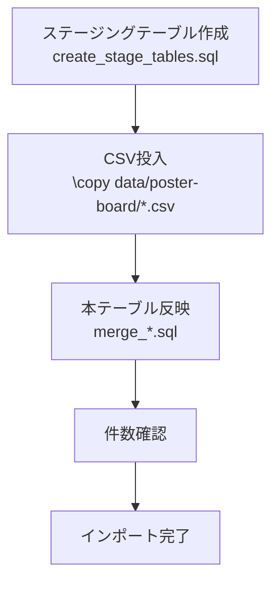
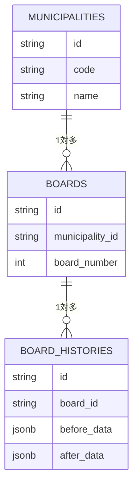

# 掲示板データのエクスポート／インポート手順

本ドキュメントは、自治体・掲示板・掲示板履歴のデータを既存DBからエクスポートし、別環境へインポートするためのシンプルな手順をまとめています。

## 前提

- PostgreSQL と PostGIS がインストールされていること
- `DATABASE_URL` が `.env` などに設定されていること
- プロジェクトルートでコマンドを実行すること

## エクスポート手順

`scripts/poster-board-import/export.sh` を使うと、自治体／掲示板／掲示板履歴のCSVをまとめて出力できます。引数に出力先ディレクトリを指定します（省略時は `exports/`）。

```bash
./scripts/poster-board-import/export.sh              # exports/ に出力
./scripts/poster-board-import/export.sh backups/data # 任意フォルダに出力
```

内部では `psql` の `\copy` を使用しており、`.env` の `DATABASE_URL` が自動的に読み込まれます。直接コマンドを実行したい場合のSQLは `scripts/poster-board-import/sql/` を参照してください。

> NOTE: 出力されるCSVは `boards.csv` が緯度経度を `longitude` / `latitude` 列として含み、`board_histories.csv` の `before_data` / `after_data` は JSON 文字列のまま保存されます。

## インポート手順

`data/poster-board/` に配置された `municipalities.csv` / `boards.csv` / `board_histories.csv` を既定とし、以下のスクリプトで一括取り込みできます。

```bash
./scripts/poster-board-import/import.sh
```

スクリプトが行う処理は次の通りです。

1. `create_stage_tables.sql` を実行してステージングテーブルを再作成
2. `data/poster-board/*.csv` を `\copy ... FROM` でステージングへ投入
3. `merge_*` SQL を順に流し、本テーブルへ upsert
4. 取り込み件数を `SELECT COUNT(*)` で表示

別ディレクトリに出力したCSVを取り込みたい場合は、上記スクリプトの `COPY` 部分を直接実行してください（例: `psql "$DATABASE_URL" -c "\copy boards_import_stage FROM 'exports/boards.csv' WITH (FORMAT csv, HEADER true)"`）。

### インポートフロー



### データ関連図



### メモ

- `merge_boards.sql` では `deleted_at IS NULL` な掲示板のみ取り込みます。座標や自治体名が一致しないレコードがある場合は、ステージングテーブルを確認して補正してください。
- 大規模データを扱う場合は、`export.sh` で生成したCSVをバージョン管理せず別ストレージに置き、必要に応じて `data/poster-board/` へ配置してから `import.sh` を実行してください。

---

最終更新: 2025-10-19
